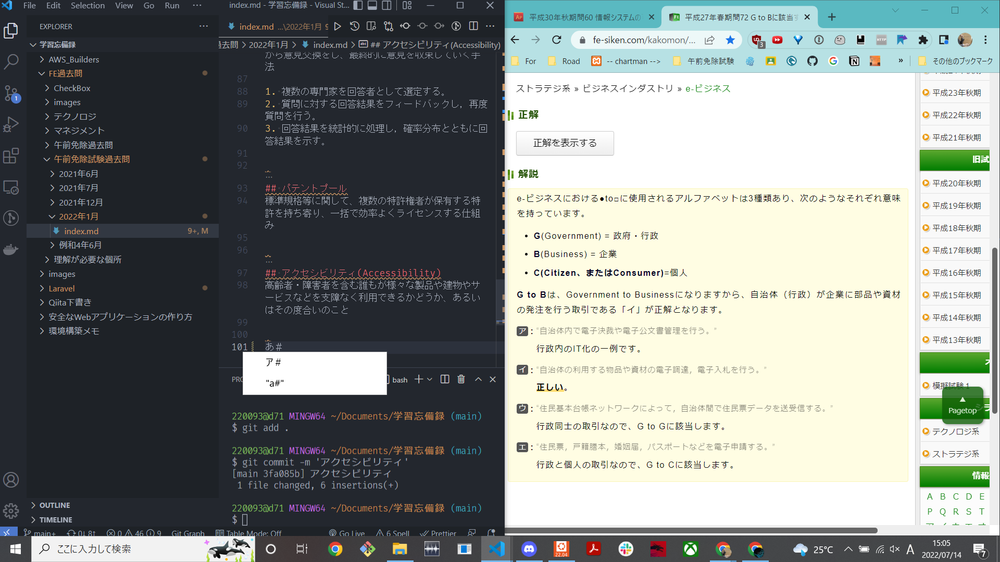

## コンピュータの命令
命令は、プログラムカウンタが示す主記憶のアドレスから取り出され、制御装置内の命令デコーダによって解読される。
したがって取り出しは「記憶装置」、解釈は「制御装置」が適切である。

## メモリ

CPU XとCPU Yのヒット率は同じという所から、連立方程式を利用する。

## コンピュータシステムの信頼性
- MTBF
  - Mean Time Between Failures
  - システムが修理され正常に稼働し始めてから、次回故障するまでの平均故障間隔のこと

- MTTR
  - Mean Time To Repair
  - 平均修理時間
  - システムの故障を修理するために要した平均時間のこと

システムが稼働している時間の割合
MTBF / (MTBF + MTTR)

## ページング方式
- ページング方式とは
  - 仮想記憶管理方式の一つ
  - 仮想アドレス空間をページと呼ばれる固定長の区画に分割するとともに、主記憶のアドレス空間(実アドレス空間)も同じように固定長に分割して、このページ単位で主記憶と仮想記憶のアドレス変換を行う方式

- ページフォールト
  - アクセス要求のあったページが主記憶上に存在しない状態
- ページイン
  - ページを仮想記憶から主記憶に移すこと
- ページアウト
  - ページを主記憶から仮想記憶に移すこと

### ページング処理の順番
1. 主記憶上の必要なデータが存在しない状態が発生する
   1. ページフォールト
2. FIFOやLRUアルゴリズムを用いて置換え対象のページを決定する
3. 置き換え対象のページを主記憶から仮想記憶に退避させる
   1. ページアウト
4. 実行に必要なページを仮想記憶から主記憶に移す
   1. ページイン

## マスターブートレコード
PCの電源が入れられて、最初に読まれるハードディスク内の場所

## システムの要求分析時に行うインタビュー
インタビュー対象者の回答が、事実であるか憶測であるかを区別すべきである。

## イテレーション
アジャイル開発における反復の単位
分析、設計、実装、テストの一連の活動を含む
振り返りはイテレーションの各回の最後に行う

## EVM (Earned Valued Management)
コストとスケジュールの2つを定量的に管理する進捗管理手法

## SLA (Service Level Agreement)
提供者と顧客の間でサービスの品質に関して結ぶ契約の事
サービスの品目と水準、および水準を達成できなかった場合のペナルティ事項などが盛り込まれる

## 可監査性(Auditability)
監査が実施可能であること
ログや処理手順が完備され、業務処理の正当性や内部統制を効果的に監査またはレビューできるように、情報システムが設計・運用されている度合いを指す言葉

## 非機能案件
業務要件を実現するためにシステムに求められる機能要件以外の要件のこと

## バリューチェーン分析
業務を主活動と支援活動に分類し、製品の負荷価値がどの部分(機能)で生み出されているかを分析する手法

## デルファイ法
技術革新や社会辺土などに関する未来予測において良く用いられる
多数の専門家が他の専門家の意見も相互に参照しながら意見交換をし、最終的に意見を収束していく手法

1. 複数の専門家を回答者として選定する。
2. 質問に対する回答結果をフィードバックし，再度質問を行う。
3. 回答結果を統計的に処理し，確率分布とともに回答結果を示す。

## パテントプール
標準規格等に関して、複数の特許権者が保有する特許を持ち寄り、一括で効率よくライセンスする仕組み

## アクセシビリティ(Accessibility)
高齢者・障害者を含む誰もが様々な製品や建物やサービスなどを支障なく利用できるかどうか、あるいはその度合いのこと

## 〇 to 〇

- G to B
  - 自治体(行政)が企業に部品や資材の発注を行う取引
