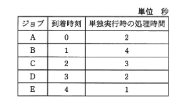
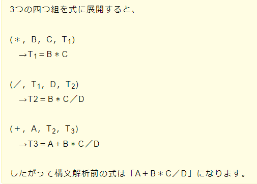

# 例和4年6月
## アクセス時間の速さ
コンピュータに使われる主な記憶装置を高速に動作するものから順番に並べる
1. レジスタ
2. キャッシュメモリ
3. 主記憶
4. SSD
5. HHD
6. 磁気テープ

## レーザプリンタの性能を表す指標
1インチ(2.54cm)当たりのドット数と1分間に印刷できるページ数

## ターンアラウンドタイム
利用者がシステムに処理要求を開始してから、すべての結果を受け取るまでに要する時間

## フールプルーフ
不特定多数の人が操作しても、誤作動が起こりにくいように設計する考え方

## メールのプロトコル
- 送信用
  - SMTP
- 受信用
  - POP3
  - IMAP4

## PINとIDカード
- PIN
  - ICカードの利用の際にシステムと利用者の間で共有している暗証番号
  - PINは他人に知られるとなりすまして悪用される恐れがあるため、推測が困難な文字列を設定するとともに秘密にして管理する必要がある

ICカードが配送中に盗難にあったり紛失しても、PINは別経路で配送されるため不正利用を防ぐことができる

## プレースホルダ
入力フォームの記入欄のこと(テキストボックス)

## 耐タンパ性
外部から行われる内部データへの改ざん・解読・読み出しなどの行為の対する耐性度合いを示す
- タンパ
  - 改ざんするという意味

## 処理時間順方式
処理時間の短いタスクを優先的に実行する。

A~Eで考えると
Aは最初に実行するので考えない。
E < D < C < B
の順で大きいことが分かるので、
待機状態のタスク同士を比較して、処理実行時間が短いタスクを先に処理する。

## メモリリーク
コンピュータの動作中に使用可能な主記憶容量が徐々に現象していく状態を表す

## スキーマ
データの内容、データの論理構造、記憶形式や編成などデータベースの構造を記述したもの
