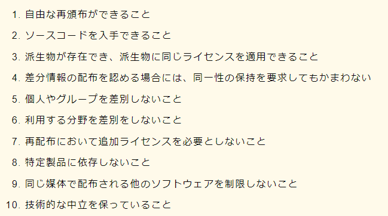

## 桁落ち
- 計算誤差のひとつ
- 計算結果の有効桁数が少なくなること

## OSS

## スプーリング
プリンタなどの低速な装置への出力データを一旦高速な時期ディスクに格納しておき、そのあとに目的の装置に出力する

## ストアドプロシージャ
データベースに対する一連の処理をまとめた手続きにして、データベース管理システムに保存したもの

## OpenFlow, SDN
- OpenFlow
  - 既存のネットワーク機器がもつ制御処理と転送処理を分離したアーキテクチャ
  - 制御部をネットワーク管理者が自ら設計・実装することで、ネットワーク機器ベンダの設定範囲を超えた柔軟な制御機能を実現できる

- SDN
  - OpenFlow上でソフトウェア制御による動的で柔軟なネットワークを作り上げる技術全般
  - SDNを用いると、物理的に接続されたネットワーク上で、別途仮想的なネットワークを構築するといった柔軟な制御が可能になる
