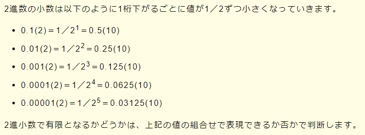

# コンピュータ構成要素
[メイン処理，及び表に示す二つの割込みA，Bの処理があり，多重割込みが許可されている。割込みA，Bが図のタイミングで発生するとき，0ミリ秒から5ミリ秒までの間にメイン処理が利用できるCPU時間は何ミリ秒か。ここで，割込み処理の呼出し及び復帰に伴うオーバヘッドは無視できるものとする。](https://www.fe-siken.com/fekakomon.php)

デイジーチェーン接続は、パラレル転送規格のSCSI(スカジー)などで用いられる接続方法で、「PC－周辺機器－周辺機器」というように、PCを起点として複数の周辺機器を直列で(数珠つなぎのように)接続する方法です。

## 論理式
[論理式図解](https://pyming.info/2021/07/24/ronri_kairo/)

## 無限小数点

