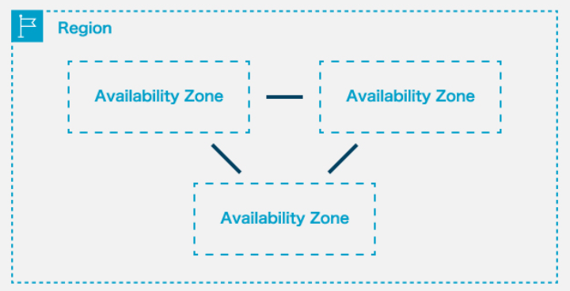
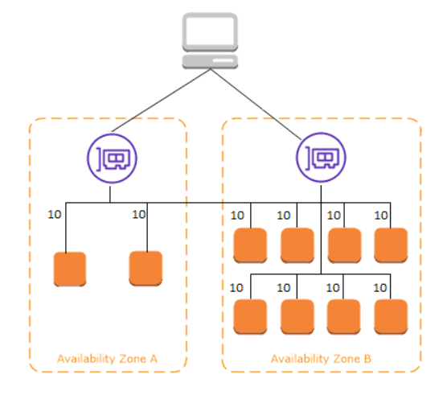

# 可用性とは

こちらの記事では、「可用性」について解説します。
可用性は、「**システムが安定的に稼働し続けられる能力**」のことを指します。どんなに信頼性の高いシステムにも**絶対に落ちない**というシステムは存在しません。安定的にシステムを稼働するためや、万が一障害などが発生した場合のことを考慮しておかなければなりません。また、2018年に日本政府が公開した[**政府情報システムにおけるクラウドサービスの利用に係る基本方針**](https://cio.go.jp/sites/default/files/uploads/documents/cloud_%20policy.pdf)に可用性が取り上げられるなど、可用性が重視されていることが分かります。
本記事では、クラウド技術の発展によって年々重要度を増す可用性について詳しく説明していきます。

## 可用性の概要

可用性は、**Availability(:アベイラビリティー)**の訳語です。可用性は、「可用性が高い、低い」という表現の仕方します。可用性が高い事を指して、**高可用性**(HA: **H**igh **A**vailability)と表す用語も使われています。

また、可用性は稼働率(%)で表す事ができます。例えば、あるシステムが10時間稼働した時に、「実稼働が6時間・稼働停止時間が4時間」だったとしたら、稼働率は60％と表す事ができます。

### システムの評価指標

**可用性はシステムやソフトウェアの品質を評価する際の評価指標の1つです**。システムの評価指標には可用性と似た用語も存在しており、同じような意味で捉えているケースも見受けられますので、一度整理しておきましょう。

| 頭文字 | 評価指標の用語 | 評価指標の訳語 | 用語の説明 |
| --- | --- | --- | --- |
| R | Reliability | 信頼性 | 故障しにくいこと |
| A | Availability | 可用性 | 使える時に使えること |
| S | Serviceability | 保守性 | すぐに復旧できること |
| I | Integrity | 完全性 | 破壊・改竄無く正確であること |
| S | Security | 機密性 | 不正アクセスされないこと |

システムの評価指標には**RAS**、および**RASIS**と呼ばれるものがあります。表の上から3つの評価指標の頭文字を並べたものがRASで、表の上から5つ全てを並べたものがRASISです。特に**RASの信頼性、可用性、保守性はシステムの評価指標で最重要視されています**ので、この3つを混同しないようにしましょう。

初めてRASをシステムの評価指標に導入したのは[IBM](https://ja.wikipedia.org/wiki/IBM)という世界最大規模のIT企業です。IBMは1970年6月に大型コンピュータの「System/370シリーズ」を発表し、この機種において新たなRASの考え方を採用し、商品としての新たな価値を訴えました。
その後、RASにISの要素を追加する形でシステムの評価指標が拡張されました。そのため、RASの3つの要素の重要度が一番高くなっており、RASISは日本独自で広まった用語であると考えられています。(参照: [IT用語辞典 RASIS](https://e-words.jp/w/RASIS.html#:~:text=%E3%80%8Crasis%E3%80%8D%E3%81%AF%E6%97%A5%E6%9C%AC%E8%AA%9E%E4%BB%A5%E5%A4%96%E3%81%AE%E8%B3%87%E6%96%99%E3%81%AB%E3%81%AF%E8%A8%98%E8%BC%89%E3%81%8B%E3%82%99%E6%A5%B5%E3%82%81%E3%81%A6%E4%B9%8F%E3%81%97%E3%81%8F%E3%80%81%E6%AC%A7%E7%B1%B3%E5%9C%8F%E3%81%A6%E3%82%99%E3%81%AF%E3%81%9D%E3%81%AE%E5%BE%8C%E3%82%82(%E7%8F%BE%E5%9C%A8%E3%82%82)%E5%B0%82%E3%82%89ras%E3%81%AE%E7%94%A8%E8%AA%9E%E3%81%8B%E3%82%99%E7%94%A8%E3%81%84%E3%82%89%E3%82%8C%E3%81%A6%E3%81%8A%E3%82%8A%E3%80%81rasis%E3%81%AF%E6%97%A5%E6%9C%AC%E3%81%A6%E3%82%99%E7%8B%AC%E8%87%AA%E3%81%AB%E6%8B%A1%E5%BC%B5%E3%81%95%E3%82%8C%E3%81%A6%E5%BA%83%E3%81%BE%E3%81%A3%E3%81%9F%E7%94%A8%E8%AA%9E%E3%81%A6%E3%82%99%E3%81%82%E3%82%8B%E3%81%A8%E8%80%83%E3%81%88%E3%82%89%E3%82%8C%E3%82%8B%E3%80%82))

### 可用性はどうやって高めるのか

システムの運用において可用性を高める方法は以下の2点です。

* より可用性の高いシステムへリプレイスすること。
* 同じシステムを障害発生時の予備として別途用意しておくこと。

前者の場合、耐障害性システムなどの導入を行い高可用性を求めるほどに大きな投資が必要になります。また、リプレイス自体の手間や現在使用している資産(システム)が無駄になってしまうなどの問題があります。
後者は**冗長化**と呼ばれ、可用性を高める方法としてよく使われます。冗長化のイメージとしては、まず運用システムとは別に待機システムを用意し、両者を同期しておきます。もし障害が発生した場合に切り替えるだけで100％に近い高可用性を実現できます。(切り替えにともなうダウンタイムを考慮しない場合)
つまり、あらゆるシステムにおいていつかは障害が発生する以上、冗長化で高可用性を担保するアプローチは基本中の基本と言って良いでしょう。

## サーバの可用性

Webサーバはアクセス状況の変化の影響を受けやすく、複雑なプログラムが動作する事からトラブルが発生しやすいです。また、インターネットに直接接続されているため攻撃のターゲットとなりやすい、といった性質もあります。サービスの可用性を高めるためには、まずはサービス提供の土台となるサーバの冗長化が必要です。本記事では以下の3つに分けて説明していきます。

* **オンプレミス**(自社でサーバを用意した場合)の可用性
* **仮想サーバ**(自社で仮想サーバを用意した場合)の可用性
* **クラウド**(クラウドベンダーを利用した場合)の可用性

### オンプレミスの可用性

* サーバが物理である点
まずはこの点から考えなくてはいけません。サーバがハードウェアである異常、故障は避けることができません。なので故障が発生する前提で故障時にもサービス全体に影響しないようにシステム設計をすることが物理サーバでの可用性を高くする基本となります。そのためには止まってしまうとサービスが利用できなくなる「SPoF(**S**ingle **P**oint **O**f **F**ailure: 単一障害点)」を無くす、あるいは少なくすることが重要になります。

* ハードウェアや回線などの予備を用意する
記と同様の観点からではありますが、オンプレミスでは、物理的に存在するハードウェアや回線を冗長化して障害時に切り替えるという運用を行います。予備のハードウェアや回線を上用意しておき、正常な回線に経路を切り替えることで障害の影響を最小限に抑えられます。

サーバを切り替える方法には、以下の3種類の方法があります。
* 障害時に運用系から待機系に自動的に切り替える「**ホットスタンバイ**」
* 待機系サーバは停止状態で用意しておき、障害時に待機系を起動してから切り替える「**コールドスタンバイ**」
* 常に複数台稼働させておき、**ロードバランサー**を用いて分散処理させる方法

ロードバランサーは、ロード(負荷)、バランサー(平衡・バランスを取るもの)といった意味があり、**負荷分散装置**のことを指します。主にWebシステムに対してかかる負荷を複数のサーバへ分散させて、処理バランスを調整するために用いられます。
複数のサーバを用意することで仮に1つのサーバがダウンしても残ったサーバでサービスの継続が可能です。この冗長化を実現するためには、複数のサーバそれぞれに対する負荷やサーバダウンに対応して処理を効率的にバランスよく割り振る必要があります。その役割を担えるのがロードバランサーであり、ロードバランサーを導入することで安定したサービス提供を維持することができます。

**物理サーバの可用性の図**

### 仮想サーバの可用性

仮想サーバは、1台の物理サーバ上で複数のOSを動かすことで仮想的に複数のサーバとして運用する方法です。使用する基盤はあくまでも物理サーバなので、その物理サーバに対しての冗長化はオンプレミスと同じです。

オンプレミスとの違いとして、仮想サーバは、物理サーバ自体を遠隔地かつ複数拠点に置くことが可能という点です。そうすることで災害時や事故で深刻なハードウェア障害が起きた時にも安心です。仮想サーバごと別のハードウェアに移行し、マイグレーションを行うことですぐに業務を再開することができます。ですので仮想サーバは、国の定める**事業継続計画(BCP)**の対策にも有効と言えます。

**仮想サーバの可用性の図**
(遠隔地、複数拠点でのハードウェア障害　BCP)

### クラウドの可用性

クラウドサービスは、導入の手軽さや初期費用を抑えられることもあり、開発者の利用や企業のシステムをオンプレミスからクラウドへ移行するなどで利用されることは少なくありません。クラウドベンダーを利用すると、まずオンプレミスで気にすべき点はクラウドベンダーの方で行ってくれるので気にする必要がありません。また、仮想サーバの利点であるBCP対策も基本的にクラウドベンダーの方で行ってくれます。つまり、**クラウドベンダーがシステムの基盤に関する冗長化を全て担ってくれる点**がクラウドベンダーを利用する一番の利点と言えます。

しかし、クラウドを利用するユーザは可用性を一切考えなくて良いのかというと、そうではありません。クラウドベンダーが担うのは、**あくまでもシステムの基盤に関してのみ**です。ユーザがクラウドを利用する上でどういった所に可用性を意識しなくてはいけないのか、AWSを例に挙げて説明していきます。

## AWSとは

AWSは**A**mazon **W**eb **S**erviceの略で、Amazonが提供しているクラウドプラットフォームです。3大パブリッククラウドの1つ且つ、シェア率No.1と世界中で利用されています。(参照: [米Gartner社調査のワールドワイドにおける2021年のIaaSクラウドの市場シェア](https://www.itmedia.co.jp/news/articles/2206/10/news084.html))

AWSで提供するサービスは、ユーザが利用するサービスによって高可用性を確保する難易度は違います。AWSを利用する上で高可用性を確保するために知っておかなくていけないことを説明していきます。

### 責任共有モデル

AWSでは[**責任共有モデル**](https://aws.amazon.com/jp/compliance/shared-responsibility-model/#:~:text=%E4%BF%9D%E8%AD%B7%C2%A0%20%20%0A%20%20%20%20%20%20%20%20%E5%AD%A6%E7%BF%92%C2%A0%20%20%0A%20%20%20%20%20%20%20%20%E3%83%AA%E3%82%BD%E3%83%BC%E3%82%B9%C2%A0%20%20%0A%20%20%20%20%20%20%20%20%E3%83%91%E3%83%BC%E3%83%88%E3%83%8A%E3%83%BC-, %E8%B2%AC%E4%BB%BB%E5%85%B1%E6%9C%89%E3%83%A2%E3%83%87%E3%83%AB, %E5%91%BC%E3%81%B0%E3%82%8C%E3%81%BE%E3%81%99%E3%80%82, -AWS%20%E3%81%AE%20%E2%80%9C%E3%82%AF%E3%83%A9%E3%82%A6%E3%83%89)を採用しています。**セキュリティとコンプライアンスに対して、AWS側とユーザ側とで責任を共有する**というものです。一部抜粋して責任共有モデルを整理すると以下のようになります。

|  | AWS側の責任の有無 | ユーザ側の責任の有無 |
| --- | --- | --- |
| 設備施設・管理 | ◯ | × |
| データベース | ◯ | × |
| ストレージ | ◯ | × |
| ホストOS | ◯ | × |
| ゲストOS | × | ◯ |
| ネットワーク設定 | × | ◯ |
| アプリケーション | × | ◯ |
| アクセス権限の管理 | × | ◯ |

* AWS側の責任
AWS側の責任範疇は、**AWSのサービス基盤であるインフラストラクチャー部分**です。AWS側は提供するサービスをユーザが安定的に使用できるように努め、サービスの可用性がAWSの**SAL**(**S**erves **L**evel **A**greement)を満たすか、上回ることを保証します。SLAとはサービス提供事業者とその利用者との間で結ばれる**サービス品質保証**のことです。可用性が保証値を下回った場合、SLAを下回ったとして利用料金の減額などが行われます。([AWSはSLAを公開しています](https://aws.amazon.com/jp/legal/service-level-agreements/))

* ユーザ側の責任
ユーザ側の責任範疇は、**AWSが提供しているサービス以外の部分**です。ユーザ側が責任を持つ範囲については選択したAWSのサービスによって変わってくるので、サービスによっては自身で可用性を担保しなくてはいけません。

### クラウドの提供する3種類のサービス形態

AWSに限った話ではありませんが、クラウドベンダーはサービスを利用する利用者のニーズに合わせてIaaS、PaaS、SaaSという3つのサービスモデルを提供しています。大まかな違いやAWSが提供する代表的なサービスは以下の通りです。

|  | IaaS | PaaS | SaaS |
| --- | --- | --- | --- |
| 正式名称 | Infrastructure
as a Service | Platform
as a Service | Software
as a Service |
| 読み方 | アイアース
イアース | パース | サース |
| 提供するサービス | ハードウェア
インフラ | ソフトウェア一式 | 各種サービス |
| 自由度 | 高い | 低い | 無し |
| 代表的なサービス | Amazon EC2 | Amazon S3 | Microsoft Office 365 |
| 可用性の確保の難易度 | 高い | 中程度 | 低い |

### リージョンとアベイラビリティゾーン

AWSは世界各地にデータセンターを保有しています。これらのデータセンターを**リージョン**という単位で地理的に分割して管理しており、リージョンは更に**アベイラビリティゾーン**という単位に分割して管理されています。

リージョンは、リージョンとリージョンの間は完全に分離しており、あるリージョンで障害が発生しても他のリージョンに影響が及ぶことがないように設計されています。アベイラビリティゾーンもリージョンと同様に独立していますが、アベイラビリティゾーンは互いに高速な通信線によって接続されており、この点がリージョンと異なっています。
高可用性へのアプローチとして、1つのリージョンに障害が起きた時を想定して複数リージョンにシステムを構成するか、1つのリージョン内の複数のアベイラビリティゾーンでシステムを構成するか、もしくはその両方でシステムを構成するかをユーザ側で選択する必要があります。[2019年の東京リージョンの大規模障害](https://aws.amazon.com/jp/message/56489/)が起こったように、どんなに信頼性が高くても自身のビジネス運営における重要性に応じてしっかりと検討する事が必要です。

### AWSで行う冗長化

例えば、AWSで提供している仮想サーバを構築できるサービスに、Amazon EC2(**A**mazon **E**lastic **C**ompute **C**loud)があります。このEC2を建てる際に可用性を高めるために行える方法を説明していきます。

* Multi-AZ構成
EC2の可用性を高めるための1つ目の方法は、複数のAZ(アベイラビリティゾーン)による冗長構成をとることです。これは**Multi-AZ構成**と呼ばれます。EC2はIaaSとして提供されているため、EC2を利用する際はユーザ自身でEC2の可用性を高める対策を行う必要があります。逆に、PaaSとして提供されるAmazon S3(**A**mazon **S**imple **S**torage **S**ervice)は最初からAWSリージョンの最低3つのAZに渡ってデータを保存する方法をとっており、S3の利用に際してこの点を気にする必要はありません。AZを増やせばその分可用性は高くできますが、その分コストが高くなったり、レイテンシ(通信遅延時間)が増えやすくなるというデメリットもあります。

* ロードバランサー
もう1つの方法は、**ロードバランサー**を使用することです。AWSのロードバランサーはELB(**E**lastic **L**oad **B**alancing)と呼ばれ、アプリケーションへの負荷やCPUの稼働状況をリアルタイムにモニタリングできるロードバランサーです。ELBは非常に多機能で、システムのボトルネックを見つけて解消したり、アクセスを自動的に分散、サーバがダウンしたらそのサーバへのアクセスを止めて、他に割り振ることも可能です。また、ヘルスチェック機能があり、ロードバランサーの内側にあるそれぞれのサービスの状態をモニタリングすることもできます。

ELBには大きく分けて4種のサービスがあり、その特徴などが以下の通りです。ロードバランサーを導入する際にはそれぞれのサービスの特徴に合わせて導入を検討しましょう。また、AWSは、よくある質問でアプリケーションに最適なロードバランサーを提案しています。(参照: [Elastic Load Balancingのよくある質問](https://aws.amazon.com/jp/elasticloadbalancing/faqs/))

| ELBの種類(略称) | ALB | NLB | GLB | CLB |
| --- | --- | --- | --- | --- |
| 正式名称 | Application
Load Blancer | Network
Load Blancer | Gateway
Load Blancer | Classic
Load Blancer |
| 動作する階層 | レイヤー7 | レイヤー4 | レイヤー3 | レイヤー7/4 |
| 対応ネットワーク/プラットフォーム | VPC | VPC | VPC | VPC
EC2-Classic(2022年8月に終了) |
| 特徴 | ・HTTP/HTTPSに対応する単一ロードバランサー
・複数のAZをまたいだインスタンスに対応可能で、可用性に優れる
・SSL証明書がインストール可能なので、HTTPS(SSL)化が容易に行える
 | ・パケットの断片しか確認しないので、ALBほど細かく振り分けられないが、その代わりに底遅延で大量アクセスを分散できる
・アクセスの振り分けに静的IPアドレスを設定できるので、アクセスしてきたクライアント側のIPアドレスを、そのままサーバに伝える事ができる | ・サードパーティのセキュリティ製品(ファイアウォール、侵入検知および防止システムなど)などをAWS上で導入する場合に、シンプルかつ容易に可用性やサービス提供のしやすさを向上させることが可能
・ロードバランサーの機能があるので、セキュリティ製品の監視やオートスケーリングにも対応する | ・複数のAmazon EC2に対して基本的な負荷分散を行う
・対応可能なプロトコルが多く、TCP・SSL/TLS・HTTP・HTTPSなどに対応可能
・旧タイプのロードバランサー
・新規でロードバランサーを導入するならALBもしくはNLBを使用するのが一般的
 |

## 障害からの復旧

障害はいつ起こるか分かりません。だからこそ障害が起きた後のこと、つまり復旧に関して考える必要があります。障害復旧においてはRPO、RTOという概念があります。(AWSの試験にも出ます)

* RPO
RPO(**R**ecovery **P**oint **O**bjective)は「目標復旧時点」という意味で、**障害が発生した際にシステムを過去のどの地点まで復元するかを定めた目標値のこと**です。
RPOを小さく(短く)すればするほど、障害時に喪失するデータを少なくすることができます。例えば、RPOを10秒とすると障害発生の10秒前までのデータを復旧できることを意味し、RPOを1日とすると障害発生の1日前までのデータを復旧できることを意味します。前者は秒単位の頻度でバックアップを取得し続ける必要があるという事を意味し、これだけの高頻度でバックアップを行うことによるコストは大変大きくなってしまうでしょう。対して後者は、バックアップの頻度は1日1回で良いことになり、バックアップにかかるコストは小さく出来ますが、障害発生時から最大で過去24時間分のデータを喪失する可能性があるということでもあります。
リアルタイムに更新され続けるデータと1日1回しか更新されないデータとでは求められるPROは異なってきます。アプリケーションのデータ更新頻度やバックアップにかかるコストの双方を考慮してRPOを決定する必要があります。

* RTO
RTO(**R**ecovery **T**ime **O**bjective)は「目標復旧時点」という意味で、**システムの復旧までにかかる時間の目標値のこと**です。
RTOを小さく(短く)すればするほど、システムを短時間で復旧できることを意味します。しかし、RTOを小さくするためには単純にデータのバックアップを取得しておくだけでなく、システム全体を冗長化して待機しておくなどのダウンタイムを短くするための別の工夫も必要となります。

RPOとRTOをどこまで小さくするべきかは、対象システムの経過時間による影響を考慮して、慎重に決定する必要があります。また、これらの数字は前述したBCPとも密接に関わってきます。どちらの数値も小さいに越した事はありませんがコストを度外視して最小値を目指すのではなく、それぞれのビジネス規模に合わせた最適値を検討する必要があります。

### AWSでの障害復旧のための戦略

AWSで提供しているデータベースサービスにARDS(**A**mazon **R**elational **D**atabase **S**ervice)があります。ARDSのバックアップの設定は自身で設定することになります。AWSのバックアップ料金は、バックアップの回数、復元するバックアップデータの量などによって変わってきます。AWSを利用してRPO・RTOを最適値にするためにも、AWSが提供している障害復旧のための戦略を把握することが必要です。

障害復旧は**ディザスタリカバリ**(DR)と呼ばれ、障害発生時に退避するリージョンをDRリージョンと呼ぶことがあります。DR戦略の基本となる複数リージョン・複数アベイラビリティーゾーンで構成すること以外にもいくつかDR戦略が存在します。

* パイロットライト戦略
パイロットライトのイメージとしては、ガスコンロなどの設備が素早く着火できるように常にしている「ガスコンロの種火」のイメージで

2022-10-25-15-44-36.png)
**EC2の冗長化構成例 通常->冗長化**

https://cloudnavi.nhn-techorus.com/archives/3640
https://future-architect.github.io/articles/20211006b/
https://www.fenet.jp/aws/column/aws-beginner/790/

AWSはAMS(**A**mazon **M**anaged **S**ervice)というサービスを提供しています。AMSはユーザのアプリケーション

* PaaS(**P**latform **a**s **a** **S**ervice)

* SaaS(**S**oftware **a**s **a** **S**ervice)

### AWSの

**クラウドサーバの可用性の図**

### オンプレミス・仮想サーバとクラウドサーバの大きな違い

## まとめ

オンプレミス、仮想サーバ、クラウド　可用性の点から説明してきた。しかしセキュリティやコストなど、別の点も考慮しなくてはいけない。
