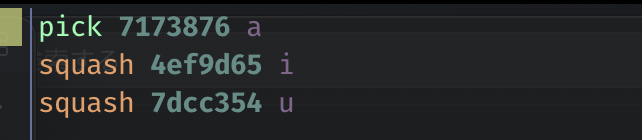

# Git

- 基礎知識
  - originとは
    - リモートリポジトリのアクセス先に対してGitがデフォルトで付ける名前のこと
      - `git remote- v`
        - `origin  git@github.com:Masaru-DaL/Lifelong-Learning.git (fetch)`
        - `origin  git@github.com:Masaru-DaL/Lifelong-Learning.git (push)`
      - `git@github.com:Masaru-DaL/Lifelong-Learning.git`が`origin`という名前で設定されているということ

## 1. 変更操作

### 1-1. コミット時点に戻す

コミット時点であったファイルを消した場合、`git checkout <ファイル名>`で取り戻せる。

1. コミットする（コミット時点で`index.md`があるとする）
2. `rm index.md`
3. `git checkout index.md`
`Updated 1 path from the index`と出て、ファイルが取り戻せる。

この作業は、「Gitのリポジトリから`index.md`を取り出す」という意味。
リポジトリ配下の複数ファイルを変更した場合、ルートで`git checkout .`とすると全てのファイルを変更前に戻せる。

### 1-2. コミットを1つ前に戻す

1. `test.md`がある時点のコミット
2. `test.md`を消してコミットする
3. 1のコミットに戻す -> `test.md`がある状態に戻る
`-> git reset HEAD^ --hard`
`HEAD is now at f1f7d4a Git`

`git reset`は、「どこまでリセットするか」と「どのモードで戻すか」を指定する必要がある。

- どこまでリセットするか
  - `HEAD`: 一番先頭のコミット
  - `^`: 1つ手前（数を増やすとその分何個手前まで戻すということができる）
- どのモードで戻すか
  - `--soft`: 「変更」->「ステージング」->「コミット」の作業の内、最後の「コミット」だけをリセットする方法。
  - `--mixed`: 上の手順の「ステージング」までをリセットする方法。
  - `--hard`: 上の手順の「変更」から全てリセットする方法。
    - やり直しが効かない作業なので、ファイルを削除してしまったり、正常に動作していたファイルを壊してしまった場合などの場合に使用する。

### 1-3. コミットIDで指定して戻す

- 特定のコミットまで戻す
`git reset <コミットID> --hard`
コミットIDは**全文字**or**先頭10文字**でOK

## 2. tag

- タグの付与
`git tag <タグ名> <コミットID>`
コミットIDを省略すると最新のコミットにタグが付与される。

- タグの一覧
`git tag`

- タグの削除
`git tag -d <タグ名>`

## 3. .gitignore

### 3-1. 既存のファイル、ディレクトリを.gitignoreに追加する場合

`.gitignore`にはGitで管理するファイルから除外するファイル、拡張子などを記述する
一度コミットしたファイルは、後から`.gitignore`に追加するだけでは、除外対象にすることはできない。そのため、対象ファイルではなく対象ファイルのキャッシュファイルを削除すると反映される。

1. 既存のリポジトリに対象ファイル, 対象ディレクトリがある状態
2. `.gitignore`に対象ファイル, 対象ディレクトリを記述する
3. キャッシュの削除
   1. ファイル: `git rm --cached <ファイル名>`
   2. ディレクトリ: `git rm --cached -r <ディレクトリ名>`
4. add
5. commit

### 3-2. 例外ファイルの指定

- `/log`の直下の`error.log`だけは`.gitignore`の対象から外したい場合
  - `.gitignore`に、`/log` -> `!/log/error.log`のようにする。（`!`で例外にできる）

## 4. branch

- ブランチを作成し、そのまま移動する
`git checkout -b <ブランチ名>`
これでブランチ名を付けてそのブランチに移動できるが、移動元の指定もできる。
`git checkout -b <ブランチ名> <移動元>`
この方が事故がない気がする。

- HEAD detached from ~
ブランチがない状態なので、ここからチェックアウトすると今いる場所がなくなる。
一度その場でブランチを作成し、何かしらコミットしてからチェックアウトして、マージする手順が良い。

### 4-1. ファストフォワードの概念

- メインがブランチ作成後も**状態が変わっていない**場合
  - 簡単にマージすることができる。
  - **ファストフォワード**と呼ばれる
[fast-forward image](https://backlog.com/ja/git-tutorial/assets/img/stepup/stepup4_2.png)
**ブランチにメインが移る**

- メインがブランチ作成後に**状態が変化している**場合
  - 逆にマスターにブランチを取り込む形になる
  - **ノンファストフォワード**

## 5. コンフリクトの解決

- コンフリクトを起こす

1. ブランチの作成と移動
2. 何か変更してコミットする
3. メインに戻る
4. メインで何か作業してコミットする
5. マージする: `git merge conf-fast --no-edit` （`--no-edit`はコミットメッセージを編集しないという指定）
6. コンフリクトが起こる
ブランチ、メインで共にコミットした際に起こる？

### 5-1. コンフリクトが起きたら

- ここから取れる手段は以下の3つ

1. mainブランチの内容を採用する
2. conf-fastブランチの内容を採用する
3. お互いの変更を確認しながら、手作業で解決する

3の手作業はVScodeでメインとブランチのどちらを採用するかを判断しながら取り込んでいく。

### 5-2. プル、プッシュの時にコンフリクトが起きたら

**基本的に作業前に必ずプルすることを心がける。**

- 状況: リモートと、リモートをクローンしたものと2つある状況でこの時点では2つとも最新

1. リモートに1つ作業をコミットしてプッシュ
2. クローンで1つ作業をコミットしてプッシュ
3. エラーが起こる（先にプルしていないため）
4. プルしようとするとコンフリクトが起こる

対処方法としては、一度ローカルリポジトリをリセットしてからプルする。（2の作業のコミットをなかったことにする）
`git reset origin/main --hard`

## 6. 取り込み

ローカルとリモートで差分があるかを調べるのを「フェッチ」と呼ぶ。
「プル」は「フェッチ」+ 「マージ」

## 7. revert

プッシュした後でコミットを取り消す
**Gitでは基本的に、一度プッシュしてしまった内容は元に戻すことができない**
なぜなら、プッシュした内容を他のメンバーがプルをして、さらに変更してしまっている場合があるため。
`revert`コマンドで出来るが、**出来ないと思って慎重に作業を行った方が良い**。

1. コミット、プッシュ
2. プッシュしたコミットの取り消し
`git revert HEAD --no-edit`: HEADは最新を表す。
`revert`に続けてコミットIDでも指定できた。`revert`を行うと取り消した時点のコミットIDもあるもよう。

## 8. プルリクエスト

実際に行ったことがないのでやってみる。

### 8-1. プルリクエストの作成

1. リモートとローカルそれぞれで同名のブランチを作成する（`pull-request-branch`とする）
2. ローカルからリモートにプッシュする
`git push origin pull-request-branch`
3. リモートのブランチを選択し、「Compare & pull request」を押す

1. base: 統合先, compare: 統合させるブランチ, コミットメッセージ名が表示されている

5. レビューしてもらうようのコメントを記述して「Create pull request」

### 8-2. プルリクエストのレビュー

1. 変更内容を確認する（Files changed）

2. 修正してほしい内容をコメントしてみる

- ボタンの違い
  - Add single comment
    - コメントを登録するたびにプルリクエストの申請者にメールが送信される
  - start a review
    - メールは送信されない（はず）

3. 指摘が終わったらフィードバックを送る
「Finish you review」をクリックしてフォームを開く
コメントと、フィードバックの種類を選ぶ。

- Comment
  - 一般的なフィードバック
  - 特に修正事項もなく、さらに「Approve」必須の運用にしていない場合はこれで十分

- Approve
  - プルリクエストの内容が問題ない場合に送る
  - レビュー必須のリポジトリの設定をしている場合、この「Approve」を得て初めてMergeできるようになる。

- Request changes
  - 修正依頼
  - プルリクエストの申請者が修正しないとMergeすることはできない

※自分のリポジトリに自分でプルリクエストを送った場合は「コメント」のみが可能

4. マージする
5. そのままブランチを削除することもできる

## 9. GitHub Flow

Gitをチームで運用する場合に設けるルール。
GitHub Flow: GitHub社が採用しているプロジェクトの開発ルール

### 9-1. GitHub Flowのルール

1. mainブランチでは開発しない

2. 開発する内容ごとに「トピックブランチ」を作成する
   1. ブランチ名は作業内容がわかるものを付ける
   2. 基本的に1つのトピックブランチで複数の内容の開発は行わない
ブランチの一覧を確認するだけで、今どんな作業が行われているのかが分かる

3. 作業に関するやり取りはプルリクエストで行う
   1. プルリクエストは比較的気軽に行って良いこととする
   2. 何かコミュケーションをしたいことがある場合は、プルリクエストのコメント欄でやり取りを行う

4. 開発が終了したら、レビューを依頼する
   1. トピックブランチで行っている開発作業が終わったら、レビュアーを指定してプルリクエストのレビュー依頼をする
   2. レビュアーは内容を確認して、承認またはコメントをする

5. レビューがすべて承認されたらmainブランチにマージする
   1. マージしたら、すぐにアプリケーションとしてリリースする。

### 9-2. GitHub Flowによるメリット

- ブランチがシンプルで、mainブランチだけを気にすれば良い
- ブランチの一覧を確認するだけで、今どんな作業が行われているのかが分かる
- ブランチで行った作業に関するやり取りは、プルリクエストのコメント欄で追うことができる
- マージをすると、リリース準備が完了する
- mainブランチを安心してリリースできる

### 9-3. GitHub Flowまとめ

- GitHub Flowの特徴
テストやリリースを厳格に行うソフトウェアの開発などで利用される。トラブルが生じにくい反面かなり複雑なワークフローになる。

- チュートリアルもある
[GitHub Flow Tutorial](https://www.atlassian.com/ja/git/tutorials/comparing-workflows/gitflow-workflow)

## 10. チーム開発

### 10-1. Stash（こっそり隠す）

コミットしていない変更がある状態でブランチを切り替えると、その変更は切り替えた先のブランチに適用されてしまう。作業途中でコミットをするとコミットログが汚くなることや、作業のログが分からなくなってしまう。
こういう時に変更を一時的に退避させて保管できるのが「Stash（スタッシュ）」。**Stashは作業内容を一時的に、コミットせずに保管する機能**。

- やってみる

1. コミット時点から何かしら変更を加える
2. スタッシュしてみる
`git stash save <スタッシュ名>`
`git stash save '作業途中' -u`
`-u`はステージングしていないファイルもスタッシュの対象にするというオプション。これを付けない場合はステージングしているファイルのみスタッシュする。
3. スタッシュの確認
`git stash list`でスタッシュのリストが確認できる。
4. スタッシュの適用
`git stash appley <スタッシュID>`
スタッシュIDを省略すると最新のスタッシュを適用する。
5. スタッシュの削除
   1. スタッシュIDを指定: `git stash drop`
   2. 全てのスタッシュ: `git stash clear`

### 10-2. Amend（修正する）

既存のコミットに変更ができるのが「Amend（アメンド）」
※プッシュするとAmendは出来ない！

- やってみる

1. 何かしらコミットする
2. 更に変更を加える
3. Amendする
`git commit -a --amend --no-edit`
`-a`: ステージングを同時に行う
直前のコミットに対してAmendする。

### 10-3. Rebase（土台に戻す）

「Rebase（リベース）」とは、マージの1種でコミットログをきれいにするための機能。
基本的にコミットログを整理したい時に使う。
概要だけ。

### 10-4. Squash（押しつぶす）

コミットをまとめる。

1. a, i, uという3のコミットをまとめる。
2. `git rebase -i HEAD^^^`（最新から3つを指定）
3. vimが開かれる
4. 以下のように編集 -> `:wq` -> `:wq`
pick: 統合先コミット
squash: 統合させるコミット

### 10-5. Cherrypick（おいしいとこ取り）

ブランチをマージせずに、欲しいところのコミットログだけを取り込んで反映する操作のこと。例えば、ブランチで修正した内容を他のブランチに取り込むなどに使える。

### 10-6. Patch（つぎはぎ）

## 設定編

### アップストリーム

- ブランチの紐付けを行う

`git push --set-upstream origin main`
ローカルのメインブランチとリモートのメインブランチが紐づいたので、次回から`git push`だけで`git push origin main`が行える。
ブランチごとにアップストリームを設定する必要はある。
