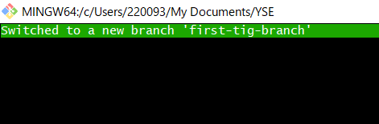
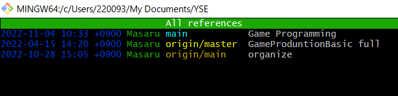
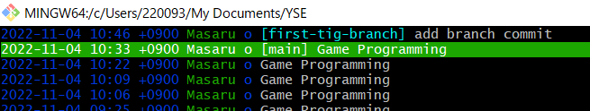
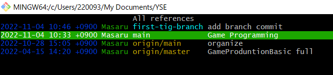
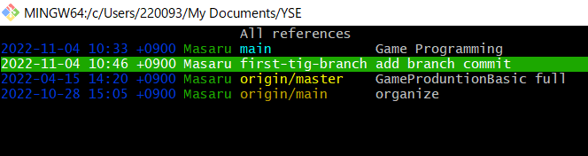
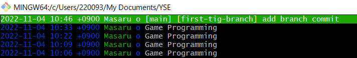
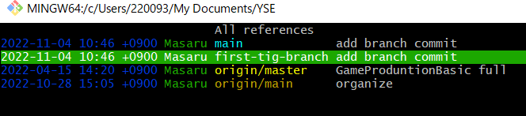
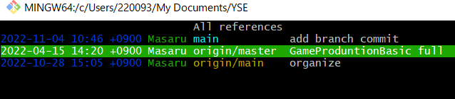

# tigの使い方に慣れる

参考: [tigでgitをもっと便利に！ addやcommitも](https://qiita.com/suino/items/b0dae7e00bd7165f79ea)

## 1. 何はともあれ、tigと打ってみる

* `tig`
  + = `git log`
  + 表示された画面は`main view`と言う


-
* `main view`でenter
  + `diff view`と言う
  + `diff view`では個々のコミットの`diff`を表示することができる。
`Unstaged Changes` はまだステージに上げていない差分を見れる。


## 2. tigでaddする

* `main view`で`S`（`shift+s`）を押すと、`git status`の結果が表示される。（`status view`）
enterを押すとファイルの差分も見れる。


* ステージングしたいファイルに合わせて`u`を押すとステージングできる。
`M MyLearning/BasicLearning/GitHub/index.md` （ファイル）が `Changes not staged for commit:` から `Changes to be committed:` に移動した。
=> `git add MyLearning/BasicLearning/GitHub/index.md`


* tigのステージングポイント

1. グループ化されているのでグループごとにステージングできる
@@ ~ @@までがグループ化
多分グループ単位でステージング出来て、自分でどこからどこまでとかは出来なさそう（あやしい）

2. 1行単位でもステージングできる
`diff view` で `1` を押すとできるもよう。

## 3. tigでcommitする

* `status view`で、`C`（`shift+c`）を押すと`commit`の画面が表示される。
一番上の場所にコミットメッセージを書いて `:wq` を押すとコミットが完了する。
=> `git commit -m 'First Commit of tig`


## 4. tigでpushする

**tigでpush, pullができないもよう**
気合いで出来なくはないが、tigはあくまでもビュワーの役割みたい。

## 5. tigは慣れるまで大変

`main view` で `h` を押すとヘルプ画面になるので、そこを見ながら覚えていく形が良さそう。


コミットしようとして `shift+c` と間違えて `ctrl+c` を押すと強制終了した。

## 5. tigでブランチの作成

vimのように**半角モード**でコマンド受付が可能になり、そこでコマンドを打つ事が出来る。Gitコマンドは `:!<コマンド>` ように打つ。

* ブランチの作成
 `:!git checkout -b first-tig-branch`



* `r`を押すとブランチの情報が見れる



## 6. tigでブランチをマージする

1. ブランチからメインにチェックアウト
2. メインにブランチをマージする

### 6-1. メインにチェックアウト

* ブランチからメインにチェックアウト



メインに合わせて、 `C` （ `shift+c` ）を押す。



再確認されるので `y` を押す。
メインがブランチより上に来る。



### 6-2. メインにブランチをマージする

* `:!git merge first-tig-branch`
特に問題なければマージが完了する



## 7. 不要なブランチの削除

* `r`でrefs viewに移動



* 不要なブランチに合わせて`!`を押す
再確認されるので `y` を押す。
ブランチが削除される。



## 8. tigでプッシュする

普通にできたもよう。
 `:!git push origin main`

## 9. tigのキーバインド設定

`.tigrc` で設定が可能
何個か設定してみる。主にコマンドに対応していないのを設定すると良さそう。

```code: .tigrc
###################################################
#

# main view

#
###################################################

# "P" でプッシュするようにする

bind refs P ?git push -u origin %(branch)

###################################################
#

# refs view

#
###################################################

# "n" でブランチを作成出来るようにする/再確認

bind refs n ?git checkout -b "%(prompt Enter new branch name: )" %(branch)

# "M" でマージ出来るようにする/再確認

bind refs M ?git merge %(branch)

# "L" でプル出来るようにする/再確認

bind refs L ?git pull origin %(branch)
```
