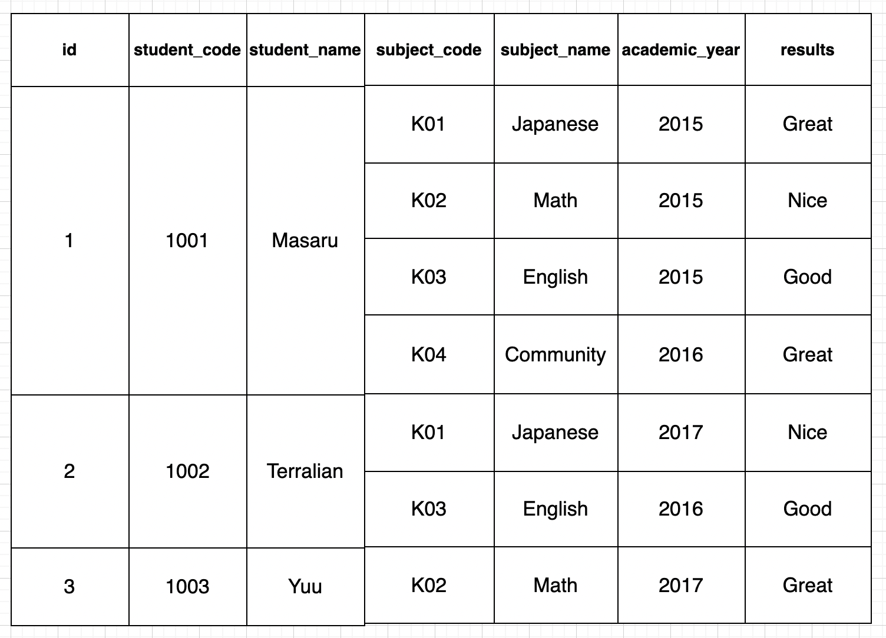
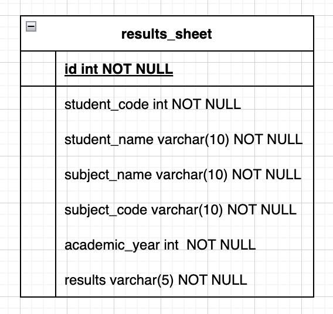
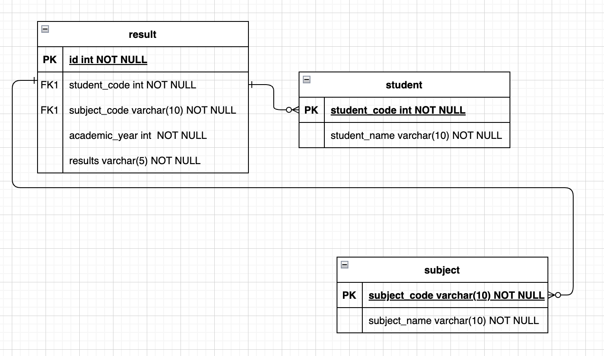
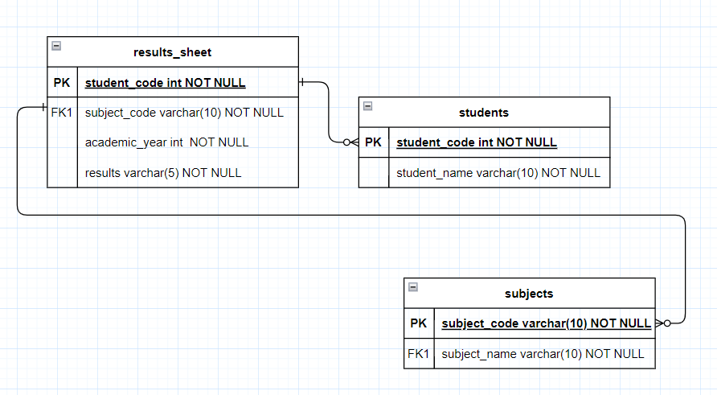
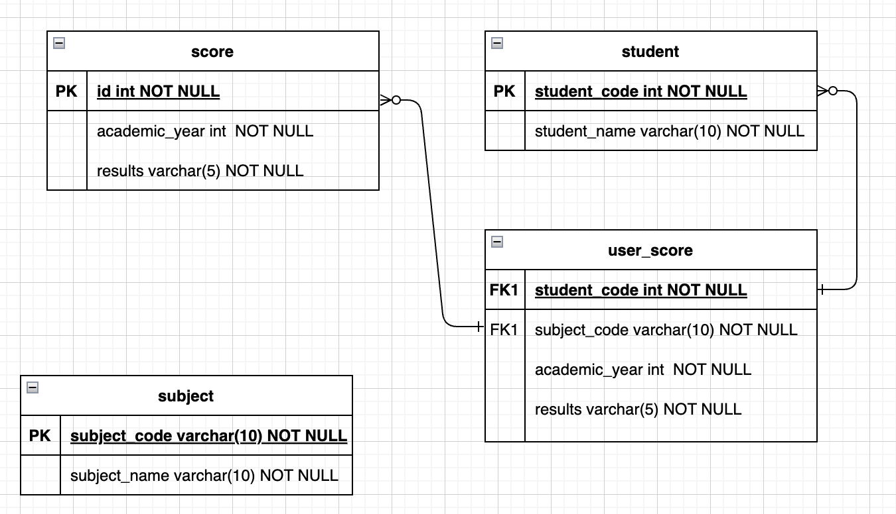

# データベースの正規化とは

## 1. 正規化とは

[関係の正規化](https://ja.wikipedia.org/wiki/%E9%96%A2%E4%BF%82%E3%81%AE%E6%AD%A3%E8%A6%8F%E5%8C%96)

> 関係の正規化（かんけいのせいきか）は、関係データベース (リレーショナル・データベース) において、関係（リレーション）を正規形と呼ばれる形式に準拠させることにより、データの一貫性の維持と効率的なデータアクセスを可能にする関係設計を導くための方法である。正規形には様々なものが存在するが、いずれにせよ、正規化を行うことにより、データの冗長性と不整合が起きる機会を減らすことができる。

- 関係の正規化の定義
**関係(リレーション)を正規形と呼ばれる形式に準拠させること**
※正規形には様々なものが存在する

- 関係の正規化とは
データの一貫性の維持と効率的なデータアクセスを可能にする関係設計を導く。

- 正規化を行うことによるメリット
データの冗長性と不整合が起きる機会を減らせる。

> 多くの関係データベース管理システム (RDBMS) は、論理的なデータベース設計とデータを格納する物理的な実装方法とが十分に分離されていないので、完全に正規化されたデータベースへのクエリ（検索質問）はパフォーマンスが良くないことがある。このような場合、パフォーマンスを向上させるためにデータの一貫性の低下と引き換えにあえて非正規化されることもある。

- 非正規化を行う場合もある

## 2. もう少し正規化について詳しく

[データベースの正規化の基礎](https://learn.microsoft.com/ja-jp/office/troubleshoot/access/database-normalization-description)

> 冗長なデータがあると、ディスク領域が浪費され、保守上の問題点が生じます。 複数の場所に存在するデータの変更が必要な場合、すべての場所でそれらのデータがまったく同一になるように変更する必要があります。 顧客の住所を変更する際に、データが格納されているのが "顧客" テーブルのみで、データベース内の他のテーブルに存在しない場合、変更作業を簡単に行うことができます。

- 正規化をしなかった場合、つまり冗長なデータがあった場合

1. ディスク領域が浪費され、保守上の問題点が生じる。
2. 複数箇所に存在するデータの変更の必要性が生じた場合、その全てを変更しなくてはならない。

> データベースの正規化にはいくつかの規則があります。 各ルールは"通常の形式" と呼ばれます。最初の規則が観察された場合、データベースは "最初の通常の形式" と呼ばれます。最初の 3 つの規則が観察された場合、データベースは "3 番目の通常の形式" と見なされます。他のレベルの正規化は可能ですが、3 番目の標準形式は、ほとんどのアプリケーションに必要な最高レベルと見なされます。

- 正規化にはいくつかの規則がある。
  - 各ルールは「通常の形式」と呼ばれる
    - あまり聞いたことがない
    - 第◯正規化というものがある、程度で良さそう
  - 第3正規化が良い感じ

> 多くの規則や規格がそうであるように、現実のシナリオは常に規則に完全に適合しているとは限りません。 一般的に、正規化を行うと追加テーブルが必要となるため、わずらわしいと感じる顧客もいます。 正規化の最初の 3 つの規則のいずれかに違反した設計をする場合、冗長データや矛盾する従属関係など、アプリケーションで発生する可能性のある問題点を考慮しておく必要があります。

- 正規化を行うと追加テーブルが必要となる

## 3. 正規化の例

[データベースの正規化の基礎](https://learn.microsoft.com/ja-jp/office/troubleshoot/access/database-normalization-description)を参考にしながら、自分で実際にデータベースとテーブルを作成して行ってみる。サンプル用のテーブル作成や正規化の流れは[データの正規化](https://basics.k-labo.work/2017/10/30/%E3%83%87%E3%83%BC%E3%82%BF%E3%81%AE%E6%AD%A3%E8%A6%8F%E5%8C%96/)を参考にする。

使用環境 -> [Envader](https://envader.plus/)

[正規化における時点の名前](https://breezegroup.co.jp/wp-content/uploads/2020/04/%E6%AD%A3%E8%A6%8F%E5%8C%96%E3%81%AE%E7%A8%AE%E9%A1%9E-1-1024x275.png)で、何となくイメージは掴んでおく。

| **状態** | **内容** |
| --- | --- |
| **非正規化状態** | 全く正規化が行われていない状態のテーブル |
| **第一正規形** | 非正規形のテーブルを、繰り返し現れる列がない状態 |
| **第二正規形** | 主キー
となる列の値が決まれば、他の従属する値が決まるようにテーブルを分割した状態 |
| **第三正規形** | 主キーとなる列以外の値によって、他の非主キー列の値が決まることがない状態にテーブルを分割した状態 |

### 3-1. 非正規形

- 正規化される前のテーブルを作成する。
テーブルは行列の調整が出来ないので図で。



1つのstudent_code, student_nameに対して複数の項目が繰り替えし存在しているため、非正規化に該当する。

### 3-2. 第1正規形

上記の非正規形に対し、**第1正規化**を行い、**第1正規形**にする。



1. データベースの作成(normalize_dbとしてデータベースを作成する)

```sql:
mysql> create database normalize_db;
Query OK, 1 row affected (0.06 sec)

mysql> show databases;
+--------------------+
| Database           |
+--------------------+
| food_app           |
| information_schema |
| mysql              |
| normalize_db       |
| performance_schema |
| sys                |
+--------------------+
6 rows in set (0.01 sec)

mysql> use normalize_db;
Database changed
```

2. tableの作成(results_sheetとしてテーブルを作成する)

```sql;
mysql> create table normalize_db.results_sheet (
    -> id int,
    -> student_code int,
    -> student_name varchar(10),
    -> subject_code varchar(10),
    -> subject_name varchar(10),
    -> academic_year int,
    -> results varchar(5));
Query OK, 0 rows affected (0.11 sec)

mysql> show tables;
+------------------------+
| Tables_in_normalize_db |
+------------------------+
| results_sheet          |
+------------------------+
1 row in set (0.00 sec)
```

3. 第1正規形としてサンプルデータを挿入する。

```sql:
mysql> select * from results_sheet;
+------+--------------+--------------+--------------+--------------+---------------+---------+
| id   | student_code | student_name | subject_code | subject_name | academic_year | results |
+------+--------------+--------------+--------------+--------------+---------------+---------+
|    1 |         1001 | Masaru       | K01          | Japanese     |          2015 | Great   |
|    2 |         1001 | Masaru       | K02          | Math         |          2015 | Nice    |
|    3 |         1001 | Masaru       | K03          | English      |          2015 | Good    |
|    4 |         1001 | Masaru       | K04          | Community    |          2016 | Great   |
|    5 |         1002 | Terralian    | K01          | Japanese     |          2017 | Nice    |
|    6 |         1002 | Terralian    | K03          | English      |          2016 | Good    |
|    7 |         1003 | Yuu          | K02          | Math         |          2017 | Great   |
+------+--------------+--------------+--------------+--------------+---------------+---------+
7 rows in set (0.00 sec)
```

### 3-3. 第2正規形

次に**第2正規化**を行い、**第2正規形**にします。
第2正規化では従属関係を作成する。



1. results_sheetの情報を確認する。
重複してるものを洗い出すと、student, subjectが重複してるのでその2つのテーブルを作成と、最終的な結果(result)のテーブルの全部で3つのテーブルが必要です。

2. 3つのテーブルに分割する。

- student
  - student_code
  - student_name

- subject
  - subject_code
  - subject_name

- result
  - id
  - subject_code
  - academic_year
  - results

3. 参照先を設定する

- student
  - student_code(primary key)
  - student_name

- subject
  - subject_code(primary key)
  - subject_name

- result
  - id(primary key)
  - student_code(foreign key)
  - subject_code(foreign key)
  - academic_year
  - results

(若干理解が怪しいので従属関係が間違っている可能性もあり)



```sql:
-- テーブルの作成 --
mysql> create table normalize_db.student (student_code int, student_name varchar(10));

mysql> create table normalize_db.subject (subject_code varchar(10), subject_name varchar(10));

-- 主キーの設定 --
alter table student add primary key (student_code);
alter table subject add primary key (subject_code);
alter table result add primary key (id);

mysql> create table normalize_db.result (id int, student_code int, subject_code varchar(10), academic_year int, results varchar(5));

-- 外部キーの設定 --
alter table result add foreign key fk_subject_code(subject_code) references subject(subject_code);
alter table result add foreign key fk_student_code(student_code) references student(student_code);

-- テーブルの確認 --
mysql> show tables;
+------------------------+
| Tables_in_normalize_db |
+------------------------+
| result                 |
| student                |
| subject                |
+------------------------+
3 rows in set (0.01 sec)

-- カラムの確認(主キー, 外部キー) --
mysql> show columns from student;
+--------------+-------------+------+-----+---------+-------+
| Field        | Type        | Null | Key | Default | Extra |
+--------------+-------------+------+-----+---------+-------+
| student_code | int         | NO   | PRI | NULL    |       |
| student_name | varchar(10) | YES  |     | NULL    |       |
+--------------+-------------+------+-----+---------+-------+

mysql> show columns from subject;
+--------------+-------------+------+-----+---------+-------+
| Field        | Type        | Null | Key | Default | Extra |
+--------------+-------------+------+-----+---------+-------+
| subject_code | varchar(10) | NO   | PRI | NULL    |       |
| subject_name | varchar(10) | YES  |     | NULL    |       |
+--------------+-------------+------+-----+---------+-------+

mysql> show columns from result;
+---------------+-------------+------+-----+---------+-------+
| Field         | Type        | Null | Key | Default | Extra |
+---------------+-------------+------+-----+---------+-------+
| id            | int         | NO   | PRI | NULL    |       |
| student_code  | int         | YES  | MUL | NULL    |       |
| subject_code  | varchar(10) | YES  | MUL | NULL    |       |
| academic_year | int         | YES  |     | NULL    |       |
| results       | varchar(5)  | YES  |     | NULL    |       |
+---------------+-------------+------+-----+---------+-------+

-- サンプルデータ挿入 --
insert into student values (1001, 'Masaru');
insert into student values (1002, 'Terralian');
insert into student values (1003, 'Yuu');

insert into subject values ('K01', 'Japanese');
insert into subject values ('K02', 'Math');
insert into subject values ('K03', 'English');
insert into subject values ('K04', 'Community');

insert into result values (1, 1001, 'K01', 2015, 'Great');
insert into result values (2, 1001, 'K02', 2015, 'Nice');
insert into result values (3, 1001, 'K03', 2015, 'Good');
insert into result values (4, 1001, 'K04', 2016, 'Great');
insert into result values (5, 1002, 'K01', 2017, 'Nice');
insert into result values (6, 1002, 'K03', 2016, 'Good');
insert into result values (7, 1003, 'K02', 2017, 'Great');
-- 挿入ここまで --

-- データの確認 --
mysql> select * from student;
+--------------+--------------+
| student_code | student_name |
+--------------+--------------+
|         1001 | Masaru       |
|         1002 | Terralian    |
|         1003 | Yuu          |
+--------------+--------------+

mysql> select * from subject;
+--------------+--------------+
| subject_code | subject_name |
+--------------+--------------+
| K01          | Japanese     |
| K02          | Math         |
| K03          | English      |
| K04          | Community    |
+--------------+--------------+

mysql> select * from subject;
+--------------+--------------+
| subject_code | subject_name |
+--------------+--------------+
| K01          | Japanese     |
| K02          | Math         |
| K03          | English      |
| K04          | Community    |
+--------------+--------------+

-- 最終結果 --
mysql> select * from result;
+----+--------------+--------------+---------------+---------+
| id | student_code | subject_code | academic_year | results |
+----+--------------+--------------+---------------+---------+
|  1 |         1001 | K01          |          2015 | Great   |
|  2 |         1001 | K02          |          2015 | Nice    |
|  3 |         1001 | K03          |          2015 | Good    |
|  4 |         1001 | K04          |          2016 | Great   |
|  5 |         1002 | K01          |          2017 | Nice    |
|  6 |         1002 | K03          |          2016 | Good    |
|  7 |         1003 | K02          |          2017 | Great   |
+----+--------------+--------------+---------------+---------+
```

### 3-4. 第3正規形

最後に**第3正規化**を行い、**第3正規形**にします。
項目同士が既存関係を持っているもの(推移的従属関係)も、別テーブルにっきり出す。(=成績テーブルの作成)



最終テーブル数は4つ。


```sql:
-- テーブルの作成 --
mysql> create table normalize_db.student (student_code int, student_name varchar(10));

mysql> create table normalize_db.subject (subject_code varchar(10), subject_name varchar(10));

mysql> create table normalize_db.score (id int, academic_year int, results varchar(5));

mysql> create table normalize_db.user_score (student_code int, subject_code varchar(10), academic_year int, results varchar(5));

-- 主キーの設定 --
alter table student add primary key (student_code);
alter table subject add primary key (subject_code);
alter table score add primary key (id);

-- 外部キーの設定 --
alter table user_score add foreign key fk_student_code(student_code) references student(student_code);
alter table user_score add foreign key fk_subject_code(subject_code) references subject(subject_code);

-- サンプルデータの挿入 --
insert into student values (1001, 'Masaru');
insert into student values (1002, 'Terralian');
insert into student values (1003, 'Yuu');

insert into subject values ('K01', 'Japanese');
insert into subject values ('K02', 'Math');
insert into subject values ('K03', 'English');
insert into subject values ('K04', 'Community');

insert into score values (1, 2015, 'Good');
insert into score values (2, 2015, 'Nice');
insert into score values (3, 2015, 'Great');
insert into score values (4, 2016, 'Good');
insert into score values (5, 2016, 'Nice');
insert into score values (6, 2016, 'Great');
insert into score values (7, 2017, 'Good');
insert into score values (8, 2017, 'Nice');
insert into score values (9, 2017, 'Great');

insert into user_score values (1001, 'K01', 2015, 'Great');
insert into user_score values (1001, 'K02', 2015, 'Nice');
insert into user_score values (1001, 'K03', 2015, 'Good');
insert into user_score values (1001, 'K04', 2016, 'Great');
insert into user_score values (1001, 'K01', 2015, 'Nice');
insert into user_score values (1002, 'K01', 2015, 'Nice');
insert into user_score values (1002, 'K03', 2015, 'Good');
insert into user_score values (1003, 'K02', 2015, 'Great');


-- 結果テーブルの確認 --
mysql> select * from user_score;
+--------------+--------------+---------------+---------+
| student_code | subject_code | academic_year | results |
+--------------+--------------+---------------+---------+
|         1001 | K01          |          2015 | Great   |
|         1001 | K02          |          2015 | Nice    |
|         1001 | K03          |          2015 | Good    |
|         1001 | K04          |          2016 | Great   |
|         1001 | K01          |          2015 | Nice    |
|         1002 | K01          |          2015 | Nice    |
|         1002 | K03          |          2015 | Good    |
|         1003 | K02          |          2015 | Great   |
+--------------+--------------+---------------+---------+
```
