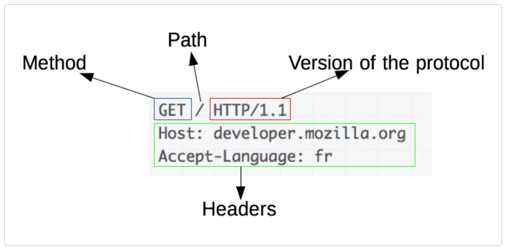

- [HTTP通信について細かく調べる＋curlコマンドを使って色々してみる](#http通信について細かく調べるcurlコマンドを使って色々してみる)
  - [1. HTTPベースシステムの構成要素](#1-httpベースシステムの構成要素)
    - [1-1. クライアント: ユーザエージェント](#1-1-クライアント-ユーザエージェント)
    - [1-2. Webサーバ](#1-2-webサーバ)
    - [1-3. プロキシ](#1-3-プロキシ)
  - [2. HTTPの基本方針](#2-httpの基本方針)
    - [2-1. HTTPはシンプル](#2-1-httpはシンプル)
    - [2-2. HTTPは拡張可能](#2-2-httpは拡張可能)
    - [2-3. HTTPはステートレスであるがセッションレスではない](#2-3-httpはステートレスであるがセッションレスではない)
    - [2-4. HTTPとコネクション](#2-4-httpとコネクション)
  - [3. HTTPのフロー](#3-httpのフロー)
  - [4. HTTPメッセージ](#4-httpメッセージ)
    - [4-1. HTTPリクエスト](#4-1-httpリクエスト)
    - [4-2. レスポンス](#4-2-レスポンス)
  - [5. curlコマンドを通して、HTTPまわりをもう1回しっかり勉強する](#5-curlコマンドを通してhttpまわりをもう1回しっかり勉強する)
# HTTP通信について細かく調べる＋curlコマンドを使って色々してみる
* HTTP(Hypertext Transfer Protocol)
WebブラウザとWebサーバの間で、Web情報をやりとりするためのプロトコル(通信規則)

## 1. HTTPベースシステムの構成要素

HTTPは**クライアントサーバプロトコル**。
リクエストはユーザエージェント(または代理のプロキシ)というひとつの実体から送信される。
ほとんどの場合、ユーザエージェントはウェブブラウザだが、検索エンジンのインデックスを収集および保守するためにウェブをクロールするロボットなど、**どれでもクライアントになることが出来る**。

個々のリクエストはサーバに送信され、処理した後にレスポンスと呼ばれる回答を提供する。

クライアントとサーバの間には、例えばゲートウェイやキャッシュなどの様々な操作を行う、まとめて**プロキシサーバ**と呼ばれるいくつもの実体が存在している。


実際はブラウザとサーバの間にルータやモデムなどの機器が存在する。これらはウェブが階層構造で設計されたおかげでネットワークやトランスポート層の中に隠されている。
**HTTPはアプリケーション層の最上位に存在する**。HTTPを説明する際に下層のことはほとんど重要ではない。

### 1-1. クライアント: ユーザエージェント

**ユーザエージェントとは、ユーザのために働くツールのことを指す**。ユーザエージェントの役割は、主にウェブブラウザが担うが、エンジニアやウェブ開発者がアプリケーションをデバッグするために使用するプログラムである可能性もある。

ブラウザは、**常に**リクエストを生成する実体である。サーバにはならない。

* ウェブページを表示する順序

1. ページを表すHTML文書を読み込むための最初のリクエストを送信する
2. このファイルを解析し、以下に対応する追加のリクエストを発行する
   1. 実行するスクリプト
   2. 表示するレイアウトの情報(CSS)
   3. ページに含まれるサブリソース(通常は画像や動画)
3. これらのリソースを組み合わせて、Webブラウザは完全な文書であるウェブページを提供する
4. ※スクリプトによっては後の段階でブラウザが実行してウェブページを更新する場合もある。

WebページはHyper Text Transferである。つまり、表示されているコンテンツの一部が新たなウェブページの取り込みを発生させるリンクであり、ユーザがユーザエージェントを導いてウェブ内を移動できるということである。(**ページ同士が連結しているイメージ**)ブラウザはこれらの導きをHTTPリクエストに変換して、さらにユーザへ明確なレスポンスを返すためにHTTPレスポンスを解釈する。(**ユーザの需要を満たす**)

### 1-2. Webサーバ

サーバは、仮想的には1台だけのマシンとして見えるが、実際は負荷を共有する(負荷分散の)ための複数のサーバの集合体である場合もあるし、他のコンピュータ(キャッシュ、DBサーバ、ECサーバなど)に問い合わせを行っている場合もある。つまりリクエストの内容に応じて、**全面的に文書を生成したり、キャッシュを使用して部分的に文書を生成してたりする**。

### 1-3. プロキシ

ブラウザとサーバ間には、多数のコンピュータや端末がHTTPメッセージを中継する。ウェブは階層構造であるため、これらの処理のほとんどはトランスポート層、ネットワーク層、物理層のいずれかで行われ、受信したリクエストをいかなる場合も変更せずHTTP層に送られる。
アプリケーション層で行われる処理は、通常**プロキシ**と呼ばれる。これらは受信したリクエストをいかなる場合も変更せず転送する場合と、サーバを通過する前に何らかの形でリクエストを変更する場合とがある。

* プロキシが実行するさまざまな機能
  + キャッシュ
  + フィルタリング(アンチウィルススキャンなど)
  + 負荷分散(複数のサーバが別々のリクエストに対応できるようにする)
  + 認証(さまざまなリソースへアクセスを制御する)
  + ログ記録(履歴情報の保管を可能にする)

## 2. HTTPの基本方針

### 2-1. HTTPはシンプル

HTTP/2でHTTPメッセージをフレームにカプセル化することにより複雑さが増したが、HTTPは全体的にシンプルで人間が読めるように設計されている。

### 2-2. HTTPは拡張可能

(ちょっとイメージが付かない。)
HTTP/1.0で導入されたHTTPヘッダーによって、プロトコルの拡張や実験が容易になっている。

### 2-3. HTTPはステートレスであるがセッションレスではない

HTTPはステートレスで状態を保持できない。ECサイトなどで支障が出る。HTTP Cookieによってステートフルなセッションを実現できる。

### 2-4. HTTPとコネクション

コネクションはトランスポート層で制御される。(TCP or UDP)HTTPの範囲から根本的に外れている。HTTPは信頼性(メッセージを失わないこと)だけを要求する。つまりHTTPは信頼性のあるTCPに依存する。

クライアントとサーバがHTTPのリクエスト/レスポンスのペアを交換する前にTCPコネクションの確立が必要で、これには複数のやり取りを必要とする。(スリーウェイハンドシェイク)

このやり取りを不要とするために、HTTP/1.1でパイプライン(実装が難しいことが立証された)や持続性接続を導入した。コネクションをウォーム状態に保つのに役立ち、効率が向上した。

## 3. HTTPのフロー

クライアントがサーバと通信したいとき、クライアントは以下の段階を踏む。

1. TCPコネクションを開く
TCPコネクションは、ひとつまたは複数のリクエストを送信したり、レスポンスを受け取ったりするために使用する。

2. HTTPメッセージを送信する
HTTPメッセージは(HTTP/2より前)人間が読むことができる。
※HTTP/2では直接読むことが不可能になったが、原理は変わっていない。

```http:
GET / HTTP/1.1
Host: developer.mozilla.org
Accept-Language: fr

```

3. サーバから送信されたレスポンスを読み取る

```http:
HTTP/1.1 200 OK
Date: Sat, 09 Oct 2010 14:28:02 GMT
Server: Apache
Last-Modified: Tue, 01 Dec 2009 20:18:22 GMT
ETag: "51142bc1-7449-479b075b2891b"
Accept-Ranges: bytes
Content-Length: 29769
Content-Type: text/html

<!DOCTYPE html...（ここに、リクエストした 29769 バイトのウェブページが来ます）
```

4. 次のリクエストのために、コネクションを閉じるか再利用する

## 4. HTTPメッセージ

HTTP/1.1メッセージの形式で理解する。
HTTP/2では読めないため。

### 4-1. HTTPリクエスト



* メソッド
GET, POST, PUT, DELETEなど

* パス
取り込むリソースのパス。
状況から明らかな場合はリソースのURLはこの要素から取り除かれる。
今回は以下が取り除かれている。
  + プロトコル(http://)
  + ドメイン(ここでは、developer.mozilla.org)
  + TCPポート(ここでは、80)

* httpプロトコルのバージョン

* ヘッダー
サーバに追加の情報を与える

※POSTのようなメソッドではレスポンスと同様に、送信するリソースを内包した本体がある。

### 4-2. レスポンス


* HTTPプロトコルのバージョン

* ステータスコード
200, 300, 400など

* ステータスメッセージ
ステータスコードの簡単な説明

* ヘッダー
リクエストと同様のヘッダー

* リソースを含む本体(省略可能)

## 5. curlコマンドを通して、HTTPまわりをもう1回しっかり勉強する

RareTECHの授業を再視聴して理解を深める。

* URLのプロトコル
  + `https://raretech.site/users`

1. https: スキーム
2. raretech.site: ドメイン/ホスト名
3. users: パス

プロトコルとは: ルール、定義
URLはスキーム、ドメイン、パスを持ってくださいというルール。

 `https://raretech.site(:ポート番号)/users`

ポート番号が省略されている。

* クライアントサーバモデル
クライアント -リクエスト-> サーバ
クライアント <-レスポンス- サーバ

* httpプロトコルのリクエストメッセージ
  + メソッド
    - GET
    - POST
      - ヘッダとボディの間に一行空ける(ルール)
    - PUT
    - DELETE
    - HEAD
    - など
=> CRUD処理

* httpプロトコルのレスポンスステータスコード
  + 100
    - 基本的に見ることはない
  + 200
    - 成功
    - OK
  + 300
    - リダイレクト
  + 400
    - クライアントエラー
    - クライアント側(ユーザ)が悪い
    - 存在しないページを指定した: 404
    - 認証エラー: 401
  + 500
    - サーバエラー
    - サーバが落ちた: 500

* `curl -I https://raretech.site`
GETでページを取得した結果が返ってくる。

```shell: Response
-> curl -I https://raretech.site
HTTP/2 200 # ステータスコード
x-powered-by: Next.js
content-type: text/html; charset=utf-8
cache-control: private, no-cache, no-store, max-age=0, must-revalidate
vary: Accept-Encoding
date: Wed, 19 Oct 2022 04:55:10 GMT
server: Google Frontend
via: 1.1 google
alt-svc: h3=":443"; ma=2592000, h3-29=":443"; ma=2592000
```
