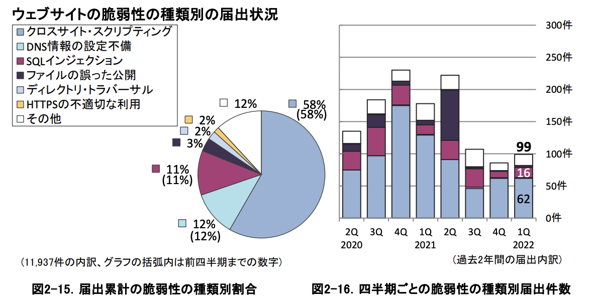

# XSS
1. XSSとは
2. なぜXSS攻撃の対策をしないといけないのか
   1. Webページの仕組み(静的・動的)
   2. 動的Webページの需要の高さ
3. なぜXSS攻撃されてしまうのか
4. XSS攻撃の種類と対策
5.

6. まとめ

## XSSとは　XSSの概要

* スクリプトとは
  + 簡易なコンピュータ・プログラムをスクリプトと呼ぶ事が多い。

* Webサイトの仕組み
  + 動的Webページ
  + [【IT用語】 静的サイトと動的サイトとは？違いやできることを解説！](https://pikawaka.com/word/static-dynamic-site)

* IPA（情報処理推進機構）が発表している「ソフトウェア等の脆弱（ぜいじゃく）性関連情報に関する届出状況[2020年第4四半期（10月～12月）]」を見ると、届けられたWEBサイトの脆弱（ぜいじゃく）性のうち58%がクロスサイトスクリプティングであると言われています。

https://www.shadan-kun.com/waf/xss/

* Webアプリケーションへのサイバー攻撃手法、代表的なサイバー攻撃のひとつ
  + XSSによって顧客の個人情報流出もあり得る
  + Webサイトの脆弱性を利用する
  + HTMLに悪質なスクリプトを埋め込む攻撃
  + Cross Site Scripting -> XSS(CSS)

## XSS動向

IPA
ここ何年かの動向、3年分

## XSS標的になりやすいWebアプリケーション

* FacebookやTwitterのようなWebアプリケーション
* アンケートサイトやサイト内検索、ブログ、掲示板などユーザからの入力内容をもとにWebページを生成するサイト

## XSS攻撃手段

* サイトに設置されたフォームにユーザが情報を入力・送信する際に、産められた悪質なHTMLスクリプトが実行され、入力された情報に加え、Cookie情報なども攻撃者に送られる。

## XSS攻撃の流れ

1. 攻撃者は、入力フォームにスクリプト付きのリンクを含む内容を入力してWebアプリケーションに罠を仕掛ける(例: 掲示板サイト)
2. 訪問者が該当のWebアプリケーションを利用
3. リンクをクリックしてスクリプトが実行されると、別のWebサイトに遷移(クロスする)して、悪意のある内容(スクリプト)が実行される。

## XSS攻撃されてしまう要因

* 攻撃者が容易にスクリプトを入力できてしまうこと
入力値が制限されていない
入力したスクリプトをそのまま実行できる状態にある

## XSS対策

なぜ対策しないといけないのか？
動的Webページの需要が近年では高い

## まとめ

