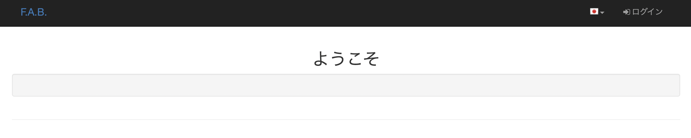

# 本記事のゴール
:::message
Flask-AppBuilderを使ってブラウザにアクセスする
※AppBuilderは、Flask製のCRUDアプリケーションをさくっと作れるオープンソースのことです。
:::

Flaskの環境構築はこちらの前回の記事をご覧ください。
[Flask + MySQL (Docker) の環境構築] (https://zenn.dev/articles/556d3f3864cf51/edit)

参考記事は前回同様こちらを参考に進めていきます。
[flask + mysql の環境をDocker（docker-compose）で構築する](https://www.anypalette.com/ja/posts/20191201_flask-docker/)

環境構築後なので、上記記事の「flaskの起動」からになります。

### 進めていく段階で遭遇した不明点/エラー
:::message alert
1. Dockerのコンテナへの入り方(コマンド)
2. create-adminでのエラー
:::

## 1. Dockerのコンテナへの入り方(コマンド)
`docker compose up -d`
(バックグラウンドで)起動後にコンテナに入ります。

コンテナIDは
`docker ps`
でコンテナIDを参照します。(webの方を参照)

`docker exec -it [コンテナID] /bin/sh`
で入ると先頭に`/app`は付かず、#となります。

最後を`/bin/bash`で入ると`root@コンテナID`となりますが、先頭に`/app`が付きましたので自分はこちらの入り方で進めました。

コンテナに入った後に、
`flask fab create-app`
でスケルトンの作成を行います。

`Downloaded the skeleton app, good coding!`
が表示されるとコンテナ内に作成した名前でディレクトリがありますので、そちらに移動します。
`cd [作成したappディレクトリ]`


## 2. create-adminでのエラー
記事通り進めて行き、
コンテナの作成したディレクトリに移動してから
`flask fab create-admin`
を打つと、

`Error: Failed to find Flask application or factory in module "app". Use "FLASK_APP=app:name to specify one.`
このエラーメッセージが出力されます。

色々調べた結果、config.pyに記述した接続先データベースの設定が違うということが分かりました。

```c: config.py
# 記事通り記述したもの
SQLALCHEMY_DATABASE_URI = 'mysql://root:root@db/app'

# 上記を以下に変更してください
SQLALCHEMY_DATABASE_URI = 'mysql://root:root@db/flask'
```

docker-compose.ymlで記述した`MYSQL_DATABASE: flask`を指定する形が正解でした。(記事の筆者のGitHubを確認したらこちらになっていました。)

:::message
もしMySQLではなく、デフォルトで指定されたsqliteであればconfig.pyの接続先データベースの設定は変更しなければ特にエラーは出なかったです
:::

## flaskの起動、ブラウザでアクセス
参考記事の通りに`view.py`を変更しておきます。

(入ったコンテナの)作成したディレクトリに移動し、

`flask run --host 0.0.0.0 --port 5000`
でflaskを起動させ、

ブラウザから`http://localhost:5000/`にアクセスする。



上記の画面が出ればゴールです。
