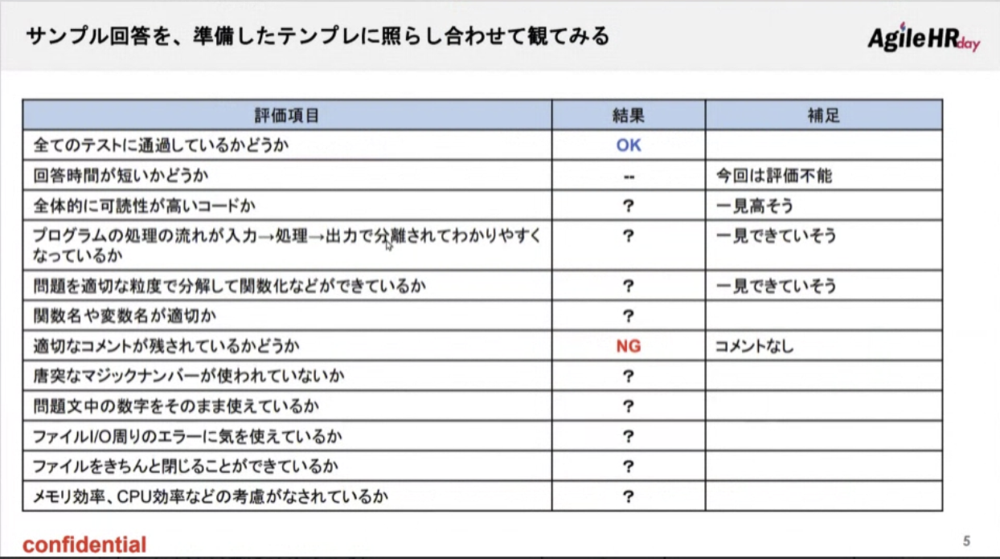

# 2022.11.22. 勉強会

https://tracks.run/

1. カジュアル面談
2. 書類審査
3. 機械採点による足切り
4. **エンジニアによるコードレビュー**
5. エンジニアによる一次面接
6. 代表による最終面接

## コードチェック

業務でよく扱う領域を重要視する

* 重要度高
  + チームでの開発を意識したコードか？
  + 長期のメンテナンスを意識したコードか？
  + バグの入り込みにくいコードか？

  + メモリ効率・実行効率などを意識しているか？

  + 複雑な要件の実装が短時間でできるか？
  + 特定の言語、ライブラリに精通しているか？
  + 効率的なアルゴリズムを知っているか？
* 重要度低

一行が意味のある関数
2種類を持たない方がいい
 `if __init__ == "__main__":`

グローバル変数ではなく、メインロジックに閉じ込める
（main関数）

リストよりも辞書型が良いケースもある
playerとscoreはセットで意味のある

マジックナンバーNG（0などは許容される可能性がある）

withは例外処理が必要

最終的に欲しいのは個数と合計があればよい（全ての数値をアペンドする必要がない

グローバル変数を使うのは良くない

ソートを使う場所を考える。
どこの責務なのかが重要

コメントはwhat, howではなく、whyが重要

型ヒントがあると良い

## 今後

コメントをしっかり書く
コードを憎んで人を憎まず
指摘が悪いことではない
指摘しないことがいいことではない

