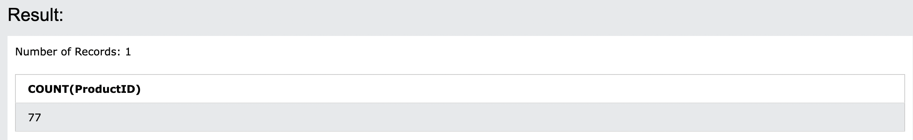
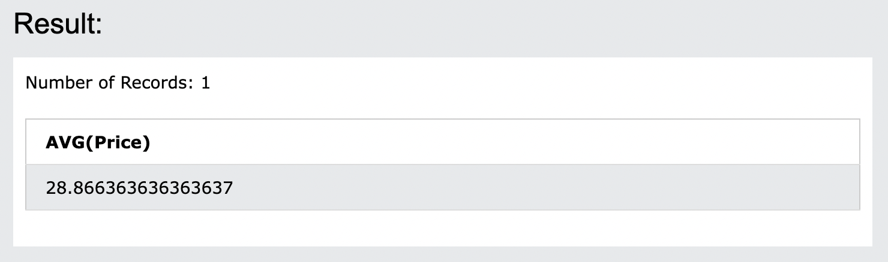
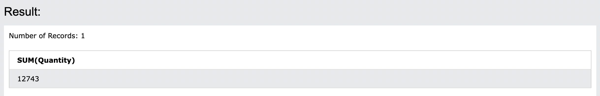

# 13. COUNT() / AVG() / SUM()
COUNT()関数は、**指定された条件に一致する行数を返します**。
AVG()関数は、**数値列の平均値を返します**。
SUM()関数は、**数値列の合計を返します**。

- COUNT()構文
```sql: COUNT
SELECT COUNT(column_name)
FROM table_name
WHERE condition;
```

- AVG()構文
```sql: AVG
SELECT AVG(column_name)
FROM table_name
WHERE condition;
```

- SUM()構文
```sql: SUM
SELECT SUM(column_name)
FROM table_name
WHERE condition;
```

## 13-1. DemoDatabase
https://www.w3schools.com/sql/trysql.asp?filename=trysql_select_all
`select * from Products`に変更して実行してください。
SUM()は、`SELECT * FROM OrderDetails;`で実行してください。

## 13-2. COUNT()
- Productsテーブルから製品の数を検索します

```sql: COUNT
SELECT COUNT(ProductID)
FROM Products;
```

ProductIDが何個あるかの結果が出ます。

## 13-3. AVG()
- Productsテーブルから全ての製品の平均価格を見つけます

```sql: AVG
SELECT AVG(Price)
FROM Products;
```


## 13-4. SUM()
- OrderDetailsからQuantityフィールドの合計を求めます

```sql: SUM
SELECT SUM(Quantity)
FROM OrderDetails;
```



