# SQLを学んでいく
2, 3ヶ月前に買ったSQLの書籍が埃を被っていて、SQLを学んでおかなければ...という強迫観念に駆られながらもSQLを学ぼうと気になったので、各種コマンドをまとめておこうと思います。

学習サイト -> [w3schools](https://www.w3schools.com/) を(無料)
参考書籍 -> [スッキリわかるSQL入門 第2版 ドリル222問付き! (スッキリわかる入門シリーズ)](https://www.amazon.co.jp/%E3%82%B9%E3%83%83%E3%82%AD%E3%83%AA%E3%82%8F%E3%81%8B%E3%82%8BSQL%E5%85%A5%E9%96%80-%E7%AC%AC2%E7%89%88-%E3%83%89%E3%83%AA%E3%83%AB222%E5%95%8F%E4%BB%98%E3%81%8D-%E3%82%B9%E3%83%83%E3%82%AD%E3%83%AA%E3%82%B7%E3%83%AA%E3%83%BC%E3%82%BA-%E4%B8%AD%E5%B1%B1%E6%B8%85%E5%96%AC/dp/4295005096/ref=d_pd_vtp_sccl_2_1/356-9315042-2456419?pd_rd_w=Q5ZKI&content-id=amzn1.sym.cbb45385-7b99-44b7-a528-bff5ddaa153d&pf_rd_p=cbb45385-7b99-44b7-a528-bff5ddaa153d&pf_rd_r=VNNY3Y475FXE2S0N11PR&pd_rd_wg=zUpeN&pd_rd_r=c6378186-3f1b-426b-a2e6-c464b37e0a82&pd_rd_i=4295005096&psc=1)

書籍でもSQLを利用出来る無料サイト等で学習可能です。
w3schoolsはWeb上で演習問題も解くことが可能です(ただし、英語)
今回は英語にも慣れていきたいのでw3schoolsを利用します。

## 1. SQLの基礎知識
- 構文に小文字、大文字の区別はない
  - select ~ でも、 SELECT ~ でも処理は同じ
- 行末にはセミコロンを付ける
- * (全てという意味, 正規表現で使われる)


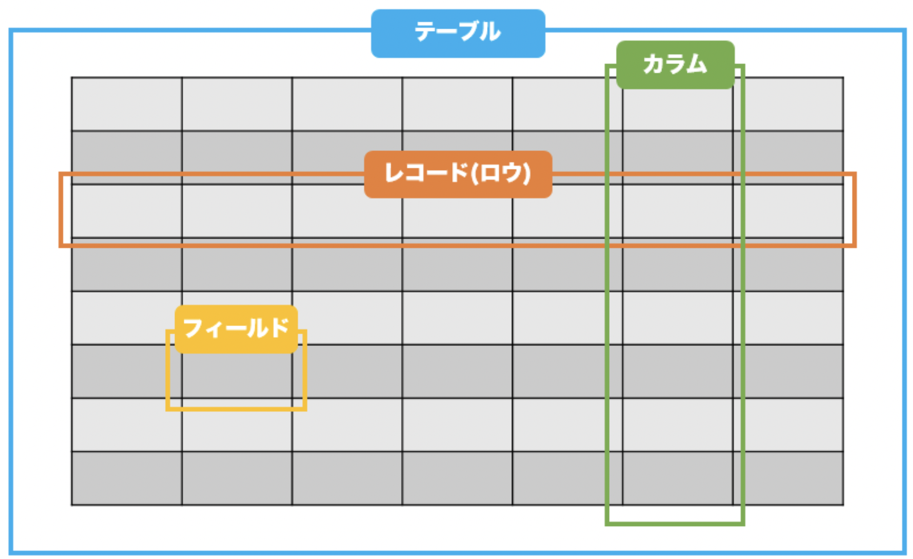


## 2. SELECT構文
基礎中の基礎、ここから覚えていきます。
取り出したい表と、列を指定し、指定の列を抜き出せます。

- FROM ~
  - 取り出したいテーブル(表)を指定
- SELECT ~
  - カラム(列)の名前を指定
  - 複数選択可能

```sql: SELECT
SELECT column1, column2, ...
FROM table_name;
```

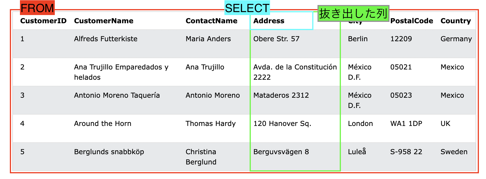


## 3. SELECT DISTINCT 構文
- SELECT構文と使い方は同じですが、**重複している行**を取り除いて抜き出せます。

```sql: SELECT DISTINCT
SELECT DISTINCT column1, column2, ...
FROM table_name;
```

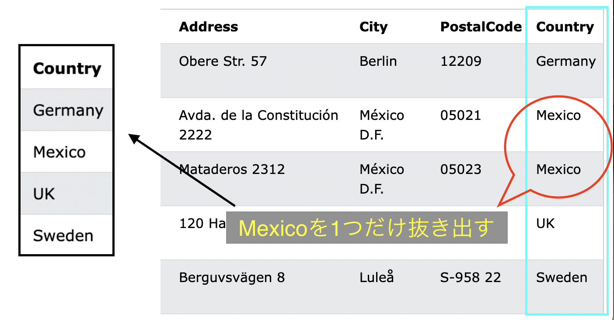


## 4. SELECT WHERE 句
- 指定した条件を満たすレコードのみを抽出するために使用される。

```sql: SELECT WHERE
SELECT column1, column2, ...
FROM table_name
WHERE condition;
```

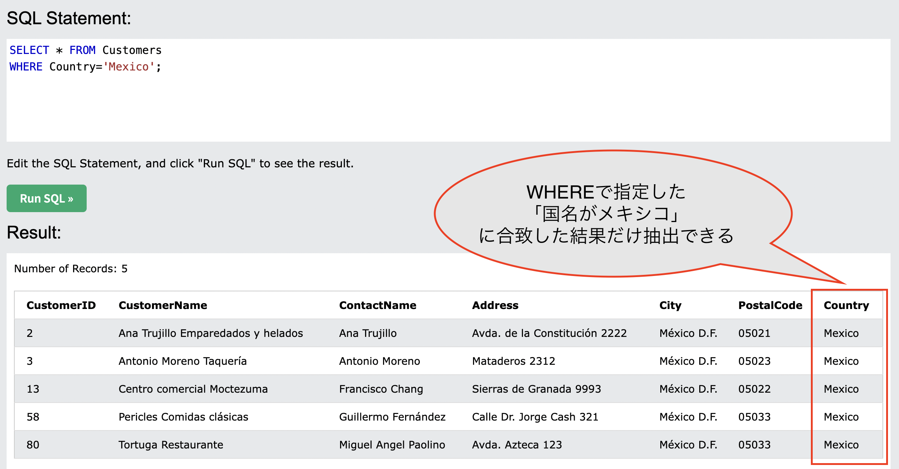

## 5. 演算子
#### 5-1. 比較演算子
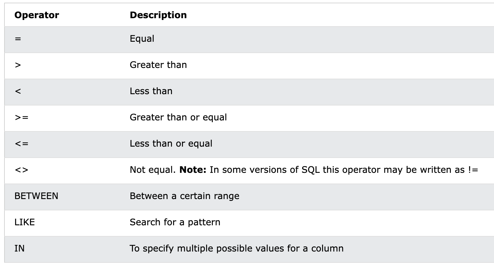

:::message alert
=>, =<のように=が前に来ないようにする
:::

#### 5-2. AND, OR, NOT演算子
- AND構文
  - 条件を全て満たすものを抽出する

```sql: WHERE AND
SELECT column1, column2, ...
FROM table_name
WHERE condition1 AND condition2 AND condition3 ...;
```

- OR構文
  - どちらかの条件が満たされているものを抽出する

```sql: WHERE OR
SELECT column1, column2, ...
FROM table_name
WHERE condition1 OR condition2 OR condition3 ...;
```

- NOT構文
  - NOT ~ と記述し、~ではないものを抽出する
  - WHERE NOT, AND NOTなどの場合がある

```sql: WHERE NOT
SELECT column1, column2, ...
FROM table_name
WHERE NOT condition;
```

## 6. ORDER BY
- ORDER BY ~
  - ~を昇順、または降順でソートするために使用される
  - デフォルトでは昇順
  - 降順でソートするには、DESCを使用する

```sql: ORDER BY
SELECT column1, column2, ...
FROM table_name
ORDER BY column1, column2, ... ASC|DESC;
```

#### 6-1. Demo用Database


#### 6-2. ORDER BY (昇順)
- Countryを昇順で抽出
```sql: ORDER BY
SELECT * FROM Customers
ORDER BY Country;
```
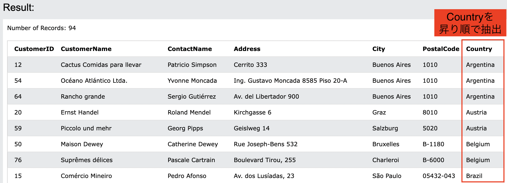

#### 6-3. ORDER BY DESC (降順)
- Countryを降順で抽出
```sql: OERDER BY DESC
SELECT * FROM Customers
ORDER BY Country DESC;
```
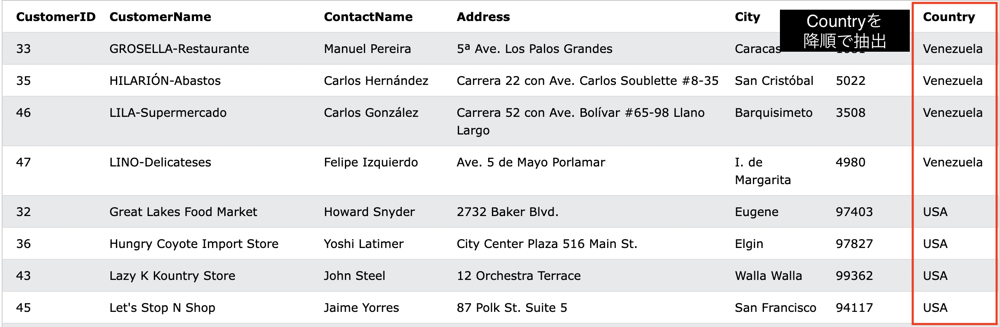

#### 6-4. ORDER BY (複数列の抽出 / 昇順)
- Country, CustomerNameを昇順で抽出
- ただし、先に指定したものをまず昇り順で抽出し、それを更に後から昇り順にするという流れ
```sql: ORDER BY
SELECT Country, CustomerName FROM Customers
ORDER BY Country, CustomerName;
```
- 優先順位
1. Country
2. CustomerName
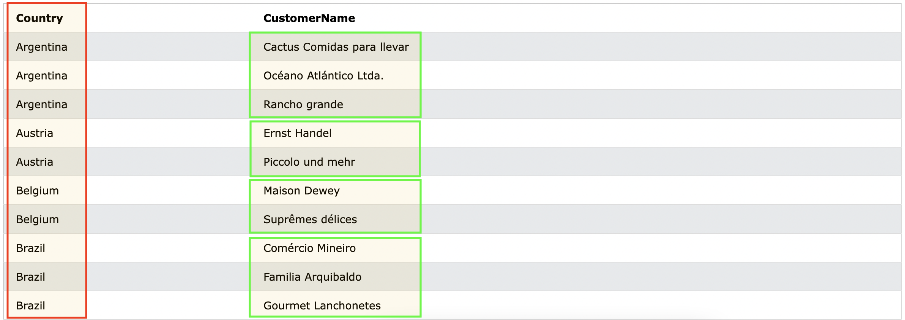

#### 6-5. ORDER BY DESC (複数列の抽出 / 列毎)
- Countyを昇順, CustomerNameを降順で抽出
```sql: ORDER BY DESC
SELECT Country, CustomerName FROM Customers
ORDER BY Country ASC, CustomerName DESC;
```
- 優先順位
1. Country(昇り順)
2. CustomerName(降り順)
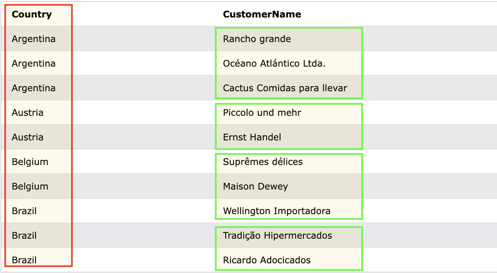
## 7. INSERT INTO
- INSERT INTO
  - テーブルに新しいレコードを挿入する

#### 7-1. Demo用データベース


#### 7-2. 列名と挿入する値の両方を指定する
```sql: INSERT INTO
INSERT INTO Customers (CustomerName, ContactName, Address, City, PostalCode, Country)
VALUES ('Cardinal', 'Tom B. Erichsen', 'Skagen 21', 'Stavanger', '4006', 'Norway');
```
既存の列名を指定して、それの列に対応したレコードを挿入する
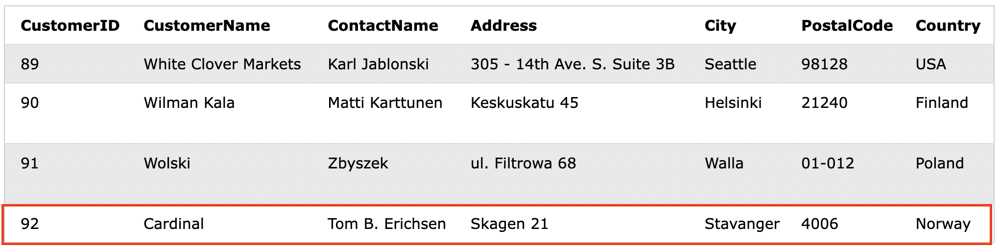

#### 7-3. テーブルの全ての列に値を追加する
```sql: INSERT INTO
INSERT INTO Customers (CustomerName, City, Country)
VALUES ('Cardinal', 'Stavanger', 'Norway');
```
`VALUES (value)`が指定されなかった場合は`null`が入る
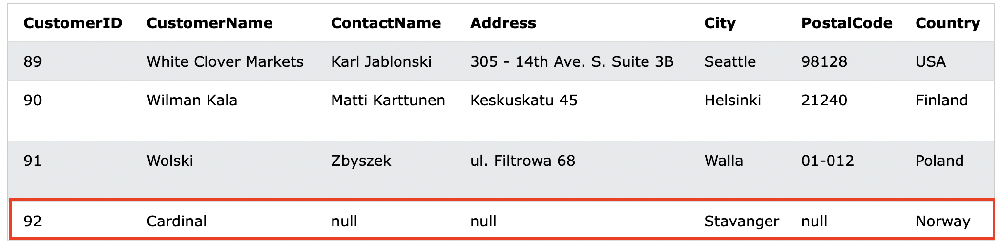


## 8. NULL値
- NULL値とは
  - NULL値を持つフィールドは、値のないフィールド
:::message alert
NULL値は、ゼロ値またはスペースを含むフィールドとは異なります。
NULL値を持つフィールドは、レコードの作成中に空白のままにされたフィールドのことです。
:::

#### 8-1. NULL値のテスト方法
