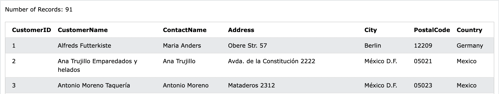
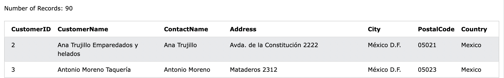

# 10. DELETE
**テーブル内の既存レコードを削除するために使用される**

- DELETE 構文
```sql: DELETE
DELETE FROM table_name WHERE condition;
```

## 10-1. DemoDatabase
https://www.w3schools.com/sql/trysql.asp?filename=trysql_select_all

## 10-2. DELETEの実行
- Customersテーブルから'Alfreds Futterkiste'を削除する

1. `Restore Database`でデーターベースを初期化します。


2. DELETE文を実行します。


1であったCusmerID1のデータが消えています。
そして、`Number of Recorsds`が91 -> 90に減っている事から、データの削除が確認出来ました。

## 10-3. 全てのレコードを削除する
- **テーブルの削除はせず**、テーブル内の全ての行を削除することが出来る。
```sql: DELETE(ALL)
DELETE FROM table_name;
```

`DELETE FROM Customers;`を実行し、`SELECT * FROM Customers;`を実行します。

全て削除されたので、実行結果は無しと返ってきました。


