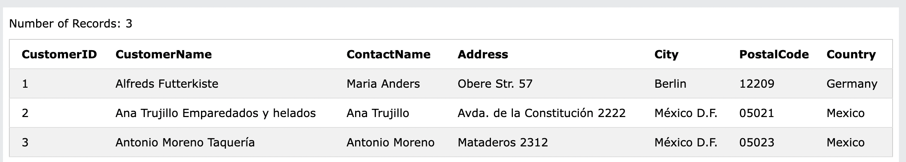
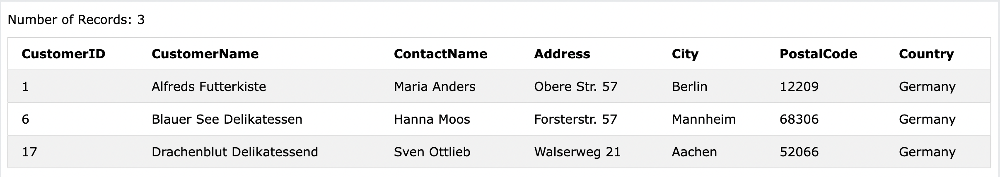

# 11. SELECT TOP
**返されるレコードの数を指定するために使用される**
数百、数千のレコードを持つ大きなテーブルで役立ちます。
※ただし、多数のレコードを返す処理は、パフォーマンスに影響を与える可能性があります。

:::message alert
全てのデータベースシステムが`SELECT TOP`をサポートしているわけではありません。
MySQLは限られた数のレコードを選択する`LIMIT`をサポートしており、Oracleは`and`をしています。
:::

## 11-1. SELECT TOP
- 構文
```sql:
SELECT TOP number|percent column_name(s)
FROM table_name
WHERE condition;
```

- Customersテーブルから最初に3つのレコードを選択します。
```sql: SELECT TOP
SELECT TOP 3 * FROM Customers;
```



## 11-2. LIMIT (MySQL)
ポピュラーなMySQLでの構文を理解していきます。

- 構文
```sql:
SELECT column_name(s)
FROM table_name
WHERE condition
LIMIT number;
```

- 上記と同様に、Customersテーブルから最初に3つのレコードを選択します。(結果も同じです)
```sql: LIMIT
SELECT * FROM Customers LIMIT 3;
```


## 11-3. TOP PERCENT
`SELECT TOP [PERCENT]`でテーブルの何割を選択するか指定出来ます。

- Customersテーブルの50％を選択する
```sql: SELECT TOP
SELECT TOP 50 PERCENT * FROM Customers;
```
91個中46個のレコードが出力されます。

## 11-4. WHERE句の追加
- Customersテーブルから最初の3つのレコードを選択します。
  - かつ、国名がGermanyの場合です
```sql: SELECT TOP(WHERE)
SELECT TOP 3 * FROM Customers
WHERE Country='Germany';
```


- MySQL(LIMIT)の場合
```sql: LIMIT(WHERE)
SELECT * FROM Customers
WHERE Country='Germany'
LIMIT 3;
```

