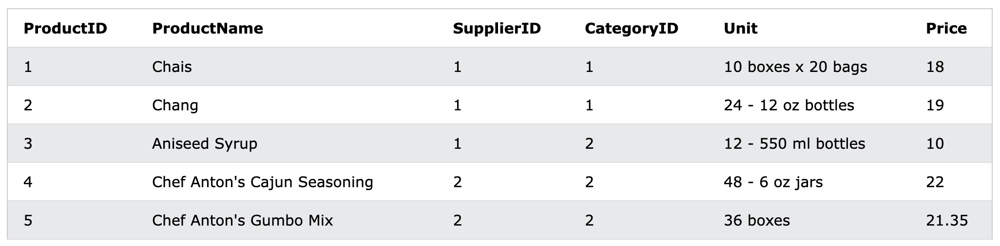
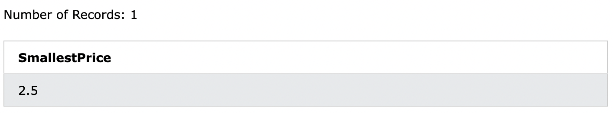
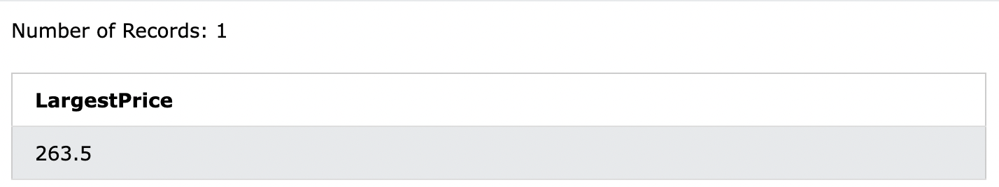

# 12. MIN() / MAX()
MIN()関数は、選択した列の**最小値**を返します
MAX()関数は、選択した列の**最大値**を返します

- MIN() 構文
```sql: MIN
SELECT MIN(column_name)
FROM table_name
WHERE condition;
```

- MAX() 構文
```sql: MAX
SELECT MAX(column_name)
FROM table_name
WHERE condition;
```

## 12-1. DemoDatabase
今回は`Products`テーブルを使います。
`select * from Products`



## 12-2. MIN()
- Productsテーブルから、一番安い製品の価格を見つけます。

```sql: MIN()
SELECT MIN(Price) AS SmallestPrice
FROM Products;
```


## 12-3. MAX()
- Productsテーブルから、一番高い製品の価格を見つけます。

```sql: MAX()
SELECT MAX(Price) AS LargestPrice
FROM Products;
```

