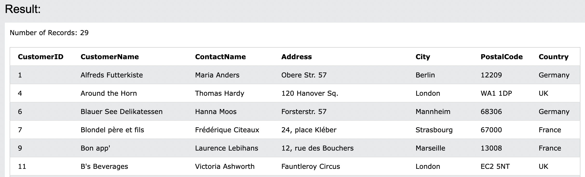
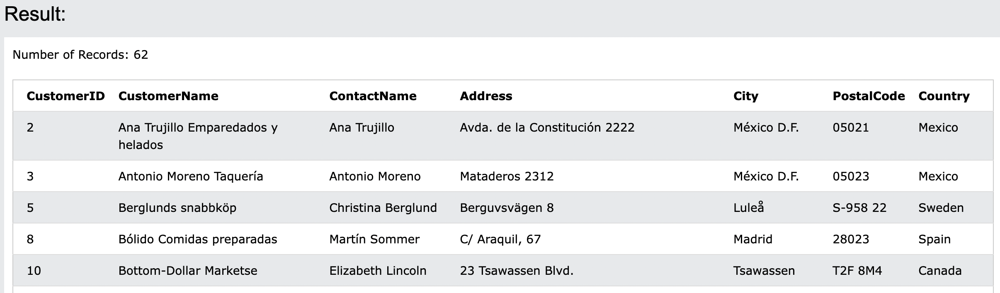
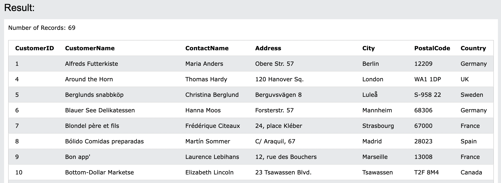

# 16. IN
**WHERE句で複数の値を指定できる**

- 構文
```sql: IN
SELECT column_name(s)
FROM table_name
WHERE column_name IN (value1, value2, ...);
```
または:
```sql: IN
SELECT column_name(s)
FROM table_name
WHERE column_name IN (SELECT STATEMENT);
```

## 16-1. DemoDatabase
https://www.w3schools.com/sql/trysql.asp?filename=trysql_select_all

## 16-2-1. IN演算子の使用
- Countryが`Germany`, `France`, `UK`のいずれかに所在する全ての顧客を選択する

```sql: IN
SELECT * FROM Customers
WHERE Country IN ('Germany', 'France', 'UK');
```


## 16-2-1. IN演算子の使用
- Countryが`Germany`, `France`, `UK`のいずれかに所在しない全ての顧客を選択する

```sql: IN(NOT IN)
SELECT * FROM Customers
WHERE Country NOT IN ('Germany', 'France', 'UK');
```


## 16-2-1. IN演算子の使用
- Countryが`Suppliers`と同じ国の全ての顧客を選択する

```sql: IN
SELECT * FROM Customers
WHERE Country IN (SELECT Country FROM Suppliers);
```

:::message
`SELECT * FROM [Suppliers]`と同じCountryという意味で、別のテーブルと一致することを条件としています。
:::
