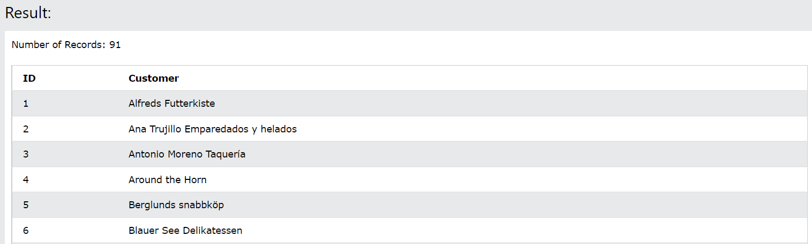
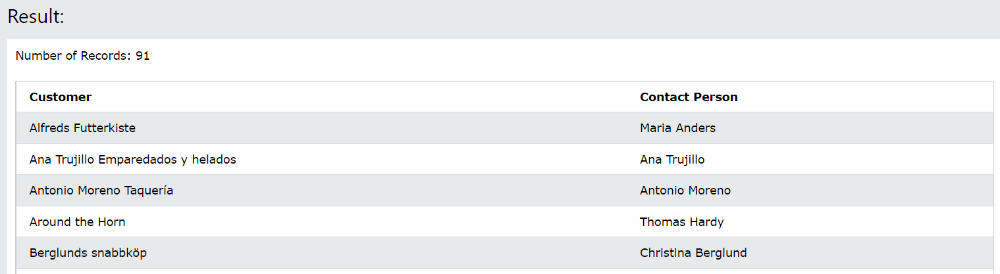
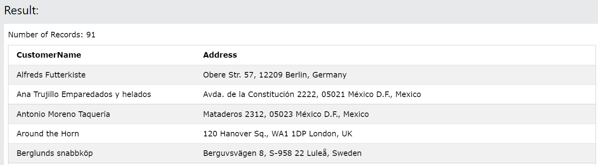
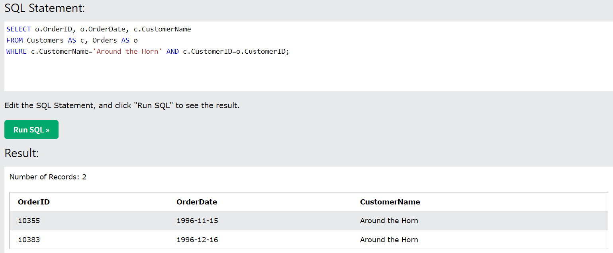

# 18. Aliases
**テーブル、またはテーブルの内の列に一時的な名前を付けるために使用されます。**
別名は、**列名を読みやすくするため**によく使用されます。
Aliasesーー、そのクエリの間だけ存在します。
Aliasesは`AS`というキーワードで作成されます。

- 構文
```sql: Aliases
SELECT column_name AS alias_name
FROM table_name;
```

- AliasesTableの構文
```sql: AliasesTable
SELECT column_name(s)
FROM table_name AS alias_name;
```

## 18-1. DemoDatabase
https://www.w3schools.com/sql/trysql.asp?filename=trysql_select_all

CustomersTable & OrdersTableの2つを使用

## 18-2-1. Aliases (列)
- CustomerIDをIDに、CustomerNameをCustomerに変更して、表示する

```sql: Aliases
SELECT CustomerID AS ID, CustomerName AS Customer
FROM Customers;
```


## 18-2-2. Aliases (スペースを含む場合)
- CustomerNameをCustomerに、ContactNameをContact Personに変更して、表示する

```sql: Aliases
SELECT CustomerName AS Customer, ContactName AS [Contact Person]
FROM Customers;
```

:::message
エイリアス名にスペースを含む場合は二重引用符、または角括弧が必要です。
:::

## 18-2-3. Aliases (結合)
- Address, PostalCode, City, Countryの4つの列を結合し、Addressという名前で作成し、表示する。

```sql: Aliases
SELECT CustomerName, Address + ', ' + PostalCode + ' ' + City + ', ' + Country AS Address
FROM Customers;
```


- MySQLの場合
```sql: Aliases(MySQL)
SELECT CustomerName, CONCAT(Address,', ',PostalCode,', ',City,', ',Country) AS Address
FROM Customers;
```

## 18-3. Aliases (Table)
- Customersテーブルを`c`, Ordersテーブルを`o`という名前でエイリアスを付ける。
  - CustomerID=4の条件に合うものを表示する

```sql: AliasesTable
SELECT o.OrderID, o.OrderDate, c.CustomerName
FROM Customers AS c, Orders AS o
WHERE c.CustomerName='Around the Horn' AND c.CustomerID=o.CustomerID;
```


- 上記と同じだが、エイリアスを付けない場合
```sql: not Aliases
SELECT Orders.OrderID, Orders.OrderDate, Customers.CustomerName
FROM Customers, Orders
WHERE Customers.CustomerName='Around the Horn' AND Customers.CustomerID=Orders.CustomerID;
```
