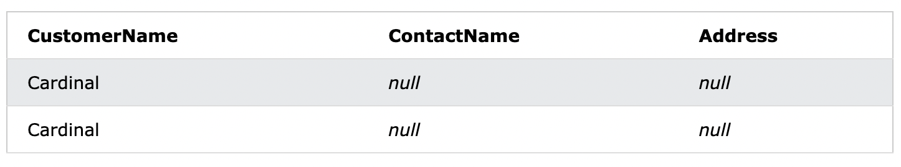

# 8. NULL値
- NULL値とは
  - NULL値を持つフィールドは、値のないフィールド
:::message alert
NULL値は、ゼロ値またはスペースを含むフィールドとは異なります。
NULL値を持つフィールドは、レコードの作成中に空白のままにされたフィールドのことです。
:::

## 8-1. NULL値のテスト方法
:::message alert
=、<、<> などの比較演算子を使用して NULL 値をテストすることはできません。

なので、**`IS NULL`**, **`IS NOT NULL`**演算子を使用します。
:::

## 8-2. DemoDatabase
https://www.w3schools.com/sql/trysql.asp?filename=trysql_select_where

## 8-3. IS NULL
- IS NULL 構文
```sql: IS NULL
SELECT column_names
FROM table_name
WHERE column_name IS NULL;
```

#### 8-3-1. IS NULLの実行
- 抽出する列名
  - CustomerName, ContactName, Address
- 条件
  - AddressがNULLかどうかを条件とする

```sql: IS NULL
SELECT CustomerName, ContactName, Address
FROM Customers
WHERE Address IS NULL;
```
`INSERT INTO`の章で挿入したNULL入りのレコードが該当し、それが結果として出力される。


#### 8-3-2. IS NULLが該当しない場合
上で抜き出した列名のCustomerNameはNULLではありません。
つまり、`CustomerName IS NULL`を条件とすると出力されないはずです。
試してみます。

```sql: IS NULL
SELECT CustomerName, ContactName, Address
FROM Customers
WHERE CustomerName IS NULL;
```
No result.
と出ました。

## 8-4. IS NOT NULL
- IS NOT NULL 構文
```sql: IS NOT NULL
SELECT column_names
FROM table_name
WHERE column_name IS NOT NULL;
```

#### 8-4-1. IS NOT NULLの実行
抽出する列名、どこの列名を条件とするかは上と同じにします。
ただし、AddressがIS NOT NULLがどうかを条件にします。

```sql: IS NOT NULL
SELECT CustomerName, ContactName, Address
FROM Customers
WHERE Address IS NOT NULL;
```
DemoDatabaseの96レコードの内、94レコード(IS NULLが2つ該当してた為)がヒットしました。

#### 8-4-2. IS NOT NULLが該当しない場合
IS NULLで検証しましたが、CustomerNameにNULLがないということを確認します。

```sql: IS NOT NULL
SELECT CustomerName, ContactName, Address
FROM Customers
WHERE CustomerName IS NOT NULL;
```
DemoDatabaseの96レコードがヒットしました。
CustomerNameにはNULLがないということが確認出来ました。
