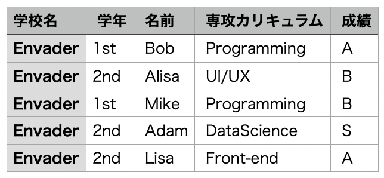

# Python csv基礎

この記事ではPythonのcsvについて解説します。

Pythonのcsvモジュールを操作は、アプリケーションから取り出したcsvファイルを使って独自の集計やデータの移行などさまざまな場所で活用することができます。

## csvとは

Pythonのcsvは、CSV（**C**omma **S**eparated **V**alues）形式で書かれたファイルを扱えるモジュールのことを指します。csvを使用する際は `import` が必要です。

CSVファイルはスプレッドシートやデータベース間で使用される最も一般的な形式です。Excelファイルと混同されがちですが、CSVファイルの方が**互換性が高い**という特徴があります。

以下がCSVファイル形式で書いた場合です。

```csv:
学校名, 学年, 名前, 専攻カリキュラム, 成績
Envader, 1st, Bob, Programming, A
Envader, 2nd, Alisa, UI/UX, B
Envader, 1st, Mike, Programming, B
Envader, 2nd, Adam, DataScience, S
Envader, 2nd, Lisa, Front-end, A

```

上記のCSVファイルを読み込むと以下のようになります。



## ファイル操作

csvモジュールはCSVファイルを扱いますので、まず簡単にPythonにおけるファイルの取り扱いを説明します。

- with
`with`はファイルを**一定期間操作する構文**です。`with`には、ファイルを自動でクローズするという特徴があります。Pythonのファイル操作には`open()`関数がありますが、こちらはファイルを明示的にクローズする必要があります。本記事では`with`を使ってファイル操作を行います。

withの構文は以下です。

```python:
with open(<ファイル>, mode=<"モード">, encoding="文字コード") as <別名>:
```

ファイル指定は必須です。モードと文字コードは必要に応じて使用・使い分けします。また、 `as` でファイル操作を行うファイルオブジェクトに別名を付けることができます。その別名はファイルをクローズするまでのスコープで使用できます。

モードはいくつかの種類とそれぞれの特徴がありますので表にまとめました。

| mode=” “ | 詳細 | 特徴 |
| --- | --- | --- |
| r | 読み込み用 | デフォルト値 |
| w | 書き込み用 |  |
| x | 新規作成 + 書き込み用 | 既にファイルがあるとエラーになる |
| a | 追記用 |  |
| b | バイナリモード | r, w, aと一緒に指定が必要 |
| t | テキストモード | r, w, aと一緒に指定が必要 |
| + | 更新用 | r, w, a, xと一緒に指定が必要 |

## csvモジュールの主な関数

今回紹介するcsvモジュールの関数を表にまとめました。

| 関数 | 詳細 | 特徴 |
| --- | --- | --- |
| csv.reader | ファイルの読み込み | リスト型を返す |
| csv. Dictreader | ファイルの読み込み | 辞書型を返す |
| csv.writer | ファイルの書き込み | リスト型を書き込む |
| csv. DictWriter | ファイルの書き込み | 辞書型を書き込む |

## リスト内包表記

今回使用する範囲でのリスト内包表記を簡単に解説します。

* リスト内包表の基本型

```py:

# 基本型（一次元リストの取得）

[<式> for <任意の変数名> in <繰り返し可能なオブジェクト>]

# ネストさせる場合（二次元リストの取得）

[<式> for <任意の変数名> in <繰り返し可能なオブジェクト1>

        for <任意の変数名> in <繰り返し可能なオブジェクト2>]

# 可読性のためにインデントを入れてるが、必須ではない

```

リスト内包表記を使用しない場合と、使用した場合を比較します。

- リスト内包表記を使用しない場合

```py:
sample_list1 = [1, 2, 3, 4]
new_sample_list1 = []

# ①一次元リストの取得
for i in sample_list1:
    new_sample_list1.append(i)

print(new_sample_list1)
# 出力結果: [1, 2, 3, 4]

sample_list2 = [[1, 2, 3, 4], [5, 6, 7, 8]]
new_sample_list2 = []

# ②二次元リストの取得
for row in sample_list2:
    for i in row:
        new_sample_list2.append(i)

print(new_sample_list2)
# 出力結果: [1, 2, 3, 4, 5, 6, 7, 8]
```

* リスト内包表記を使用した場合

```py:
sample_list1 = [1, 2, 3, 4]

# ③リスト内包表記を使用して一次元リストを取得

new_sample_list1 = [i for i in sample_list1]
print(new_sample_list1)

# 出力結果: [1, 2, 3, 4]

sample_list2 = [[1, 2, 3, 4], [5, 6, 7, 8]]

# ④リスト内包表記を使用して二次元リストを取得

new_sample_list2 = [i for row in sample_list2 for i in row]
print(new_sample_list2)

# 出力結果: [1, 2, 3, 4, 5, 6, 7, 8]

```

①と③、②と④を比較して頂きたいのですが、リスト内包表記を使用すると空の配列の宣言を省略でき、繰り返し処理自体を短く書くことができます。

CSVファイルとその操作のコーディングを行うと全体的にコードが長くなっていきます。そのため、本記事の繰り返し処理にはリスト内包表記を使用します。

## CSVファイルの読み込み

ここから、実際にcsvモジュールを使ってCSVファイルを操作していきます。まずはCSVファイルの読み込み操作から行います。

## csv.reader

CSVファイルの読み込みは、`csv.reader`を使用します。

- 基本的な使い方

以下のCSVファイル（`sample.csv`とします）を読み込みます。

```csv:
学校名, 学年, 名前, 専攻カリキュラム, 成績
Envader, 1st, Bob, Programming, A
Envader, 2nd, Alisa, UI/UX, B
```

```py:
import csv

with open("sample.csv") as file_object:

    reader_object = csv.reader(file_object)

    # ①

    print(reader_object)

    # ②
    for row in reader_object:
        print(row)

# 出力結果①: <_csv.reader object at 0x1029fc040>

# 出力結果②:

# ['学校名', ' 学年', ' 名前', ' 専攻カリキュラム', ' 成績']

# ['Envader', ' 1st', ' Bob', ' Programming', ' A']

# ['Envader', ' 2nd', ' Alisa', ' UI/UX', ' B']

```

出力結果①は、`open()`で開いたファイルオブジェクトを`csv.reader()`に渡して出力した結果です。つまり、`csv.reader`でファイルオブジェクトを読み込むとreaderオブジェクトが返されます。

csv.readerが返したreaderオブジェクトはイテレータプロトコルに対応します。そのため、②のようにfor文で行ごとに取り出すことができます。

- 二次元配列として取得

以下のCSVファイル（`sample.csv`）を読み込み、二次元リストで出力します。

```csv:
1, 2, 3, 4
5, 6, 7, 8
```

```py:
import csv

with open("sample.csv") as file_object:

    reader_object = csv.reader(file_object)

    # ①

    sample_list = [row for row in reader_object]

print(sample_list)

# 出力結果:

# [['1', ' 2', ' 3', ' 4'], ['5', ' 6', ' 7', ' 8']]

```

今回はリスト内包表記を使用します。①のように、readerオブジェクトから行を取り出すと二次元リストで出力できます。

### 行・要素・列の取得

以下のCSVファイル（`sample.csv`）の、「行・要素・列」を取得します。

```csv:
1, 2, 3, 4
5, 6, 7, 8
9, 10, 11, 12
13, 14, 15, 16
17, 18, 19, 20
```

* 行の取得

行の取得は、二次元リストに対して**インデックス指定**、または**スライス**を行います。

```py:
import csv

with open("sample.csv") as file_object:

    reader_object = csv.reader(file_object)

    sample_list = [row for row in reader_object]

# ①index指定

print(sample_list[0])
print(sample_list[-1])

# 出力結果:

# ['1', ' 2', ' 3', ' 4']

# ['9', ' 10', ' 11', ' 12']

# ②スライス
print(sample_list[3:])
print(sample_list[0:2])

# 出力結果:

# [['13', ' 14', ' 15', ' 16'], ['17', ' 18', ' 19', ' 20']]

# [['1', ' 2', ' 3', ' 4'], ['5', ' 6', ' 7', ' 8']]

```

- 要素の取得

要素の取得は、二次元リストに対して**インデックス指定**を行います。インデックス指定は①のように、「**リスト内の何番目のリスト + 何番目の要素**」を指定します。

```py:
import csv

with open("sample.csv") as file_object:
    reader_object = csv.reader(file_object)

    sample_list = [row for row in reader_object]

# ①
print(sample_list[0][0])
print(sample_list[2][3])

# 出力結果:
# 1
#  12（先頭の空白は、sample.csvに空白があるため）
```

* 列の取得

列の取得方法は二種類あります。一つ目は、二次元リストの行と列を入れ替える（転置）方法です。

```py:
import csv

with open("sample.csv") as file_object:

    reader_object = csv.reader(file_object)

    sample_list = [row for row in reader_object]

    # ①行と列を入れ替える（転置）
    columns_list = [list(x) for x in zip(*sample_list)]
    print(columns_list)
    # 出力結果: （可読性のため改行してます）
    # [['1', '5', '9', '13', '17'],
    # [' 2', ' 6', ' 10', ' 14', ' 18'],
    # [' 3', ' 7', ' 11', ' 15', ' 19'],
    # [' 4', ' 8', ' 12', ' 16', ' 20']]

    # ②特定の列を取得
    print(columns_list[0])
    print(columns_list[3])
    # 出力結果:
    # ['1', '5', '9', '13', '17']
    # [' 4', ' 8', ' 12', ' 16', ' 20']

```

2つ目は、readerオブジェクトから行を取り出し、その行の特定のインデックスを繰り返し取得することで列として取得する方法です。

```py:
import csv

with open("sample.csv") as file_object:
    reader_object = csv.reader(file_object)

    # ①特定の列を取得する
    sample_list1 = [row[0] for row in reader_object]
    print(sample_list1)
    # 出力結果: ['1', '5', '9', '13', '17']

# ②違う列を取得するためにはもう一度ファイル操作から行う
with open("sample.csv") as file_object:
    reader_object = csv.reader(file_object)
    sample_list2 = [row[3] for row in reader_object]
    print(sample_list2)
    # 出力結果: [' 4', ' 8', ' 12', ' 16', ' 20']
```

上記の①と②を見ての通り、最初に取得した列とは違う列を取得するためには、再度CSVファイルをオープンする所から始める必要があります。
csvモジュールを用いて列を取得する方法はどちらも多少の手間がかかります。ここでは紹介しませんが、Numpyやpandasを使用するともっと簡単に多次元の操作をすることが可能です。

### 文字列を数値に変換

CSVファイルから取り出した要素は**デフォルトで文字列型**です。その要素を更に加工したい場合は数値に変換する必要があります。

* int型に変換
以下のCSVファイルを使用し、int型に変換します。

```csv:
1, 2, 3, 4
5, 6, 7, 8

```

```py:
import csv

with open("sample.csv") as file_object:
    reader_object = csv.reader(file_object)

    # ①二次元リストを取得
    sample_list = [row for row in reader_object]

# ②取り出した要素の型を確認する
print(sample_list[0][0])
print(type(sample_list[0][0]))
# 出力結果:
# 1
# <class 'str'>

# ③CSVファイルの最初の行をint型に変換する
int_list = [int(i) for i in sample_list[0]]
print(int_list)
print(type(int_list[0]))
# 出力結果:
# [1, 2, 3, 4]
# <class 'int'>

# ④二次元リストを一気にint型に変換する
print([[int(i) for i in row] for row in sample_list])
# 出力結果:
# [[1, 2, 3, 4], [5, 6, 7, 8]]
```

* float型に変換

### 区切り文字

* 区切り文字を指定
    - デフォルトが`,`（カンマ）であること
    - 任意の区切り文字の指定方法
* 引用符の扱い
    - 引数`quoting`の使い方
* 改行を含むファイルの場合
    - ファイル操作の時点で `newline = ‘’`としておくほうが安全
    - pythonドキュメントを引用する
* headerなどを含むファイルの場合
    - リスト内包表記で取り出す際にスライスと組み合わせる方法があることを説明する
    - 後述するpandasを使う方が楽だということも伝えるので上はさらっと

### csv. DictReader

* 基本的な使い方
* OrderedDictに触れる
* headerがない場合は `fieldnames` を使用する
* headerの削除方法

    - `pop()` を使用する
    - `popitem()` , `del` で出来ることをさらっと紹介

## csvモジュールを使った書き込み

### csv.writer

* 基本的な使い方
    - `writerow()`

    - `writerows()`

* 区切り文字の指定
* 引用符の扱い
* 改行を含むファイルの場合
* headerなどを加える場合

### csv. DictWriter

* 基本的な使い方
    - `writerow()`

    - `writerows()`

* キーが存在しない場合の `extrasaction` の使い方

    - `extrasaction` のデフォルトが `’raise’` であること

## まとめ

まとめ
