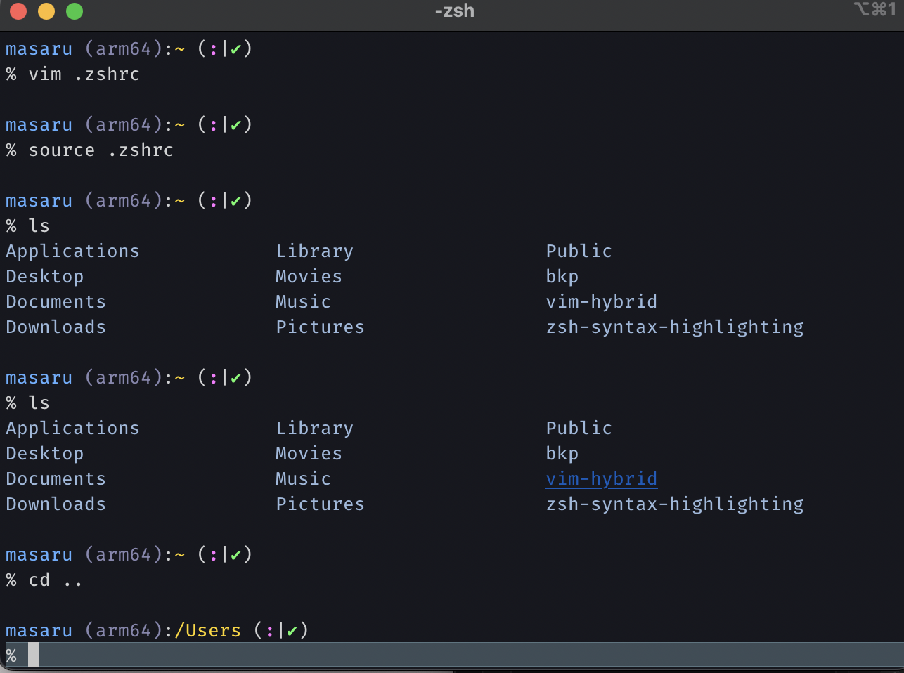

# M1mac 環境構築　ホーム画面に出てから
## Homebrewのinstall
Homebrewはパッケージマネージャーと呼ばれるもので、インストールする際に何かと便利なので、一番最初にインストールしておきます。
右上の検索(虫眼鏡)から「terminal」を検索し、ターミナルを出す
参考: [M1 MacにHomebrewをインストールする方法](https://nullnull.dev/blog/how-to-install-homebrew-on-m1-mac/)

この通りに進める形で問題ありません。

## Gitのinstall
参考: [M1 Macに最新のGitをインストールする方法](https://nullnull.dev/blog/how-to-install-latest-version-of-git-on-m1-mac/#%F0%9F%8F%A9%F0%9F%8C%99%F0%9F%9B%8F%F0%9F%92%91%F0%9F%92%A4)

こちらもこの通りに進めます。

### Gitの設定(既にアカウントなどをお持ちの方)
参考:
[8.1 Git のカスタマイズ - Git の設定](https://git-scm.com/book/ja/v2/Git-%E3%81%AE%E3%82%AB%E3%82%B9%E3%82%BF%E3%83%9E%E3%82%A4%E3%82%BA-Git-%E3%81%AE%E8%A8%AD%E5%AE%9A)
[githubでユーザー名とパスワードを毎回聞かれる問題解消](https://qiita.com/non0311/items/03e3e7a042f70f072286)
[GitHubでssh接続する手順~公開鍵・秘密鍵の生成から~](https://qiita.com/shizuma/items/2b2f873a0034839e47ce)

- ユーザー名、メールアドレスの設定
  - git config user.name / git config user.email で登録したのが出てればOK
- Remoteの設定
- ssh
  - keyの生成(.sshがなければディレクトリの作成)
  - githubに生成したkey(id_rsa.pubの方)の登録
  - Are you sure you want to continue connecting? と聞かれるのでyesと打つ

この3つを設定しておけば、pull, pushは問題ないはずです。

## VScodeのinstall
参考: [【2021年】Apple silicon(M1)Macに最適化したVSCode安定版をインストール](https://kunolog.com/m1_vscode/)

setting syncを導入していれば一瞬で同期可能です。
MacのVScodeはWindows版などと違って上部のタブが隠れているんですねぇ。少し違和感があります。
(と思いましたが、⌘ + Ctrl + w で切り替えられました。)
出てないと流石に不便でしたね。

## 電源の落とし方
参考: [Macをシステム終了する/再起動する](https://support.apple.com/ja-jp/guide/mac-help/mchlp2522/mac#:~:text=Mac%E3%81%A7%E3%80%81%E3%82%A2%E3%83%83%E3%83%97%E3%83%AB%E3%83%A1%E3%83%8B%E3%83%A5%E3%83%BC%20%EF%BC%9E,%E7%94%BB%E9%9D%A2%E3%81%8C%E9%BB%92%E3%81%8F%E3%81%AA%E3%82%8A%E3%81%BE%E3%81%99%E3%80%82)

そろそろ疲れましたよね。
一旦休憩しましょう。

## Alfredのinstall
[Alfred【概要・設定・使い方】〜Mac最強のランチャーアプリ](https://paso-jiyu.com/alfred/#st-toc-h-11)

Macと言えばAlfredですよね〜ずっと使ってみたかったです。
ショートカットキーは 「⌘ + spaceキー」 がおすすめみたいなのでその設定をしておきます。
1. デフォルトで割り当てられているspotlightのショートカットキーの削除
2. Alfredを削除したキーに割り当てる

# ターミナルのセットアップ
参考: [お前らのターミナルはダサい](https://qiita.com/kinchiki/items/57e9391128d07819c321)

基本的にはこれに沿ってカスタマイズでいいと思いますが、あとはお好みで進めていきましょう！
自分は、Iceberg, hybridを設定し、pureを入れずに手動でpureみたいな感じになるように設定しました(promptが思ったように表示されなかったので...)

1. terminal or iTerm のセットアップ
2. vim のセットアップ
3. 自分は好みでフォントを「Fira Code Light」にしているのでそちらの設定
   1. やった感じ、Lightだと暗すぎたんで、Retinaにしました。
4. terminal(適用に手間取った所は参考にさせて頂いたサイトを貼っておきます)
   1. 参考: [macOSのzshではこれだけはやっておこう](https://zenn.dev/sprout2000/articles/bd1fac2f3f83bc)
      1. zsh-completions
      2. zsh-autosuggestions
      3. 空行を出すようにする
      4. プロンプトの表示の変更
         1. Gitリポジトリの状態含む
   2. 参考: [cdした後にlsするのはzshにやらせよう。zshは両手を広げ我々を迎え入れてくれる。 - Qiita](https://qiita.com/2357gi/items/0ab1297357dedb90bbb1)
   3. 参考: [ディレクトリの移動を高速にする](https://note.com/youichiroz/n/ne7d214c5ebad#EyZFW)
      1. aliasの追加
         1. ls
         2. cd -> ls
         3. enchacdの追加

筆者のターミナルはこんな感じです。

気付いたらスライムが出現していました...
参考:  [【これでダサくない。】ターミナルをかっこよくするカスタマイズ方法~ Prezto,zsh,スライム~](https://satoriku.com/terminal-customize/)

凝り始めると時間が溶けますね〜
vimは一旦保存しないとカラーが反映されないのに気付かず沼ってました。

prompt表示は派手すぎずいい感じに仕上がりました。
手動でカラーをカスタマイズできるのもいいですね。

## もうちょっと使いやすくしときたい
ここからは好みで進めてください。
凝り出すとキリがないと思うのでw

参考: [ぼくのVimさばきを支える設定とその導入手順を紹介する](https://qiita.com/jiroshin/items/ee86ea426a51fa24b319#8-tig%E3%82%92%E4%BD%BF%E3%81%A3%E3%81%A6%E3%82%BF%E3%83%BC%E3%83%9F%E3%83%8A%E3%83%AB%E3%81%8B%E3%82%89git%E3%82%92%E9%AB%98%E9%80%9F%E3%81%A7%E6%93%8D%E4%BD%9C%E3%81%97%E3%82%88%E3%81%86-pencil)

上記記事にはありませんが、後述するtab補完はやっておいて損はないと思います！
### dotfilesで管理する
~ 直下にdotfilesを作成し、ドットファイルをシンボリックリンクで紐付けて一括管理する。

### VimとEmacsのキーバインドと仲良くなろう
vimでカーソル移動でターミナルと同じコマンドが打てないのが気持ち悪いのでこれもやっておきます。

### fzfのinstall
Ctrl + r で過去のコマンド検索が出来ます。これだけでも強力！！

### tab補完で大文字、小文字の区別を無くす
参考: [zshで大文字小文字を区別しないで補完](https://qiita.com/kenta4327/items/8faaa83f6a5bf595a4bc)

DocumentディレクトリをわざわざShift押しながらDocuって打うつのはイケてないです。
docuで補完されるようにしときましょう！
