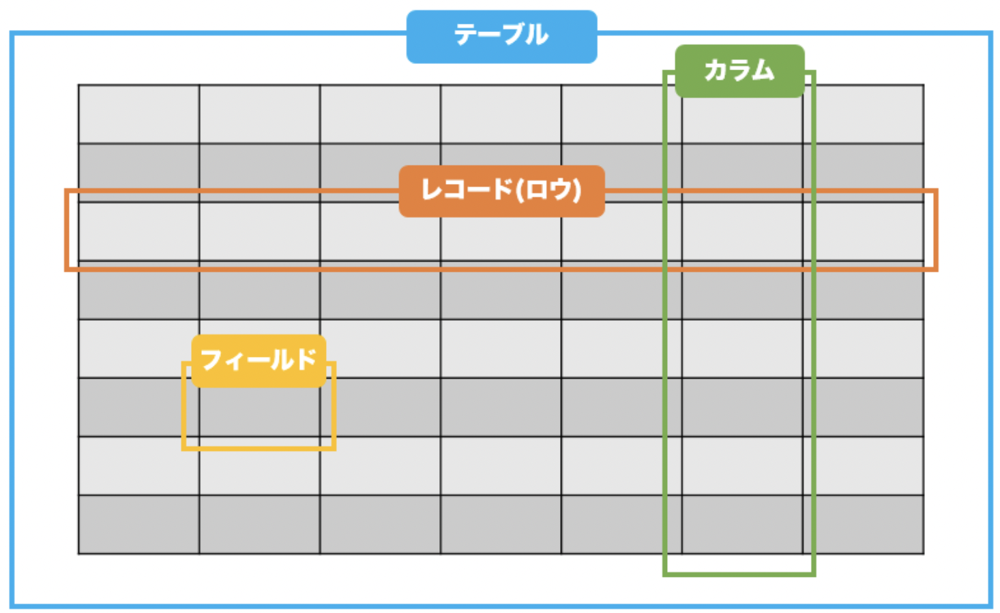

# SQLを学んでいく
2, 3ヶ月前に買ったSQLの書籍が埃を被っていて、SQLを学んでおかなければ...という強迫観念に駆られながらもSQLを学ぼうと気になったので、各種コマンドをまとめておこうと思います。

学習サイト -> [w3schools](https://www.w3schools.com/) を(無料)
参考書籍 -> [スッキリわかるSQL入門 第2版 ドリル222問付き! (スッキリわかる入門シリーズ)](https://www.amazon.co.jp/%E3%82%B9%E3%83%83%E3%82%AD%E3%83%AA%E3%82%8F%E3%81%8B%E3%82%8BSQL%E5%85%A5%E9%96%80-%E7%AC%AC2%E7%89%88-%E3%83%89%E3%83%AA%E3%83%AB222%E5%95%8F%E4%BB%98%E3%81%8D-%E3%82%B9%E3%83%83%E3%82%AD%E3%83%AA%E3%82%B7%E3%83%AA%E3%83%BC%E3%82%BA-%E4%B8%AD%E5%B1%B1%E6%B8%85%E5%96%AC/dp/4295005096/ref=d_pd_vtp_sccl_2_1/356-9315042-2456419?pd_rd_w=Q5ZKI&content-id=amzn1.sym.cbb45385-7b99-44b7-a528-bff5ddaa153d&pf_rd_p=cbb45385-7b99-44b7-a528-bff5ddaa153d&pf_rd_r=VNNY3Y475FXE2S0N11PR&pd_rd_wg=zUpeN&pd_rd_r=c6378186-3f1b-426b-a2e6-c464b37e0a82&pd_rd_i=4295005096&psc=1)

書籍でもSQLを利用出来る無料サイト等で学習可能です。
w3schoolsはWeb上で演習問題も解くことが可能です(ただし、英語)
今回は英語にも慣れていきたいのでw3schoolsを利用します。

## SQLの基礎知識
- 構文に小文字、大文字の区別はない
  - select ~ でも、 SELECT ~ でも処理は同じ
- 行末にはセミコロンを付ける
- * (全てという意味, 正規表現で使われる)





## SELECT構文
```c
SELECT column1, column2, ...
FROM table_name;
```

基礎中の基礎、ここから覚えていきます。
- FROM ~
  - 取り出したいテーブル(表)を指定
- SELECT ~
  - カラム(列)の名前を指定

