# SAA資格取得

## 1. 勉強方法

1. 書籍を通読する
2. YOU-TUBEの解説もある
3. 過去問を解く
   1. Cloud Tech 200問
   2. Tech Stock

### 1-1. 過去問の解き方・勉強方法

1. 10問ずつ行う（1-10）
2. 10問行ったらもう一度同じ10問を解く
   1. 間違えた箇所をチェックしておく
3. 11-20を解く
4. もう一度11-20を解く
   1. 間違えた箇所をチェックする
5. 1-10を解く
   1. 間違えた箇所をチェックする
6. 21-30を解く
7. もう一度21-30を解く
   1. 間違えた箇所をチェックする
8. 11-20を解く
   1. 間違えた箇所をチェックする
...

## 2. Storageサービス

### 2-1. オブジェクトストレージ（高耐久・大容量）

S3

#### 2-1-1.  用途

- バックアップ
- データレイク
 - ビッグデータを保存する容器のこと
- 静的コンテンツ（HTML/CSS）のホスティング
 - ※動的コンテンツ（Ruby, PHPなど）はEC2にホスティングする

#### 2-1-2. 構成要素

- バケット
  - 保存領域のこと。一意の名称を付ける。
- オブジェクト
  - データそのもの。一意のURLを持つ。
- メタデータ
  - 作成日時、サイズなど。
  - どんな情報を持たせるかはユーザがカスタマイズできる

#### 2-1-3. ストレージクラス

(耐久性は99.999999999※イレブンナイン)(可用性は99.※※)
- STANDARD
  - デフォルト
  - 低レイテンシー（通信の遅延時間）、高スループット（通信速度）
- STANDARD-IA
  - IA = Infrequently Access（アクセス頻度が低い）
- ONEZONE-IA
  - 単一のAZ内のみで複製する
  - AZ内での障害発生時にデータ復元が出来ない
- INTELLIGENT-TIERING
- GLACIER

#### 2-1-4. ライフサイクル管理

- STANDARD --30日間後--> STANDARD-IA --30日間後--> Gladier

#### 2-1-5. Glacierとは？

- 構成要素
  - ボールド
    - 保存領域
  - アーカイブデータ
    - データそのもの
  - インベントリ
    - アーカイブ情報（作成日、サイズなど）
  - ジョブ
    - 検索、ダウンロードなどの処理のこと
- オプション
  - データの取り出しスピードを変更できる
    - 高速（Expedited, 1~5分）
    - 標準（Standard, 3~5時間）
    - バルク（Bulk, 5~12時間）
#### 2-1-6. S3とは？

- セキュリティ
  - S3データにアクセスするには、**バケットポリシー**と**IAMロール**を両方許可する必要がある
  - ACLは、バケット単位、オブジェクト単位と二重でアクセス制御する必要があり、手間がかかるので、**パブリックアクセス**によってアカウント単位で全オブジェクトへのアクセス制御ができる。
- 事前署名付きURL
  - アプリケーション側で対象オブジェクトへの**期限付き**アクセス許可を**特定のユーザ**に付与する。
- S3 Access Analyzer
  - S3バケットに対する外部アカウントからのアクセス情報を分析し、不正アクセスがないかを確認できる。
- 暗号化
  - SSE（Server Side Encryption）
    - デフォルト
    - 暗号化・複合化をS3側で自動。AES-256を標準使用。
  - CSE（Client Side Encryption）
    - ユーザ側で独自の暗号キーを使用

- ファイルストレージ（スケーラブルな共有ストレージ）
  - EFS（Elastic File System）
  - FSx for Windows
  - FSx for Lustre
- ブロックストレージ（永続的なブロックストレージ）
  - EBS（Elastic Block Store）

#### 2-1-7. S3のその他の機能

- S3への検索ツール（S3はオブジェクトデータなので検索性はそもそも良くない）
  - S3 Select
    - クエリ（検索）を活用して、S3オブジェクトに対してデータ分析を実行
  - Athena（アテナ）
    - S3内のデータを標準SQLを使用して簡単に分析
    - S3 Selectより高度で複雑
  - Redshift Spectrum（レッドシフト スペクトラム）
    - S3に保存されたファイルをRedshiftにロードしたり、特殊な準備をすることなく高度なクエリを実行
    - 主にビッグデータ解析

- マルチアップロード
  - 大容量オブジェクトをいくつかに分けてアップロード

- S3 Transfer Acceleration
  - クライアントとS3バケットの間で、長距離にわたるファイル転送を高速、簡単、安全に行う

- クロスリージョンレプリケーション
  - 異なるAWSリージョンにある2つのバケット間で、オブジェクトを自動的、非同期にコピーする機能

- Cross-Origin Resource Sharing（CORS）
  - 既にドメインが設定されているS3バケットを他のドメインに共有することが可能

- AWS Lake Formation
  - S3を利用したデータレイク構成を容易に実施できる

### 2-2. Computing Serviceにおけるストレージ

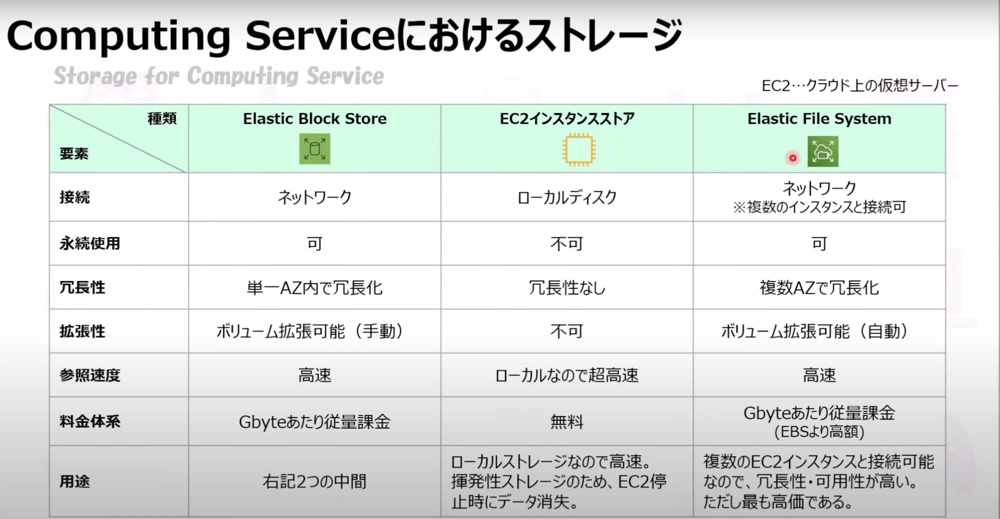

#### 2-2-1. その他関連システム

- Amazon Data Lifecycle Manager（Amazon DLM）
  - 特徴
    - EBSのバックアップであるスナップショットの作成、保存、削除を自動化
    - 定時バックアップをスケジュールして貴重なデータを保護

- Amazon FSx
  - Server Message Block（SMB）プロトコルに基づいて最大数千代のインスタンスからアクセス可能となるNTFSファイルシステム

### 2-3. ファイルストレージ（スケーラブルな共有ストレージ）

#### 2-3-1. Elastic File System（EFS）

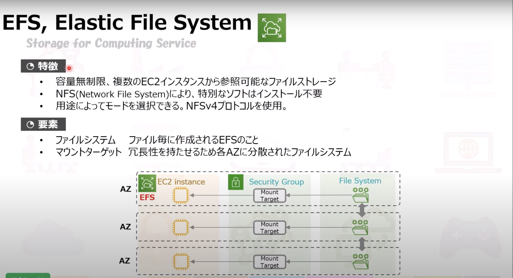

- Network File System（NFS）により特別なソフトはインストール不要

- モード選択
  - 汎用モード
  - バーストスループットモード
  - プロビジョンドスループットモード
  - 最大I/Oモード

- アクセス頻度
  - 標準アクセス
  - 低頻度アクセス
    - 切り替えが可能

#### 2-3-2. FSx for Windows

#### 2-3-3. FSx for Lustre

### 2-4. ブロックストレージ（永続可能なブロックストレージ）

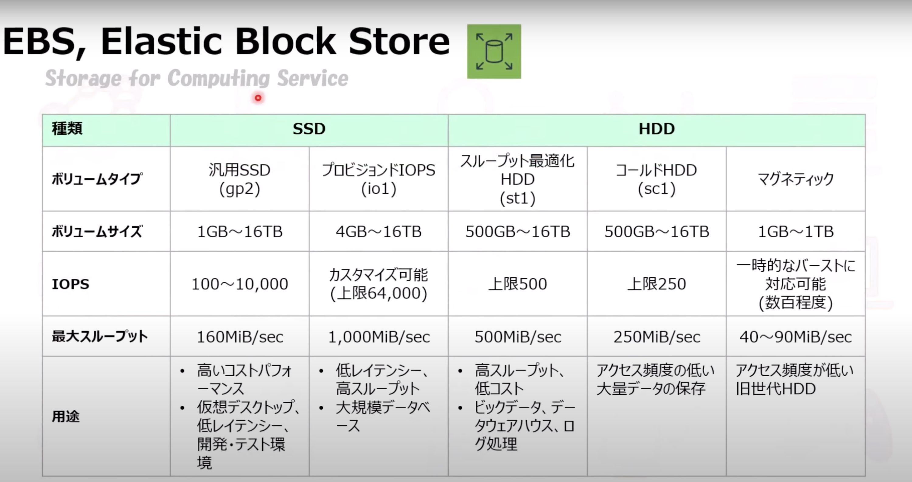

### 2-5. データ転送

#### 2-5-1. Storage Gateway

- 特徴
  - オンプレミスとクラウド間のデータ転送を容易にするサービス

- 用途
  - ハイブリット環境（オンプレミス * クラウド）の構築時に、拠点間の転送に使う
  - 例：
    - 参照頻度の高いデータ => オンプレミス
    - 参照頻度の低いデータ => クラウド

- ゲートウェイタイプ
  - ファイルゲートウェイ
    - ファイルシステム用に使える（アップロードされたファイル毎にS3オブジェクトとして保存）
    - ローカルディスクに比べると参照スピードは遅い
  - ボリュームゲートウェイ
    - 各ファイルをオブジェクトとしてではなく、1つのボリュームとして管理する
      - キャッシュ型ボリューム
        - 参照頻度が高いデータ => キャッシュ（EBS）に保存（クラウド）
        - その他 => S3に保存
      - 保管型ボリューム
        - データをローカルに保存し、定期的にスナップショットをS3に転送
  - テープゲートウェイ
    - 仮想テープにS3やGlacierにバックアップ保存

#### 2-5-2. Snow Family

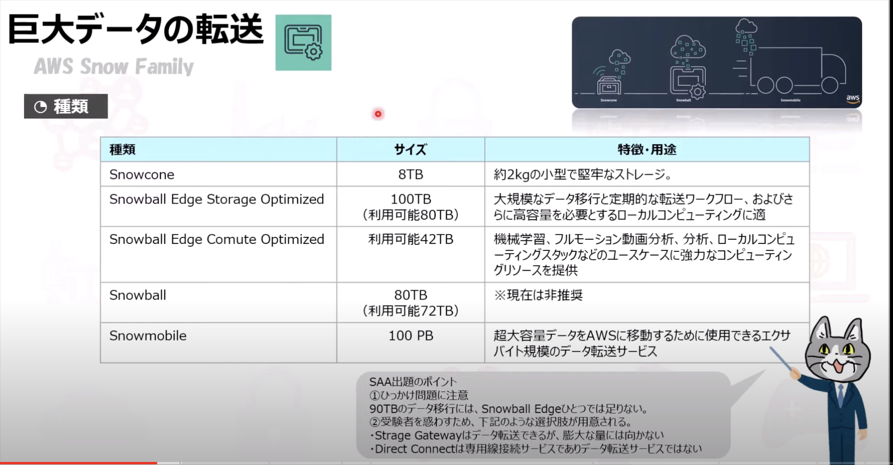

## 3. EC2（Elastic Compute Cloud）

### 3-1. 特徴

- 物理サーバを準備する手間なく、サーバを新設・増設できる
- 多くの仕様があり、拡張（インスタンスの増加）も可能

### 3-2. 課金

- 起動中（Running）
- 停止中（Stopped）
- 削除済（Terminated）
課金対象 => **Runningのみ**

- オンデマンドインスタンス
  - 時間単価で支払う
- スポットインスタンス
  - 「売れ残り」のインスタンスを安価で入札
- リザーブドインスタンス
  - 長時間の利用により割引適用

※Elastic IPは使われていないと（EC2にアタッチされていないと）課金される。（IPアドレスは有限なため）

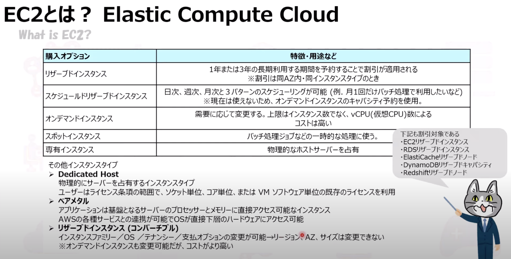

リザーブド（予約）をすると割引対象になる。
※同AZ内、同インスタンスタイプのとき

### 3-3. 用語

- インスタンス
  - EC2で作成される仮想サーバのこと
- AMI
  - Amazon Machine Image
  - EC2インスタンスを作成するためのテンプレート（OS、メモリ、CPU）
  - バックアップに使える
  - 別リージョンにコピー可

### 3-4. インスタンスタイプ

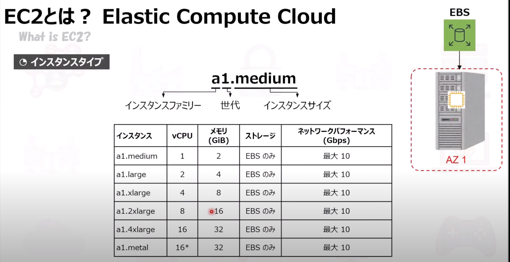

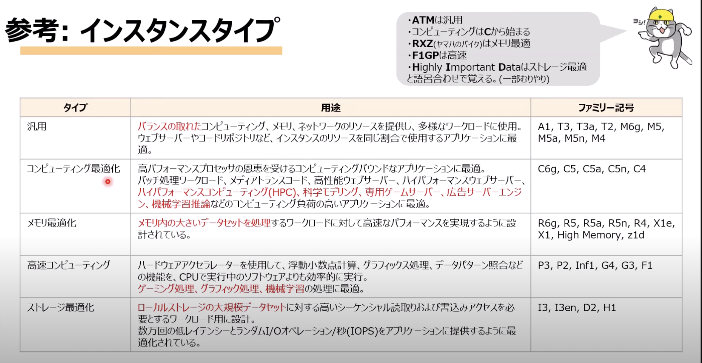

- **ATM**は汎用
- コンピューティングは**C**から始まる
- **RXZ**はメモリ最適
- **F1GP**は高速
- **H**ighly **I**mportant **D**dataはストレージ最適

### 3-5. その他、EC2の機能、注意事項など

#### 3-5-1. プレイスメントグループ

EC2インスタンス間の通信を高速化するためのグループ
単一AZ内に配置され、インスタンス間で通信が高速。

#### 3-5-2. Elastic Network Interface（ENI）

仮想ネットワークカードを表すVPCの論理ネットワークコンポーネント。
EC2インスタンスの状態によってアタッチ方法が異なる。
- 実行中のインスタンスにアタッチ
  - ホットアタッチ
- 停止中...
  - ウォームアタッチ
- 起動中...
  - コールドアタッチ

#### 3-5-3. ブートストラップ（ユーザデータの利用）

EC2インスタンスをAWSリソースにおいて起動する時、ユーザデータを利用してBashシェルスクリプトを利用して自動で設定を反映する。
ソフトウェアをインストールしたり、データをコピーしておいたりとインスタンスの設定を自動化することができる。

#### 3-5-4. ゴールデンイメージ

EC2インスタンス、RDS、DBインスタンス、EBSボリュームなどの特定のAWSリソースタイプにおいて、ユーザにとって最適な状態を保持すること。

#### 3-5-5. RAID

- RAID 0
  - **高速**
- RAID 1
  - **冗長化**

#### 3-5-6. EC2からEBSをデタッチする際の注意点

EC2インスタンスからEBSをデタッチ（取り外す）には、インスタンスを停止する。
インスタンスが実行中の場合は、インスタンスからボリュームをアンマウントする。ただし、ボリュームがインスタンスのルートデバイスの場合、インスタンスを停止する必要がある。

## 4. Scaling

### 4-1. スケーラビリティ

ELBとAuto Scalingにより、インスタンスを増減する。
例: CPU使用率が○％を超えたら、EC2を■台増やす。

アクセス負荷が上昇した場合、
1. インスタンスタイプを上げる（性能）
スケールアップ <=> スケールダウン

2. インスタンスを増設する（台数）
スケールアウト <=> スケールイン

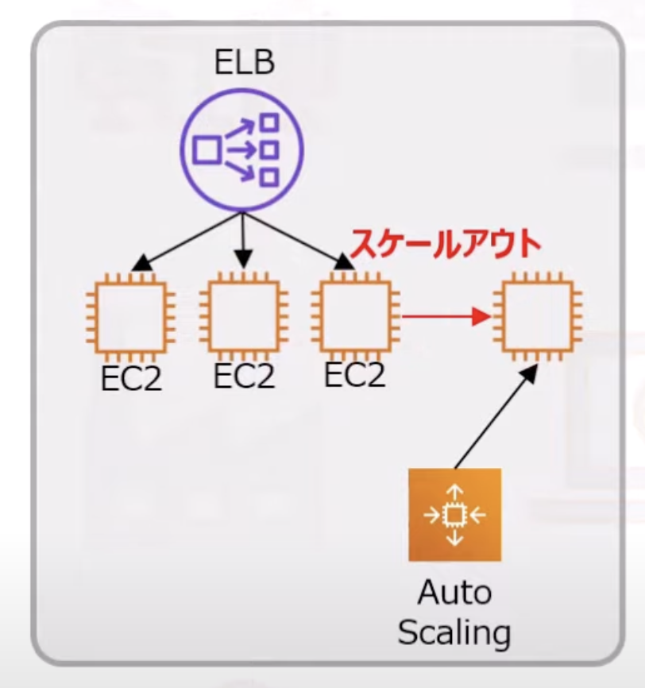

### 4-2. Auto Scaling

#### 4-2-1. ヘルスチェック

Auto Scalingは起動したインスタンスに対して定期的なヘルスチェックを実行
- EC2タイプ
  - EC2のステータスがrunning以外の場合、またはシステムステータスがimpairedの場合に、このインスタンスを異常と判断
- ELBタイプ
  - インスタンスのステータスチェックとELBのヘルスチェックからインスタンスの状態を判断

#### 4-2-2. クールダウン期間

Auto Scalingのグループが追加のインスタンスを起動、または削除することが一定期間できない

#### 4-2-3. Desired capacity

一時的なリクエスト流入増加に備えて、インスタンス数を手動で増やす

#### 4-2-4. スケーリングの種類

- 手動スケーリング
- 動的スケーリング
  - 需要増減に応じてスケールする方法を定義
- ステップスケーリングポリシー
  - 一連のスケーリング調整値（ステップ調整値）に基づいて、Auto Scalingの現在の容量を増減
  - CloudWatchメトリクスから得られる値（CPU使用率やSQSキューサイズなど）の閾値を超えて発せられるアラームに対して、値ベースでスケーリングアクションを個別設定できる
- スケジューリングスケーリング
  - スケジュールに基づいたスケーリング

#### 4-2-5. ターミネーションポリシー

- NewestInstance
  - 新しく設置されたインスタンスから削除されるポリシー設定
- OldestInstance
  - 古いインスタンスから
- OldestLaunchConfiguration
  - もっとも古い起動設定から設定されたインスタンスから削除
  - デフォルト

### 4-3. Elastic Load Balancer

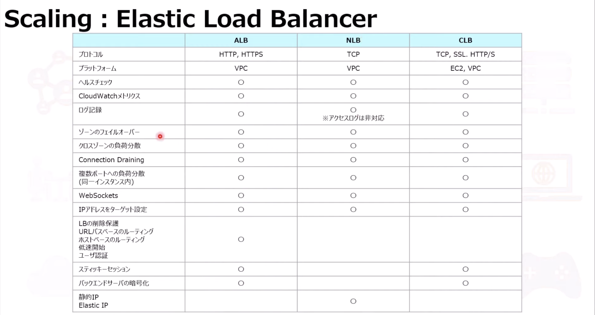

#### 4-3-1. ELBの種類

- CLB（Classic Load Balancer）
  - L4/L7
- ALB（Application Load Balancer）
  - L7（CLBにより高機能）
- NLB（Network Load Balancer）
  - L4（HTTPS除く）

#### 4-3-2. スティッキーセッション

スティッキー（固定）
同じユーザのセッションは、特定のEC2インスタンスでの処理を継続

#### 4-3-3. Connection Draining

既存の接続を開いたまま、登録解除または異常なインスタンスへのCLBのリクエスト送信を停止

#### 4-3-4. プロキシプロトコル

ELBを介してやり取りしていても、AWSリソース側のIPアドレスを確認

#### 4-3-5. SSL Termination

ELBにSSL Terminationを設定して、ロードバランサー側でSSL認証を行う機能

#### 4-3-6. クロスゾーンロードバランシング

AZ間の分散を均等に実施

#### 4-3-7. 注意点

- ELBの発動には時間がかかるため、スパイク（急激な負荷増）には対応できない
- インスタンス間でデータをミラーリングできないため、データはS3等に保存する
- 冗長性を持たせるため、複数のAZにインスタンスを構築する

## 5. コンテナーとは

### 5-1. コンテナ

- 実行環境の単位
- 実行環境を隔離することで、環境に依存せず動作させることができる

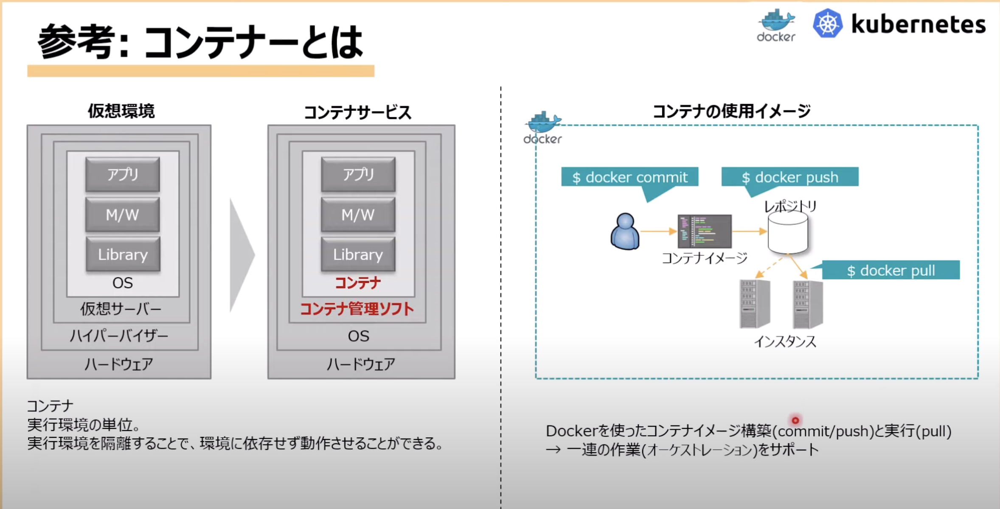

### 5-2. コンテナーサービス

#### 5-2-1. 説明

- ECS（Elastic Container Service）
  - コンテナ環境を提供するサービス
- EKS（Elastic Kubernetes Service）
  - フルマネージド型のKubernetesサービス
- ECR（Elastic Container Registry）
  - フルマネージド型のDockerコンテナレジストリ

#### 5-2-2. ホスティング先

- EC2
  - 仮想サーバへ実行
- Fargate
  -  Serverless環境への実行
  -  サーバーサイズのプロビジョニングなどが不要）

#### 5-2-3. 構成

- Task
  - コンテナのこと
  - JSON形式で記述
- Cluster
  - EC2インスタンスのこと
- Service
  - Clusterを複数並べたもの
  - ELBで負荷分散可能

#### 5-2-4. その他

- IAMでTask単位にロールを割り当てることが可能
- 2019年12月より、AWS Fargateの上でKubernetesを利用できる

## 6. ネットワークサービス

### 6-1. 用語

- リージョン
  - データセンターが蓄積されている物理的ロケーションのこと
- AZ
  - 論理的データセンターのこと

### 6-2. VPC

VPC = Virtual Private Cloud
AWSクラウド上の仮想空間

- CIDR（Classless Inter-Domain Routing）を使用可能
- **/16 ~ /18**で設定可能
  - 16bit => 65,536個
  - 28bit => 16個

### 6-3. サブネット

VPC内に設定するアドレス空間

- 設定時のルール
  - VPCで設定したCIDRの範囲内で設定する
  - サブネットあたり仮想ルータが存在する
    - このルータがルートテーブル、ネットワークACLの役割
  - /16~/28で設定可能
  - サブネット作成時に所属するAZを指定
    - ※後に変更不可
  - 1つのVPCに200個までサブネットを作成可能
    - 後に拡張可能

- サブネットの種類
  - パプリックサブネット
    - DMZに相当
  - プライベートサブネット
    - 構内ネットワーク

### 6-4. ルートテーブル

ネットワークトラフィックの経路を制御

- サブネット毎にひとつ設定
- ひとつのルートテーブルを複数のサブネットで共有することができる
- 宛先アドレスとターゲットゲートウェイを指定

### 6-5. セキュリティテーブル vs ネットワークACL

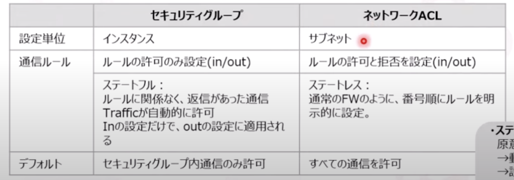

### 6-6. ゲートウェイ

VPCやサブネットの内外を結ぶ門のこと

- IGW（Internet Gateway）
  - VPCとインターネットを繋ぐ
  - VPCあたり一つのみ設定可
    - 障害時はAWS側でマネージされる
  - 一般的にデフォルトルート「0.0.0.0/0」を指定

- NAT Gateway（Network Address Transition）
  - プライベートIPをグローバルIPアドレスに変換
  - ※NATインスタンスではなく、NAT Gatewayが推奨
    - マネージド型、ボトルネット解消、パフォーマンス向上...

- VGW（Virtual Private Gateway）
  - VPCと、VPNやDirect Connectとを接続するゲートウェイ
  - クラウドとオンプレを接続するときに使う。
  - AWS側のVPC

- Customer Gateway
  - オンプレミス側のVPNエンドポイント
  - パブリックIPアドレスと自立システム番号を指定する

### 6-7. VPN

- VPN（Virtual Private Network）
  - 安全な仮想プライベートネットワーク
  - 専用線接続ではなく、インターネットを使用

- AWS managed VPN
  - オンプレミス環境とVPC間とのサイト間を接続
  - リモートの顧客ネットワークとVPCの間にIPsec VPN接続を作成するオプション

- AWS VPN CloudHub
  - 複数のカスタマーゲートウェイを使って仮想プライベートゲートウェイを作成し、サイト間接続

- Acceleratedサイト間VPN（Global Accelerator）
  - 高可用性・高パフォーマンスなVPNサービス
  - VPCにおいてAccelerationを有効にすると、AWSグローバルネットワークを使用してパフォーマンスを向上

- DirectConnect
  - オンプレミス環境からAWSへの専用ネットワーク接続
  - 高可用な専用線接続（※NPCによる接続ではない）

### 6-8. VPCエンドポイント

Gatewayを使わず、プライベートにVPCを接続するためのサービス
パブリックネットワークを介さず、AWS内だけで接続するため安全性が高い

- ゲートウェイポイント
  - S3、DynamoDBと接続
- インターフェースポイント
  - 上記以外のサービスと接続
  - AWS PrivateLinkを使う

### 6-9. VPCピアリング

2つのVPC間でプライベート接続する機能
通信相手はインスタンスなど。
AWSアカウントを持っている者同士で通信可能

- ※下記の場合はピアリング拡張できない
  - VPC同士でIPアドレスが重複している
  - 企業ネットワークへのVPN接続、またはAWS Direct Connect接続
  - インターネットゲートウェイを介したインターネット接続
  - NATデバイスを介したプライベートサブネット内のインターネット接続
  - AWSサービス（S3など）へのVPCエンドポイント
  - （IPv6）ClassicLink接続

### 6-10. VPCフローログ

VPC内の通信ログのこと
ENI（Elastic Network Interface）単位でログ（アドレス、ポート、プロトコル、データ量）を記録する

### 6-11. Route 53

53 => DNSのWell-knownポートが53であることに由来

#### 6-11-1. DNS機能

- ドメイン名とIPアドレスを変換を行う名前解決（Domain Name Solution）機能を持つ
- amazon.co.jp <=> 52.119.161.5

#### 6-11-2. 用語

- 権威DNSサーバ
  - DNS情報を保持する親サーバ
- キャッシュDNSサーバ
  - 権威DNSサーバとクライアントの間に置く
  - キャッシュDNS情報を保持
- ホストゾーン
  - 保存してるドメイン名の管理単位
  - パブリック（インターネット上に公開）とプライベートがある
- レコード情報
  - ドメイン名とIPアドレスの情報

- レコードの種類
  - Aレコード
    - ドメイン名とIPv4アドレスの対応情報
  - AAAAレコード
    - ドメイン名とIPv6アドレスの対応情報
  - CNAMEレコード
    - （複数ドメイン名を持つ場合）ドメイン名の情報
  - Aliasレコード
    - AWSリソースのFQDNを指定
  - MXレコード
    - メールサーバを指定
  - Zone Apex
    - 最上位ドメインのこと

#### 6-11-3. ルーティング

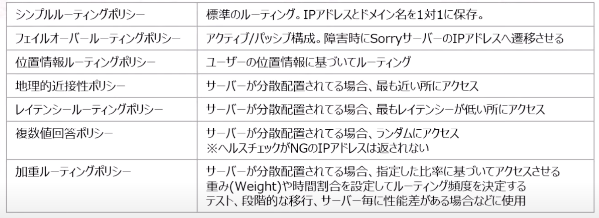

#### 6-11-4. その他

- トラフィックポリシー
  - ビジュアルエディタにより、複雑なルーティング設定が可能
  - 上記のデフォルトをカスタムするなど

- フローティングIP
  - 障害 => 待機系IPアドレスに変更する際のダウンタイム（つながらない時間）をつなぐためのIP

### 6-12. CouldFront

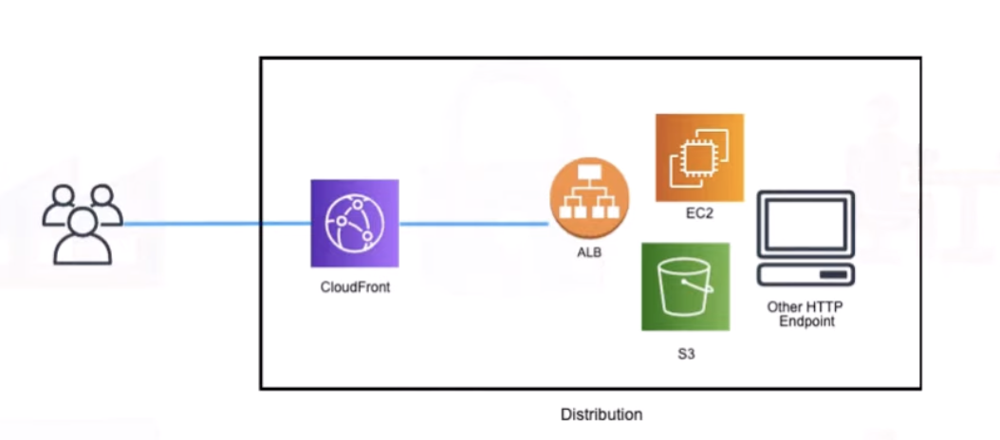

#### 6-12-1. 用途

オリジンサーバ上のデータをキャッシュサーバ（エッジサーバ）にキャッシュさせ、負荷を軽減させる

- 安全性
  - SSL機能が自動で有効
  - 独自SSL証明書の作成
  - コンテンツへのアクセス制限

- グローバルアクセスにも安定したレイテンシーを提供
  - 世界中にエッジサーバを持ち、グローバルアクセスにも柔軟に対応

- コスト削減
  - 利用した分だけ課金

- 可用性を向上
  - DDoS対策
  - トラフィックの分散

#### 6-12-2. 設定

- 閲覧権限を特定ユーザに限定
  - 署名付きCookies機能
    - HLS形式の動画ファイル、Webサイトの購読者領域のファイルなど、複数のファイルへのアクセスを制限したい場合に設定
    - オブジェクトURLを変更したくない場合にも有用（署名付きURLを利用する場合、現在のオブジェクトURLが変更される）
  - Original Access Identity（OAI）
    - ユーザ設定によりリソースへのアクセスを制限

- キャッシュ保持期間（max-age）の設定
  - キャッシュの有効期限が切れるとリクエストをオリジンサーバに転送する
  - max-ageディレクティブが低いとキャッシュ確認が短いサイクルとなり、オリジンサーバへの確認回数が増加する

- コンテンツ圧縮（gzip）
  - ファイルサイズが小さくなると、ダウンロード時間が短縮、コストが安くなる

#### 6-12-3. その他

- HTTP GET, POT, PUTリクエストの最大ファイルサイズは20GB
  - これを超えるファイルは配信できない

- エッジロケーションにより近接リソースから配信することができる
  - <=> Route 53の位置情報ルーティング
  - ユーザの位置情報（DNSクエリの発信位置）に基づいてリソースを選択

## 7. データベースサービス

### 7-1. データベースの種類

- RDB（Relational Database）
  - データをテーブルで表現し、SQLで操作し、テーブル間の関係を定義付ける
  - AWS
    - RDS
    - Redshift
    - Aurora
  - Software
    - Oracle
    - Microsoft SQL Server
    - My SQL
    - Postgre SQL
    - Maria DB

- NoSQL（Not Only SQL）
  - SQLを使わないRDBに変わる新しいデータ形式
  - AWS
    - Dynamo DB
    - Elastic Cache
    - Neptune
  - Software
    - Key-Valueストア
      - Redis
      - Memcached
    - カラム指向データベース
      - Cassandra
      - HBase
    - ドキュメント指向データベース
      - MongoDB
      - CouchDB
    - グラフ指向データベース
      - Neo4j
      - Titan

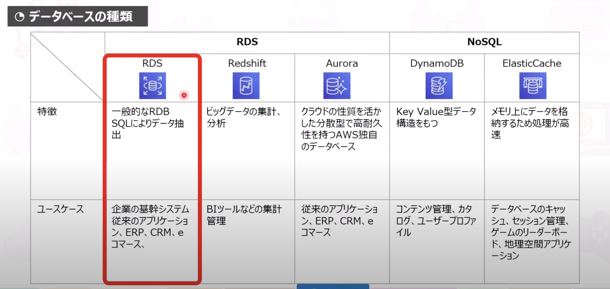

### 7-2. RDS

#### 7-2-1. ストレージタイプ

EBSの汎用SSD、プロビジョンドIOPS SSD、マグネティックを使用可能
基本的には汎用SSD、参照頻度が多い or データ量が多い場合はプロビジョンドIOPSを使う

#### 7-2-2. 特徴

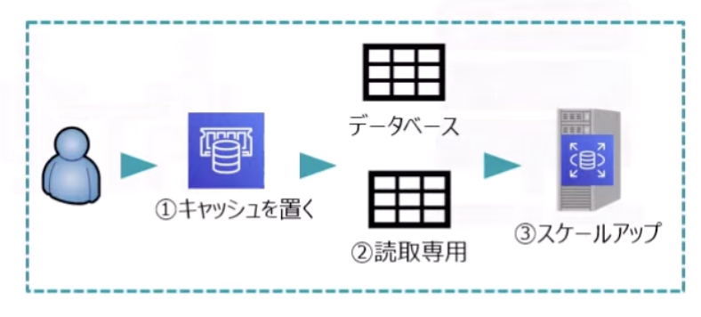

- RDSの読み取りキャパシティを向上させる方策

1. ElasticCache（キャッシュ）をRDSの全面に配置
2. リードレプリカを追加
3. 高性能なインスタンスタイプに変更（スケールアップ）
4. シャーディング（データをテーブルに分割）

- 書き込みキャパシティを向上させる方策
  - SQSキューをトリガーとしてLambda関数で書き込み処理を並列化

- マルチAZ構成
  - DBインスタンスを2つのAZにレプリケーションして冗長性を保つ

- リードレプリカ（Read Replicas）
  - 参照（Read）専用のDBインスタンスを作成
    - Oracle、Microsoft SQLでは使用不可
  - マルチAZのレプリケーションと違い、性能は落ちない

- バックアップ/リストア
  - 自動バックアップ
    - 1日1回自動バックアップ
    - 最大35日間保持
  - 手動スナップショット
    - 任意のタイミング、最大100個まで保持
  - データのリストア
    - バックアップおよびスナップショットから復元する
  - ポイントタイムリカバリー
    - 最大35日前までの任意の時点のデータを復元する

#### 7-2-3. セキュリティ

- ネットワークセキュリティ
  - VPCからセキュリティグループの設定
  - SSL暗号化可能

- データ暗号化
  - バックアップ、ストレージ、ログを暗号化できる

- Kerberos認証に対応
  - パスワードによる認証ではなく、チケットと対象キー暗号化により認証

- ログとモニタリング
  - CloudWatchとCloudTrailにより管理

- IAMによるユーザ管理
  - 削除、更新、変更などのオペレーションをコントロール

#### 7-2-4. その他設定

- RDSプロキシ（2019年2月〜）
  - アプリケーションとRDSデータベースの間の仲介役として機能するコネクション管理用のRDSの新機能

- RDSオートスケーリング
  - データ容量が不足した際に容量を自動でスケーリングする機能

### 7-3. Redshift

#### 7-3-1. 特徴

- データウェアハウス向けのデータベースサービス
  - データウェアハウスとは
    - 様々なシステムからデータを集めて整理する、データの「倉庫」
- ペタバイト規模のビッグデータを標準SQLで分析する様々なBI機能を持つ
  - BI
    - ビジネスインテリジェンス
- 複数ノードによる分散並列実行が可能
- 列指向型（カラムナ、Columnar）データベース

#### 7-3-2. 機能

- Redshift Spectrum
  - S3バケットをRedshiftの解析用のデータレイクとして構成
  - ビッグデータ解析などの高負荷な解析を実現する

- WLM（Work Load Management）
  - クエリ（検索）処理を実施する際に、クエリ処理をキューとして実行順序を定義することが可能

- 拡張VPCルーティング
  - クラスターとデータレポジトリ間のCOPY、UNLOADをVPCを通るように強制する

### 7-4. Aurora

#### 7-4-1. 特徴

AWSが独自に開発したデータベースエンジン
PostgreSQLおよびMySQLと互換性を持つ

#### 7-4-2. 構成

- DBインスタンス
  - DBサーバのこと
- DBクラスタ
  - インスタンス、ボリューム、キャッシュを合わせた単位のこと
- クラスタボリューム
  - データストレージのこと
  - SSDタイプ
  - 単一リージョン内の3つのAZにそれぞれ2つずつ複製（計6個）

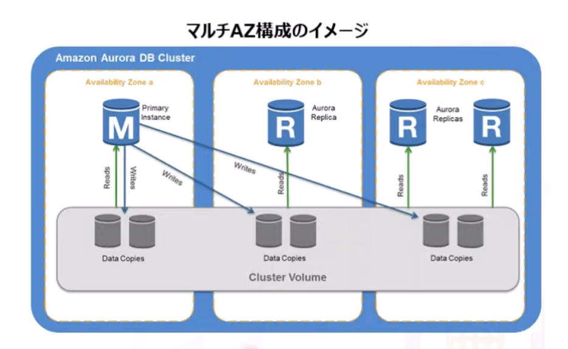

#### 7-4-3. その他

Auroraサーバレス
不規則な負荷に自動でスケーリングすることが可能

### 7-5. DynamoDB

#### 7-5-1. 特徴

- マネージド型のKey-Value型データベース
- 優れた拡張性
  - テーブル・インデックス作成時にスループットを指定して、十分なリソースを確保することで動作が安定
  - データ保存用のディスク容量を増減可能
- 10兆件/日（2,000万件/秒）のリクエストを処理

#### 7-5-2. パフォーマンス

- 高可用性
  - 自動的に3つのAZにデータ保存

- スループットキャパシティ
  - 読み取り、書き込みの必要なスループットキャパシティを割り当てることができる
    - Read Capacity Unit（RCU）
    - Write Capacity Unit（WCU）

#### 7-5-3. その他の機能

- TTL（Time To Live）
  - DB内の各項目に期限を設け、削除することができる
  - Webセッション情報の管理などに使用

- DynamoDB Streams
  - 直近24時間のCUD変更履歴を保持
  - DynamoDBテーブルの変更イベントをトリガーにしてLambda関数などを起動する際に利用

- Consistent Read
  - 参照リクエストがあった時点より前の書き込みが全て反映されたデータをもとに参照結果を返す

- DAX（DynamoDB Accelerator）
  - キャッシュクラスタを設け、処理速度を上げる
  - DAXを増やすことでリードレプリカを追加できる
  - DAXはコストがかかるので、AutoScalingでテーブルとGSIを増加させる策もアリ

### 7-6. Elastic Cache

#### 7-6-1. 特徴

- インメモリ型データベース（IMDB）
- データストレージをメインメモリ上に置くことで、処理が高速で安定

#### 7-6-2. 用途

- RDBのパフォーマンス向上
- データ量やアクセスが増加した際、キャッシュ化したクエリで対応
- Webアプリの接続情報など、一時データの格納

#### 7-6-3. 種類

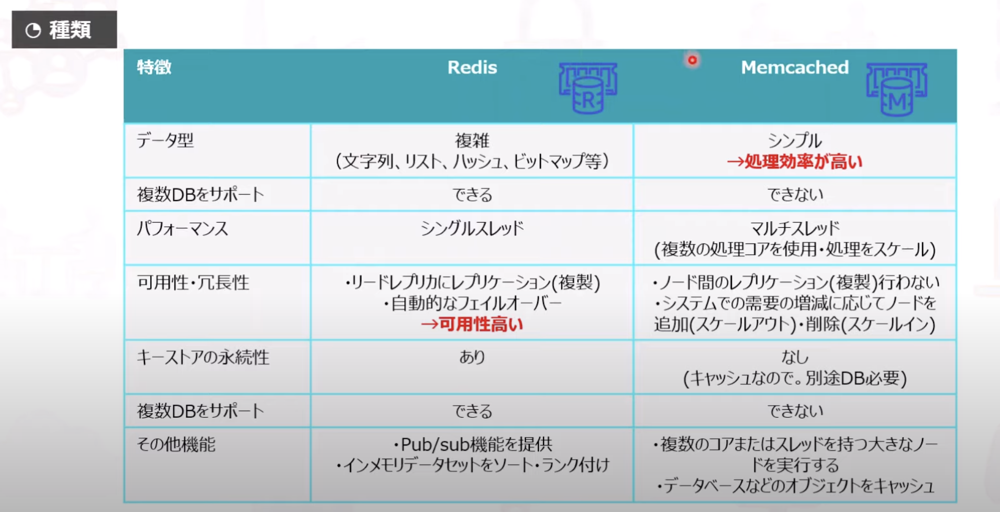

## 8. 監視・セキュリティ

### 8-1. CloudWatch 運用監視サービス

#### 8-1-1. CloudWatch

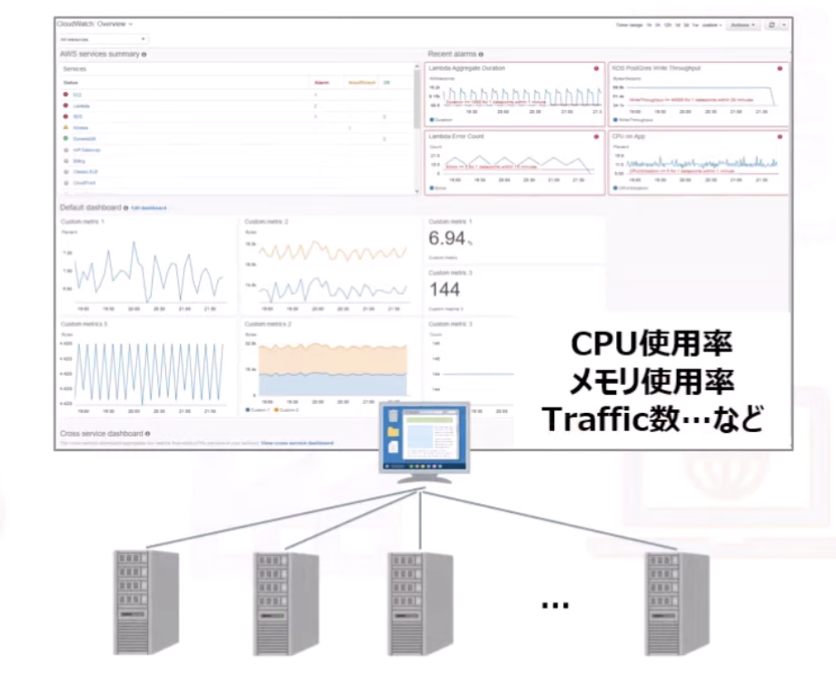

- リリース後のシステム運用監視
  - 様々なメトリクス（測定値）を収集・分析し、必要な処置をとる
- EC2、EBSなど70種類以上のサービスに対応
- 解像度（メトリクスの収集間隔）や保存期間を指定可能
- 高度な監視は3rd Partyシステム（DataDogなど）と連携
  - ただし、コストが高くなる

#### 8-1-2. CloudWatch Logs

- アプリやサーバのログをモニタリング
- 保持期間は無制限
  - 1日〜10年間、もしくは無制限を指定
- CloudWatch Logs Metric Filterにより、指定した文字列に基づきログをフィルタリング可能
  - 例: Errorを含む文字列を検索してログ管理
- CloudTrail, Route53, Lambda, VPC, EC2, RDSなどと連携可能

#### 8-1-3. CloudWatch Events

AWSリソースの状況変更をリアルタイムにストリームする
イベントとルールに基づき、ターゲットに対しアクションを起こす

- イベントソースの種類
  - スケジュール
    - 毎週何曜日の何時ごとに〜
  - イベント
    - 指定したサーバのCPU使用率が何％を超えた時〜

- ターゲット
  - 対象となるAWSリソースのこと

- アクション
  - 実行する処理のこと
    - Lambda関数を実行するなど

### 8-2. CloudTrail 操作ログを取得

#### 8-2-1. 特徴

AWSサービスの操作ログを取得（誰が、いつ、何をしたか）
90日間取得（90日以上前のログ取得はS3を併用）

#### 8-2-2. 機能

### 8-3. その他のログ管理

#### 8-3-1. VPCフローログ

VPC内のネットワークインターフェース間で取得する通信ログ
例: 宛先・送信元アドレス、プロトコル、日時、サイズ

#### 8-3-2. AWS Config

AWS内のリソースの構成変更の証跡を取得
例: インスタンスの追加・削除

#### 8-3-3. AWS Systems Manager

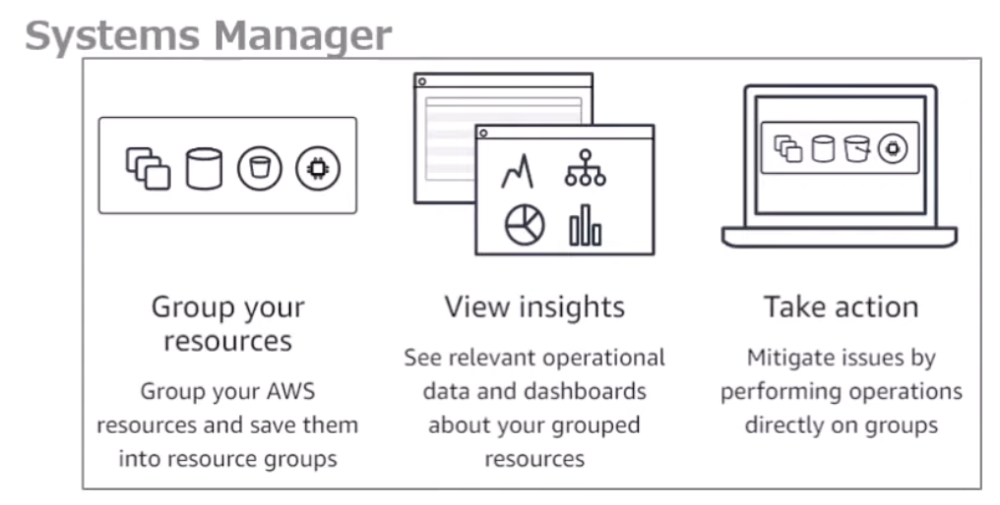

リソースの運用情報を統合的に管理
CloudWatch, CloudTrail, Configなどと併用

#### 8-3-4. AWS Trusted Advisor

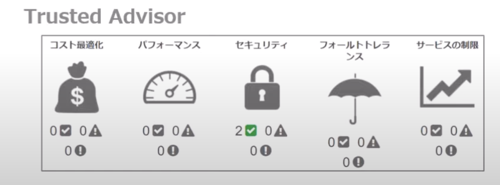

AWSのBest Practiceに基づいて利用状況をチェック

### 8-4. セキュリティ関連サービス

#### 8-4-1. CloudHSM

クラウドベースのハードウェアセキュリティモジュール（HSM）
これによりAWSクラウドで暗号化キーを簡単に生成して使用
FIPS140-2 レベル3標準に準拠

#### 8-4-2. AWS Key Management Service（KMS）

暗号化キーを簡単に作成・管理するサービス
幅広いAWSのサービスやアプリケーションで暗号化を制御

#### 8-4-3. AWS Certificate Manager(ACM)

内部接続リソースで使用するパブリック（外部セキュリティプロバイダー）または、プライベートのSSL/TLS証明書を作成・登録・管理
自動でSSL/TLS証明書の購入、アップロード、更新

※ACMがサポートされていないリージョンでは、IAMをSSLマネージャーとして使う
※Route53もSSL証明書とドメインの対応関係を検証できるが、作成・管理はできない

#### 8-4-4. AWS Shield

マネージド型のDDoS攻撃に対する保護サービス

#### 8-4-5. AWS Firewall Manager

ユーザの複数のアカウントとアプリケーションにわたって一元的にAWS WAFルールを設定・管理するセキュリティ管理サービス

#### 8-4-6. AWS Security Token Service(AWS STS)

トークン等を使用して一時的にセキュリティ認証を付与
IDフェデレーション、委任、クロスアカウントアクセス、IAMロールが使用される

#### 8-4-7. Amazon Inspector

自動化されたセキュリティ評価サービスで、AWSにデプロイしたアプリケーションのセキュリティとコンプライアンスを向上
露出、脆弱性、ベストプラクティスからの逸脱がないかどうかを確認
