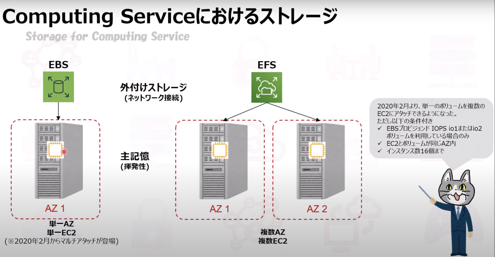

# SAA資格取得

## 1. 勉強方法

1. 書籍を通読する
2. YOU-TUBEの解説もある
3. 過去問を解く
   1. Cloud Tech 200問
   2. Tech Stock

### 1-1. 過去問の解き方・勉強方法

1. 10問ずつ行う（1-10）
2. 10問行ったらもう一度同じ10問を解く
   1. 間違えた箇所をチェックしておく
3. 11-20を解く
4. もう一度11-20を解く
   1. 間違えた箇所をチェックする
5. 1-10を解く
   1. 間違えた箇所をチェックする
6. 21-30を解く
7. もう一度21-30を解く
   1. 間違えた箇所をチェックする
8. 11-20を解く
   1. 間違えた箇所をチェックする
...

## 2. AWSが提供するStorageサービス

### 2-1. オブジェクトストレージ（高耐久・大容量）

S3

#### 2-1-1.  用途

- バックアップ
- データレイク
 - ビッグデータを保存する容器のこと
- 静的コンテンツ（HTML/CSS）のホスティング
 - ※動的コンテンツ（Ruby, PHPなど）はEC2にホスティングする

#### 2-1-2. 構成要素

- バケット
  - 保存領域のこと。一意の名称を付ける。
- オブジェクト
  - データそのもの。一意のURLを持つ。
- メタデータ
  - 作成日時、サイズなど。
  - どんな情報を持たせるかはユーザがカスタマイズできる

#### 2-1-3. ストレージクラス

(耐久性は99.999999999※イレブンナイン)(可用性は99.※※)
- STANDARD
  - デフォルト
  - 低レイテンシー（通信の遅延時間）、高スループット（通信速度）
- STANDARD-IA
  - IA = Infrequently Access（アクセス頻度が低い）
- ONEZONE-IA
  - 単一のAZ内のみで複製する
  - AZ内での障害発生時にデータ復元が出来ない
- INTELLIGENT-TIERING
- GLACIER

#### 2-1-4. ライフサイクル管理

- STANDARD --30日間後--> STANDARD-IA --30日間後--> Gladier

#### 2-1-5. Glacierとは？

- 構成要素
  - ボールド
    - 保存領域
  - アーカイブデータ
    - データそのもの
  - インベントリ
    - アーカイブ情報（作成日、サイズなど）
  - ジョブ
    - 検索、ダウンロードなどの処理のこと
- オプション
  - データの取り出しスピードを変更できる
    - 高速（Expedited, 1~5分）
    - 標準（Standard, 3~5時間）
    - バルク（Bulk, 5~12時間）
#### 2-1-6. S3とは？

- セキュリティ
  - S3データにアクセスするには、**バケットポリシー**と**IAMロール**を両方許可する必要がある
  - ACLは、バケット単位、オブジェクト単位と二重でアクセス制御する必要があり、手間がかかるので、**パブリックアクセス**によってアカウント単位で全オブジェクトへのアクセス制御ができる。
- 事前署名付きURL
  - アプリケーション側で対象オブジェクトへの**期限付き**アクセス許可を**特定のユーザ**に付与する。
- S3 Access Analyzer
  - S3バケットに対する外部アカウントからのアクセス情報を分析し、不正アクセスがないかを確認できる。
- 暗号化
  - SSE（Server Side Encryption）
    - デフォルト
    - 暗号化・複合化をS3側で自動。AES-256を標準使用。
  - CSE（Client Side Encryption）
    - ユーザ側で独自の暗号キーを使用

- ファイルストレージ（スケーラブルな共有ストレージ）
  - EFS（Elastic File System）
  - FSx for Windows
  - FSx for Lustre
- ブロックストレージ（永続的なブロックストレージ）
  - EBS（Elastic Block Store）

#### 2-1-7. S3のその他の機能

- S3への検索ツール（S3はオブジェクトデータなので検索性はそもそも良くない）
  - S3 Select
    - クエリ（検索）を活用して、S3オブジェクトに対してデータ分析を実行
  - Athena（アテナ）
    - S3内のデータを標準SQLを使用して簡単に分析
    - S3 Selectより高度で複雑
  - Redshift Spectrum（レッドシフト スペクトラム）
    - S3に保存されたファイルをRedshiftにロードしたり、特殊な準備をすることなく高度なクエリを実行
    - 主にビッグデータ解析

- マルチアップロード
  - 大容量オブジェクトをいくつかに分けてアップロード

- S3 Transfer Acceleration
  - クライアントとS3バケットの間で、長距離にわたるファイル転送を高速、簡単、安全に行う

- クロスリージョンレプリケーション
  - 異なるAWSリージョンにある2つのバケット間で、オブジェクトを自動的、非同期にコピーする機能

- Cross-Origin Resource Sharing（CORS）
  - 既にドメインが設定されているS3バケットを他のドメインに共有することが可能

- AWS Lake Formation
  - S3を利用したデータレイク構成を容易に実施できる

### 2-2. Computing Serviceにおけるストレージ

#### 2-2-1. その他関連システム

- Amazon Data Lifecycle Manager（Amazon DLM）
  - 特徴
    - EBSのバックアップであるスナップショットの作成、保存、削除を自動化
    - 定時バックアップをスケジュールして貴重なデータを保護

- Amazon FSx
  - Server Message Block（SMB）プロトコルに基づいて最大数千代のインスタンスからアクセス可能となるNTFSファイルシステム

### 2-3. ファイルストレージ（スケーラブルな共有ストレージ）

#### 2-3-1. Elastic File System（EFS）

- Network File System（NFS）により特別なソフトはインストール不要

- モード選択
  - 汎用モード
  - バーストスループットモード
  - プロビジョンドスループットモード
  - 最大I/Oモード

- アクセス頻度
  - 標準アクセス
  - 低頻度アクセス
    - 切り替えが可能

#### 2-3-2. FSx for Windows

#### 2-3-3. FSx for Lustre

### 2-4. ブロックストレージ（永続可能なブロックストレージ）

### 2-5. データ転送

#### 2-5-1. Storage Gateway

- 特徴
  - オンプレミスとクラウド間のデータ転送を容易にするサービス

- 用途
  - ハイブリット環境（オンプレミス * クラウド）の構築時に、拠点間の転送に使う
  - 例：
    - 参照頻度の高いデータ => オンプレミス
    - 参照頻度の低いデータ => クラウド

- ゲートウェイタイプ
  - ファイルゲートウェイ
    - ファイルシステム用に使える（アップロードされたファイル毎にS3オブジェクトとして保存）
    - ローカルディスクに比べると参照スピードは遅い
  - ボリュームゲートウェイ
    - 各ファイルをオブジェクトとしてではなく、1つのボリュームとして管理する
      - キャッシュ型ボリューム
        - 参照頻度が高いデータ => キャッシュ（EBS）に保存（クラウド）
        - その他 => S3に保存
      - 保管型ボリューム
        - データをローカルに保存し、定期的にスナップショットをS3に転送
  - テープゲートウェイ
    - 仮想テープにS3やGlacierにバックアップ保存

#### 2-5-2. Snow Family

## 3. EC2（Elastic Compute Cloud）

### 3-1. 特徴

- 物理サーバを準備する手間なく、サーバを新設・増設できる
- 多くの仕様があり、拡張（インスタンスの増加）も可能

### 3-2. 課金

- 起動中（Running）
- 停止中（Stopped）
- 削除済（Terminated）
課金対象 => **Runningのみ**

- オンデマンドインスタンス
  - 時間単価で支払う
- スポットインスタンス
  - 「売れ残り」のインスタンスを安価で入札
- リザーブドインスタンス
  - 長時間の利用により割引適用

※Elastic IPは使われていないと（EC2にアタッチされていないと）課金される。（IPアドレスは有限なため）

リザーブド（予約）をすると割引対象になる。
※同AZ内、同インスタンスタイプのとき

### 3-3. 用語

- インスタンス
  - EC2で作成される仮想サーバのこと
- AMI
  - Amazon Machine Image
  - EC2インスタンスを作成するためのテンプレート（OS、メモリ、CPU）
  - バックアップに使える
  - 別リージョンにコピー可

### 3-4. インスタンスタイプ

- **ATM**は汎用
- コンピューティングは**C**から始まる
- **RXZ**はメモリ最適
- **F1GP**は高速
- **H**ighly **I**mportant **D**dataはストレージ最適

### 3-5. その他、EC2の機能、注意事項など

#### 3-5-1. プレイスメントグループ

EC2インスタンス間の通信を高速化するためのグループ
単一AZ内に配置され、インスタンス間で通信が高速。

#### 3-5-2. Elastic Network Interface（ENI）

仮想ネットワークカードを表すVPCの論理ネットワークコンポーネント。
EC2インスタンスの状態によってアタッチ方法が異なる。
- 実行中のインスタンスにアタッチ
  - ホットアタッチ
- 停止中...
  - ウォームアタッチ
- 起動中...
  - コールドアタッチ

#### 3-5-3. ブートストラップ（ユーザデータの利用）

EC2インスタンスをAWSリソースにおいて起動する時、ユーザデータを利用してBashシェルスクリプトを利用して自動で設定を反映する。
ソフトウェアをインストールしたり、データをコピーしておいたりとインスタンスの設定を自動化することができる。

#### 3-5-4. ゴールデンイメージ

EC2インスタンス、RDS、DBインスタンス、EBSボリュームなどの特定のAWSリソースタイプにおいて、ユーザにとって最適な状態を保持すること。

#### 3-5-5. RAID

- RAID 0
  - **高速**
- RAID 1
  - **冗長化**

#### 3-5-6. EC2からEBSをデタッチする際の注意点

EC2インスタンスからEBSをデタッチ（取り外す）には、インスタンスを停止する。
インスタンスが実行中の場合は、インスタンスからボリュームをアンマウントする。ただし、ボリュームがインスタンスのルートデバイスの場合、インスタンスを停止する必要がある。
