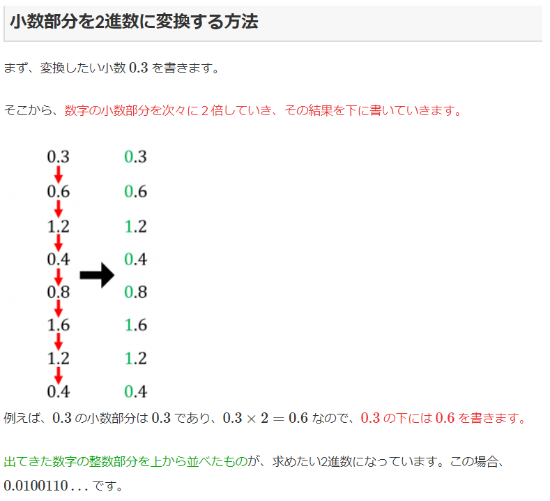

# 2021年6月

## MIPS
1秒間に実行可能な命令数を百万単位で表したもの

## フェールセーフ
システムの不具合や故障が発生したときでも、障害の影響範囲を最小限にとどめ、常に安全を最優先にして制御を行う考え方。

## スプーリング
プリンタなどの低速な入出力装置に対するデータの転送を磁気ディスク装置などを介して実効する機能
入出力装置とやり取りするデータを一度外部記憶装置などへ転送し、外部記憶装置と入出力装置の間でデータをやり取りする方法をとります。これによってCPUは低速な入出力装置の動作完了を待つことなく、次の処理に移ることができるためスループットを大幅に向上させることができる。

## モーフィング
CGにおいて、ある物体から別の物体へ変形していく間をコンピュータ演算によって補完することで、自然な変形をする映像として作成する技法

## データウェアハウス
企業内に散在しているデータ資源を有効活用するために、根幹系データベースや外部のデータベースを整理・統合し、意思決定プロセスを支援するためのデータベース

## シャドーIT
許可を得ずに業務に使用されている従業員所有のパソコン・スマートフォン・タブレットや、承認を経ずに利用されている外部サービスなどがこれに該当する

## リエンジニアリング
相関図
- リエンジニアリング
  1. リバースエンジニアリング
     1. プログラム・ソフトウェアの動作を解析するなどして、製品の構造を分析し、そこから製造方法や動作原理、設計図、ソースコードなどを調査する技法
  2. フォワードエンジニアリング
     1. リバースエンジニアリングによって導き出された仕様に新規ソフトウェア用の変更・修正を加えた新仕様からソフトウェアを作成する技法

## 傾向分析
資源の使用状況やサービスのパフォーマンスに関するデータを収集し、それらの推移を分析することで**将来予測**を行おうとする手法

## サービスデスク
- ローカルサービスデスク
  - ユーザのローカルサイト内、もしくは地理的に近い場所に設置されたサービスデスク

