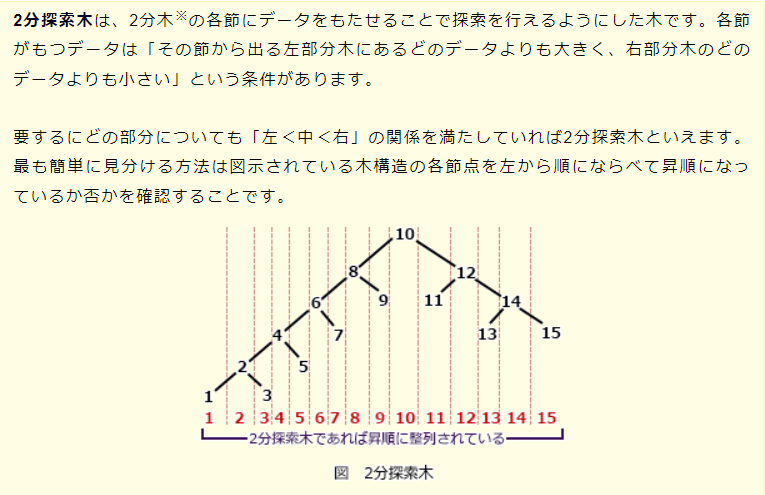
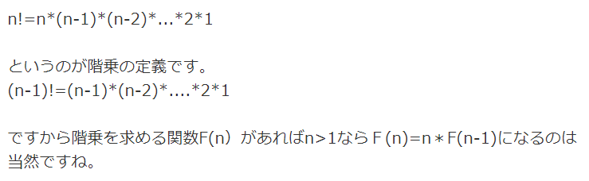
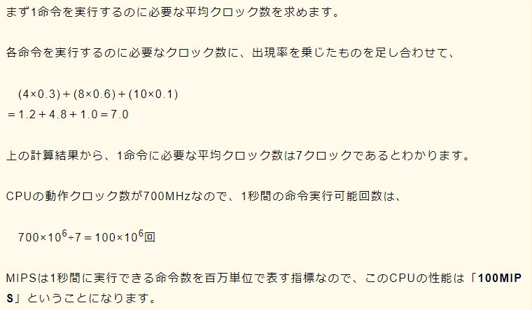

<<<<<<< HEAD
# 2021年7月午前免除試験過去問

## 2分探索木

Point！！
- 各節が持つデータは
  - その節から出る左部分木にあるどのデータよりも大きく
  - 右部分木のどのデータよりも小さい

## 階乗
1からある自然数nまでの相乗のことをいい、nの階乗は記号「！」を使って「n!」と表記される。

- 4!
  - 4 * 3 * 2 * 1 = 24

## MIPSの求め方

1. 1命令に必要なクロック数を出す
2. 1秒間の命令実行可能回数を出す
=======
## エラープルーフ化
人的な作業ミスが発生しやすい作業手順や機器のインタフェースを見直し、ミスが発生しにくい仕組みに改善すること
重要なポイントは**人以外の要素**を人に合うように改善するという点

## メモリリーク
コンピュータの動作中に使用可能な主記憶容量が徐々に現象していく状態を表す

## スキーマ
データの内容、データの論理構造、記憶形式や編成などデータベースの構造を記述したもの

## 処理時間順方式
処理時間の短いタスクを優先的に実行する。

A~Eで考えると
Aは最初に実行するので考えない。
E < D < C < B
の順で大きいことが分かるので、
待機状態のタスク同士を比較して、処理実行時間が短いタスクを先に処理する。

## ポートフォリオマネジメント
事業ごとの市場における**自社の置かれた立場を客観的にとらえるために**用いられる。

## MRP
日本語では資材所要量計画

## O to O
オンライン -> オフライン
オフライン -> オンライン

## マトリックス組織
構成員が事故の専門とする職能部門と特定の事業を遂行する部門の量に所属する組織

## 負の相関
散布図において
- 正の相関
  - 右上がりになっているもの
- 負の相関
  - 右下がりになっているもの
>>>>>>> caf4cd96280cd35d6411910d595d9f6b1f538edd
