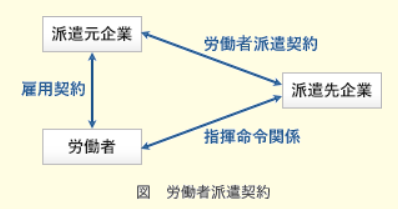

# 例和4年6月
## アクセス時間の速さ
コンピュータに使われる主な記憶装置を高速に動作するものから順番に並べる
1. レジスタ
2. キャッシュメモリ
3. 主記憶
4. SSD
5. HHD
6. 磁気テープ

## レーザプリンタの性能を表す指標
1インチ(2.54cm)当たりのドット数と1分間に印刷できるページ数

## ターンアラウンドタイム
利用者がシステムに処理要求を開始してから、すべての結果を受け取るまでに要する時間

## フールプルーフ
不特定多数の人が操作しても、誤作動が起こりにくいように設計する考え方

<<<<<<< HEAD
## メールのプロトコル
- 送信用
  - SMTP
- 受信用
  - POP3
  - IMAP4

## PINとIDカード
- PIN
  - ICカードの利用の際にシステムと利用者の間で共有している暗証番号
  - PINは他人に知られるとなりすまして悪用される恐れがあるため、推測が困難な文字列を設定するとともに秘密にして管理する必要がある

ICカードが配送中に盗難にあったり紛失しても、PINは別経路で配送されるため不正利用を防ぐことができる

## プレースホルダ
入力フォームの記入欄のこと(テキストボックス)

## 耐タンパ性
外部から行われる内部データへの改ざん・解読・読み出しなどの行為の対する耐性度合いを示す
- タンパ
  - 改ざんするという意味

## 処理時間順方式
処理時間の短いタスクを優先的に実行する。

A~Eで考えると
Aは最初に実行するので考えない。
E < D < C < B
の順で大きいことが分かるので、
待機状態のタスク同士を比較して、処理実行時間が短いタスクを先に処理する。

## メモリリーク
コンピュータの動作中に使用可能な主記憶容量が徐々に現象していく状態を表す

## スキーマ
データの内容、データの論理構造、記憶形式や編成などデータベースの構造を記述したもの

## エラープルーフ化
人的な作業ミスが発生しやすい作業手順や機器のインタフェースを見直し、ミスが発生しにくい仕組みに改善すること
重要なポイントは**人以外の要素**を人に合うように改善するという点
=======
## リバースエンジニアリング
ソフトウェアの動作を解析するなどして製品の構造を分析し、そこから製造方法や動作原理、設計図、ソースコードなどを調査する手法

- コンカレントエンジニアリング
  - 開発期間の短縮や開発コストの削減を目指す
- フォワードエンジニアリング
  - リバースエンジニアリングによって導き出された仕様に新規ソフトウェア用の変更・修正を加えた新仕様からソフトウェアを作成する技法

- COCOMO
  - 予想されるプログラム行数にエンジニアの能力や要求の信頼性などの補正係数を掛け合わせて開発工数や期間、要員や生産性を見積もる手法

- Dotyモデル
  - ソフトウェア開発の工数は、プログラムのステップ数の指数乗に比例するという考え方で開発工数を見積もる手法

- putnamモデル
  - 総開発工数から、それを分解した各開発工程の工数を推定するトップダウン式の手法

## PERT
対象となるプロジェクトを完了するために必要となる各工程の関連を分析し、プロジェクト完了に要する最小時間を特定するための手法

## 可用性
システムが正常に稼働し続け、ユーザが必要な時にシステムが利用可能である特性
障害が起きてもサービスの提供を維持できるような対策が実施されているかどうかが、可用性の監査項目になる。

## プルーフリスト
入力データを加工せず、そのままプリントアウトしたものでプルーフリストと受注伝票を照合することで、入力データの完全性および一意性が確認できる。

## オムニチャネル
販路として展開するシステムや仕組みをシームレスに連携・融合させ、、どの方法でも同レベルの利便性で注文・購入できるようにした販売環境のこと
- オムニ
  - あらゆる、すべて
- チャネル
  - 接点

## EMS
電子機器の受託生産を行うサービスや企業のこと

## ファブレス
- fab
  - 生産工場
- ファブレス
  - 生産工場を持たない という意味

## プロダクトポートフォリオマネジメント
縦軸と横軸に「市場成長率」と「市場占有率」を設定したマトリックス図を四つの象限に区分し、製品の市場における位置付けを分析して資源配分を検討する手法
1. 花形
   1. [成長率：高、占有率：高]
2. 金のなる木
   1. [成長率：低、占有率：高]
3. 問題児
   1. [成長率：高、占有率：低]
4. 負け犬
   1. [成長率：低、占有率：低]

## プロダクトライフサイクル
1. 導入期
2. 成長期
3. 成熟期
4. 衰退期

## マーケティングミックス
- 変動費
  - 仕入れ費などの変動する費用のこと
  - [販売価格] - [変動費] -> 利益

## CRM
Customer Relationship Management
顧客関係管理手法の一つ
顧客満足度を向上させるために、顧客との関係を構築することに力点を置く経営手法で、新規顧客を獲得するより、既存顧客の維持に力を入れる方が有効な戦略であるというのがCRMの考え方

## CPS
サイバーフィジカルシステム
サイバー空間とフィジカル空間を高度に融合させたシステム
日本政府が目指すSociety5.0を実現するための根幹技術

- サイバー空間
  - 仮想空間
- フィジカル空間
  - 現実空間

## ディジタルディバイド
情報格差
ITを使いこなせる者と使いこなせない者の間に生じる、待遇や貧富、機会の格差

## ブロックチェーン
仮想通貨の中核技術
一定期間に行われた取引を１つのブロックにまとめ、ハッシュ値等でブロック同士を繋いで改ざん不可能な台帳を形成する
ブロックの生成には特定のハッシュ値を得るためのデータ(ナンスと呼ばれる)が必要となる

- 仮想通貨マイニング
  - 目的のハッシュ値を得るために仮想通貨ネットワーク参加者が行うハッシュ値の計算作業のこと

## ワークシェアリング
仕事と共有を組み合わせた言葉
従業員1人当たりの労働時間を短縮したり仕事の配分方法を見直したりするなど、労働者間で労働を分かち合うことで雇用の維持・創出を図る仕組み

## ABC分析
1. パレート図を使って分析する要素・項目群を大きい順に並べる
2. 上位70%を占める要素群をA
3. 70~90%の要素群をB
4. それ以外の要素群をCとしてグルーピングする
5. 重点的に管理すべきグループがどれであるかを明らかにする手法

## 労働者派遣契約

## 製造物責任法
製造分の欠陥により人の生命、身体又は財産に係る被害が生じた際に製造業者の損害賠償の責任について定めることで、被害者の保護を目的とした法律
>>>>>>> origin/main
