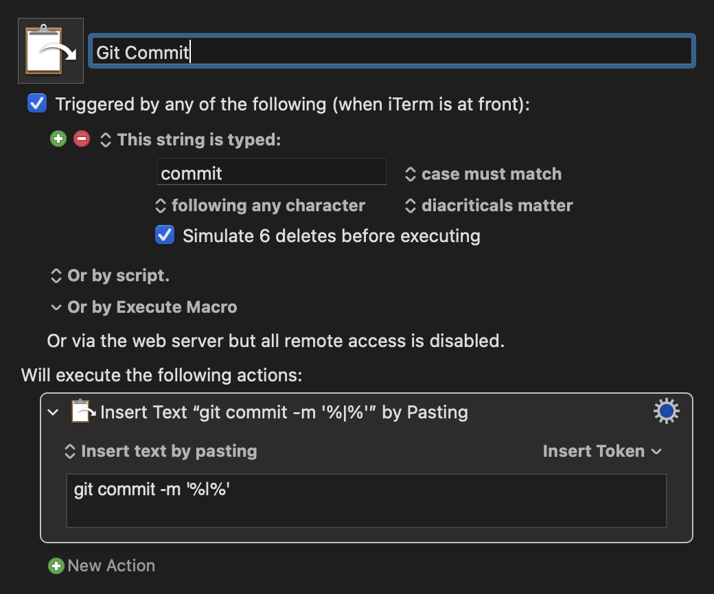

# 何がしたかったのか
commitと打つと、`git commit -m ''` が展開され、クオーテーションの間にカーソルを持っていきたかった。

:::message alert
zshのエイリアスの関数などで実現出来そうかなぁと思ったが、カーソル位置を任意の所で展開することが出来なかった。
[zshとiTerm2でキーボードショートカット（キーバインド）を作成する](https://web-guided.com/457/)
こちらのやり方でキーバインドを用いて実現出来そうではあったが自分の実現したい方法ではなかった。
:::

## KeyboardMaestroとは
公式ページ
https://www.keyboardmaestro.com/main/

簡単に言うと、キーボードの入力に合わせて動作を設定するというアプリケーションのようです。
自分はzshのエイリアスで痒い所に手が届かなかったキーボードのショートカットキーの設定に使用したいと思います。

## KeyboardMaestoroのinstall
公式サイトからダウンロードし、zipを展開後、アプリケーションファイルへとドロップしてください。

## install後に設定しておいた方が良いこと
参考: [Keyboard Maestroのインストール後、すぐにやること](https://dtptransit.design/mac/keyboard-maestro/install-keyboard-maestro.html)
こちらを参考に進めてください。

## キーボードショートカットの設定
参考: [Keyboard Maestroの使い方|はっきり言って最強のMac作業高速化ツールです](https://storehouse-techhack.com/keyboard-maestro-hack/)
これも上記の参考サイト様が分かりやすいので、こちらを参考に進められると思います。

### 1. まずは作成マクロを保存するグループを決める
ここは自分で好きに決めましょう。
自分はgitコマンドのショートカットを作成するのでGroupsの下に +ボタンがあるので、そこで新規作成し、「Terminal」というグループを作成しました。

:::message alert
ここで必ず、適用されるアプリケーションを選択しましょう。
`Available in these applications`から選択できます。
性質上打ち込むと自動で展開されるのでテキストなどでもcommitと入力すると展開されてしまいます。
自分はターミナル(or iTerm)を選択しています。
:::

### 2. マクロの作成
Macrosの下の +ボタンで新しくマクロを作成します。

画像が作成したマクロです。

#### 2-1. マクロ名を付ける
一番上はマクロ名です。(好きな名前を付けてください)

#### 2-2. どう入力したら展開するかを決める
`New Trigger`から`Typed String Trigger`を選びます。
ここに入力する値を設定します。
`commit`と打ち込むと`git commit -m ''`を展開したいので、ここには`commit`と入力します。

#### 2-3.　展開されるアクションを設定する
`New Action`を選択するとズラッと候補が出てきます。
今回はテキストを展開したいので、`Insert Text by pasting`を選択します。
テキストウィンドウが表示されるので、
`git commit -m '%|%'`と入力します。

:::message
任意の場所にカーソル位置を移動させるには`%|%`を使用します。
複数箇所にカーソル位置を設定するのは不可能なようです。
:::

クオーテーション内に%|%と入力することで、展開された後にカーソルがクオーテーション内で待機されます。

# まとめ
設定自体はシンプルに設定出来ますね。
エイリアスと違って展開されることで視覚的にどういったコマンドが展開されるのか分かる点も自分には合っているかなと思いました。
また、カーソル位置を任意の場所で待機させられるのもいいですね。
楽するために2, 3日はまったのが解消されて嬉しいです。
同じように楽したい人にはオススメです！
