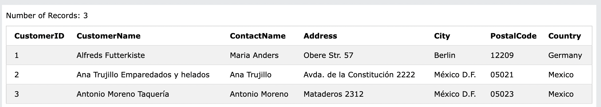

# 11. SELECT TOP
**返されるレコードの数を指定するために使用される**
数百、数千のレコードを持つ大きなテーブルで役立ちます。
※ただし、多数のレコードを返す処理は、パフォーマンスに影響を与える可能性があります。

:::message alert
全てのデータベースシステムが`SELECT TOP`をサポートしているわけではありません。
MySQLは限られた数のレコードを選択する`LIMIT`をサポートしており、Oracleは`and`をしています。
:::

## 11-1. SELECT TOP
- 構文
```sql:
SELECT TOP number|percent column_name(s)
FROM table_name
WHERE condition;
```

- Customersテーブルから最初に3つのレコードを選択します。
```sql:
SELECT TOP 3 * FROM Customers;
```



## 11-2. LIMIT (MySQL)
ポピュラーなMySQLでの構文を理解していきます。

- 構文
```sql:
SELECT column_name(s)
FROM table_name
WHERE condition
LIMIT number;
```
