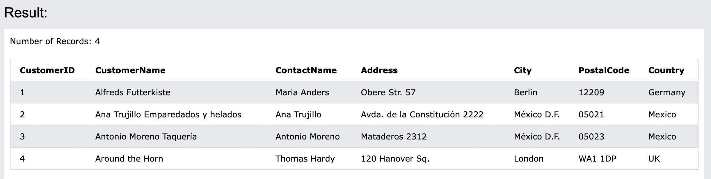

# 14. LIKE
**列で指定されたパターンを検索するために使用されます**

- LIKEと組み合わせてよく使用される2つのワイルドカード
  - パーセント記号(%)
    - 0, 1, または複数の文字を表す
  - アンダースコア記号(_)
    - 1つの単一文字を表す

- 構文
```sql: LIKE
SELECT column1, column2, ...
FROM table_name
WHERE columnN LIKE pattern;
```
:::message
AND or OR演算子を使用して、任意の数の条件を組み合わせることもできる。
:::


## 14-1. DemoDatabase
https://www.w3schools.com/sql/trysql.asp?filename=trysql_select_all

## 14-2. LIKEの実行
#### 14-2-1. LIKE 'a%'
- `a`で始まるCustomerNameを持つ全ての顧客を選択する

```sql: LIKE.1
SELECT * FROM Customers
WHERE CustomerName LIKE 'a%';
```


#### 14-2-2. LIKE '%a'
- `a`で終わるCustomerNameを持つ全ての顧客を選択する

```sql: LIKE.2
SELECT * FROM Customers

