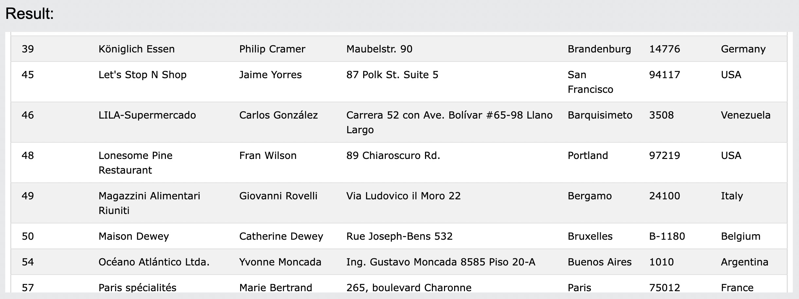

# 15. Wildcards
**文字列内の1つ以上の文字を置き換えるために使用される**
- 演算子にはワイルドカード文字が使用される
- 演算子は、列で指定されたパターンを検索するために、`WHERE`, `LIKE`などの句で使用される


## 15-1. DemoDatabase
https://www.w3schools.com/sql/trysql.asp?filename=trysql_select_all

## 15-2-1. %(パーセント) ワイルドカードの使用
- Cityが`ber`で始まる全ての顧客を選択する

```sql: %
SELECT * FROM Customers
WHERE City LIKE 'ber%';
```

:::message
~で始まる -> ~% のように%の前に文字列を指定する。
~で終わる -> %~ のように%の後ろに文字列を指定する
:::

## 15-2-2. %(パーセント) ワイルドカードの使用
- Cityに`es`を含む全ての顧客を選択する

```sql: %
SELECT * FROM Customers
WHERE City LIKE '%es%';
```

:::message
~を含む -> %~% のように任意の文字列を%で囲む
:::

## 15-3-1. _(アンダーバー) ワイルドカードの使用
- Cityが任意の文字で始まり、`ondon`と続く全ての顧客を選択する

```sql: _
SELECT * FROM Customers
WHERE City LIKE '_ondon';
```

:::message
_~ -> 任意の文字列で始まり、~という文字列と続く
~_ -> ~という文字列で始まり、任意の文字列が続く
:::

## 15-3-2. _(アンダーバー) ワイルドカードの使用
- Cityが`L`で始まり、任意の文字列、`n`、任意の文字列、`on`と続く、全ての顧客を選択する

```sql: _
SELECT * FROM Customers
WHERE City LIKE 'L_n_on';
```

検索条件を細かくするとヒットするものも狭まる。

## 15-4-1. [charlist] ワイルドカードの使用
- Cityが`b`, `s`, `p`のいずれかで始まる全ての顧客を選択する

```sql: [charlist]
SELECT * FROM Customers
WHERE City LIKE '[bsp]%';
```


## 15-4-2. [charlist] ワイルドカードの使用
- Cityが`a`, `b`, `c`のいずれかで始まる全ての顧客を選択する

```sql: [charlist]
SELECT * FROM Customers
WHERE City LIKE '[a-c]%';
```


## 15-5-1. [!charlist] ワイルドカードの使用
- Cityが`b`, `s`, `p`で始まらない全ての顧客を選択する

```sql: [!charlist]
SELECT * FROM Customers
WHERE City LIKE '[!bsp]%';
```


## 15-5-2. [!charlist] ワイルドカードの使用
