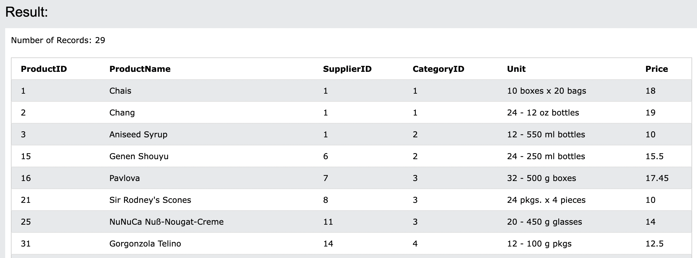
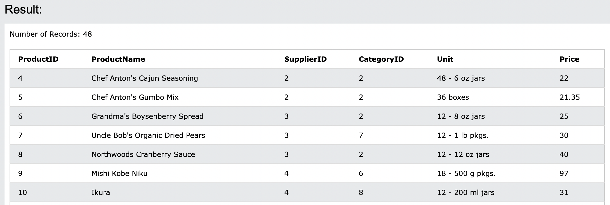
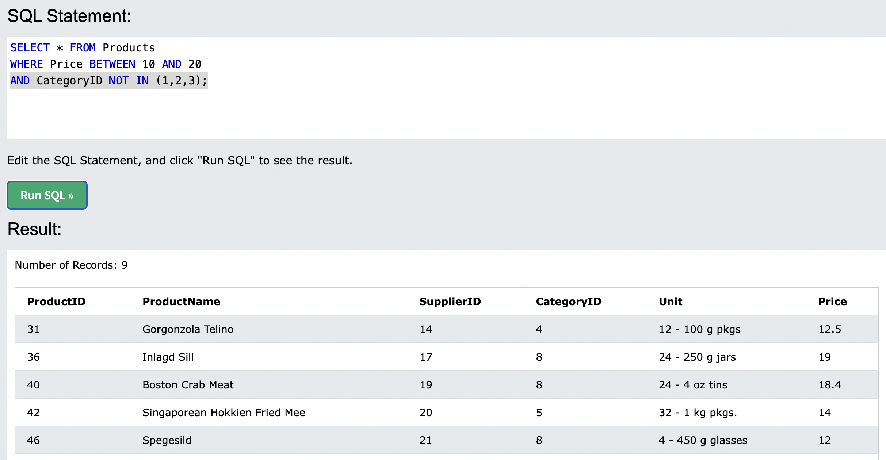
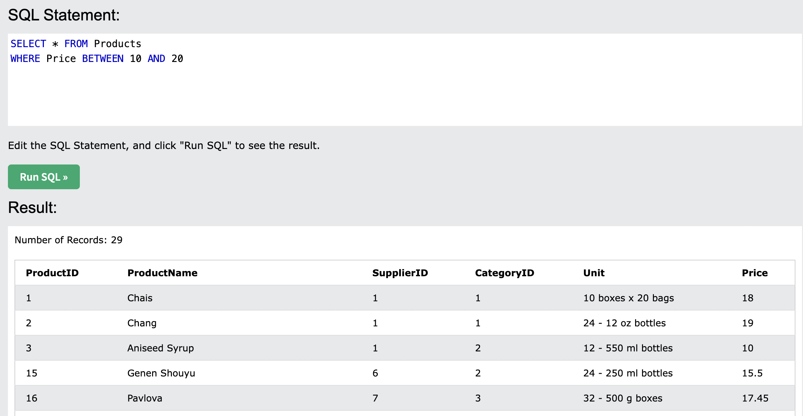
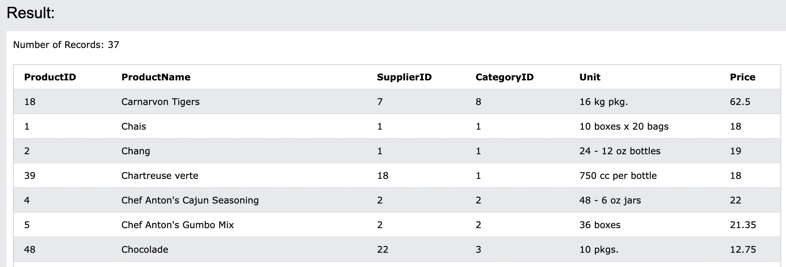

# 17. BETWEEN
**指定された範囲内の値を選択します。**
値は、**数値、テキスト、または日付**にすることができます。

- 構文
```sql: BETWEEN
SELECT column_name(s)
FROM table_name
WHERE column_name BETWEEN value1 AND value2;
```

## 17-1. DemoDatabase
https://www.w3schools.com/sql/trysql.asp?filename=trysql_select_all
`SELECT * FROM Products;`に変更して実行してください。

## 17-2. BETWEENの実行
- Priceが10~20の全ての製品を選択する

```sql: BETWEEN
SELECT * FROM Products
WHERE Price BETWEEN 10 AND 20;
```


## 17-3. NOT BETWEENの実行
- `17-2`の範囲外の製品の選択

```sql: NOT BETWEEN
SELECT * FROM Products
WHERE Price NOT BETWEEN 10 AND 20;
```


## 17-4. INを使用したBETWEENの実行
1. Priceが10~20の全ての製品を選択する
2. ただし、CategoryIDが`1, 2, 3`の製品を表示しない

```sql: BETWEEN & IN
SELECT * FROM Products
WHERE Price BETWEEN 10 AND 20
AND CategoryID NOT IN (1, 2, 3);
```


- 2を条件に入れなかった場合


## 17-5. BETWEEN (テキスト値)
- `Carnarvon Tigers`と`Mozzarella di Giovanni`の間のProductNameを持つ全ての製品を選択する

```sql: BETWEEN(text)
SELECT * FROM Products
WHERE ProductName BETWEEN 'Carnarvon Tigers' AND 'Mozzarella di Giovanni'
ORDER BY ProductName;
```

:::message
今回指定しているのは`人名`です。
1と2の間の、というのはアルファベット順で1〜2の間の人のデータを取ってきています。(1と2も含む)
:::
