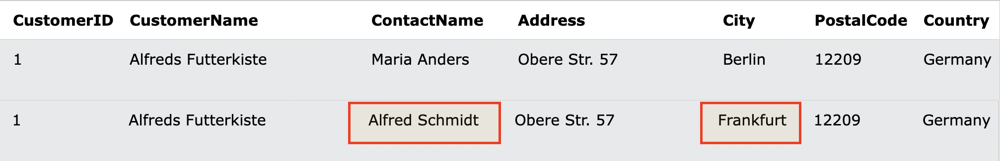
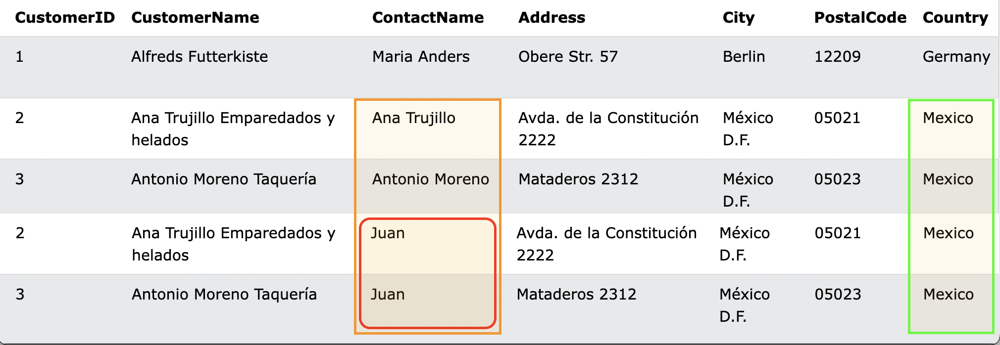

# 9. UPDATE
**テーブル内の既存のレコードを変更するために使用される**

- UPDATE 構文
```sql: UPDATE
UPDATE table_name
SET column1 = value1, column2 = value2, ...
WHERE condition;
```

## 9-1. DemoDatabase
https://www.w3schools.com/sql/trysql.asp?filename=trysql_select_where

## 9-2. UPDATEの実行
- CustomerIDが1の人の情報を更新する
  - ContactNameを'Alfred Schmidt'
  - Cityを'Frankfurt'

```sql: UPDATE
UPDATE Customers
SET ContactName='Alfred Schmidt', City='Frankfurt'
WHERE CustomerID=1;
```


*UPDATE前後の結果*

## 9-3. UPDATE 複数のレコード
- Countryが'Mexico'の人の情報を更新する
  - ContactNameを'Juan'に変更

```sql: UPDATE
UPDATE Customers
SET ContactName='Juan'
WHERE Country='Mexico';
```


*UPDATE前後の結果(一部抜粋)*

:::message alert
WHERE句(対象を決める条件)を省略すると、**全てのレコードが更新**されます。
複数レコードを更新しようとする時に特に注意が必要です。
:::
