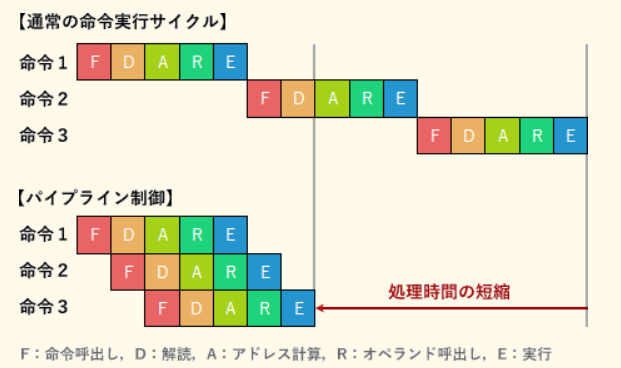
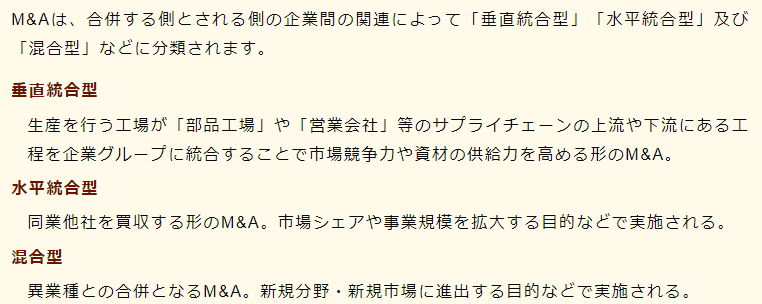

## LRU
最後に参照された時刻が最も昔であるものを置き換え対象とするアルゴリズム

## LFU
最も使用頻度の少ないものを置き換え対象とするアルゴリズム

## アクセシビリティ
高齢者・障害者を含む誰もが様々な製品や建物やサービスなどを支障なく利用できるかどうか、あるいはその度合いのこと

## バックアップ(リストア後)
- リストア後に行うべき操作
  - ロールフォワード
- その対象
  - バックアップ取得後にコミットされたトランザクション

## ゼロデイ攻撃
あるOSやソフトウェアに脆弱性が存在することが判明し、ソフトウェアの修正プログラムがベンダーから提供されるより前にその脆弱性を悪用して行われる攻撃のこと

## マッシュアップ
他サイトで公開されているWebサービスのAPIを組み合わせて1つの新しいWebサービスのように機能させること

## 逓減(ていげん)課金方式
システムの累積使用料が増加するに従って利用単位当たりの利用料金が減っていく

使えば使うほど割安な単価で利用できるようになっていく課金方式

## RFI, RFP
- RFI
  - 情報提供依頼書
  - 企業・組織がシステム調達や業務委託をする場合や、初めての取引となるベンダ企業に対して情報の提供を依頼すること、またはその際に提出される文書のこと

- RFP
  - 提案依頼書
  - 情報システムの調達を予定している企業・組織が、発注先候補のITベンダに対して具体的なシステム提案をするように求めること、またはシステム要件や調達要件を取りまとめた文書のこと。

## M&A
Merge(合併) & Acquisitions(買収)

## キャッシュフロー
- 企業会計で使われる概念
- 一定期間における現金の流入出の金額
- キャッシュフローを改善するとは
  - 組織内に現金が多く(長く)とどまるようにすること
