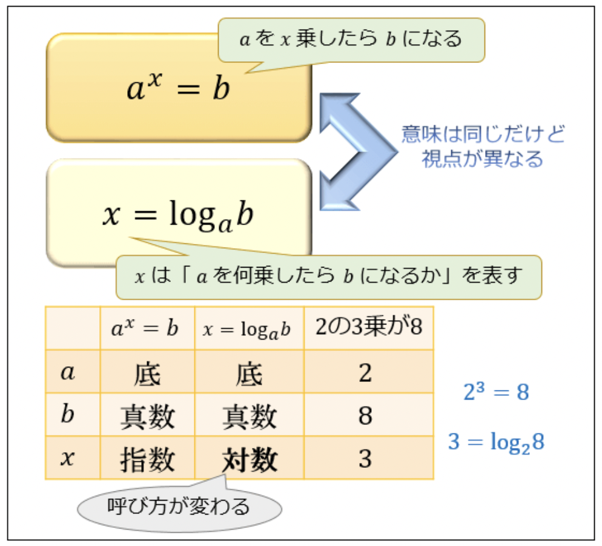

# 10章_標準ライブラリめぐり
出題数 4問

:::message alert
自分でコードを試す際にファイル名を付けると思いますが、ライブラリ名やモジュール名をファイル名に付けると、`from`や`import`でその名前を参照しようとしてエラーになるので、なるべくそういった名前を付けないようにしましょう
:::
## 1. 標準ライブラリ Part.1
#### 1-1. OSとやりとりをする
- OSをやりとりをするには`OS`というライブラリを用いる

```python: os
# OSというライブラリをインポートする
import os

# カレントディレクトリを返す
os.getcwd()

# カレントディレクトリを変更
# 現在のディレクトリ内にsampleディレクトリを作成後
os.chdir("./sample")

# ディレクトリを作成するコマンドの実行
# 上でディレクトリを変更しているのでsampleディレクトリ内にsample2ディレクトリが作成される
os.system(('mkdir sample2'))
```
1. 現在のディレクトリが絶対パスで出力される。
2. **相対パス**で指定したsampleディレクトリに移動
3. sampleディレクトリ内にsample2ディレクトリを作成

:::message
各コマンドの意味
`getcwd` -> get current working directory
`chdir` -> change directory
`mkdir` -> make directory
:::

#### 1-2. ファイルやディレクトリの管理
- `shutil`(シューティル)というライブラリを用いる
:::message
[YAHOO! 知恵袋](https://detail.chiebukuro.yahoo.co.jp/qa/question_detail/q10248221400)
shutil -> `SHell UTILities`の略
utilitiesは便利なツール(群)といった意味。
**≠ shellを操作するユーティリティ**
よくshellを使って行われる操作を行うモジュールなのでこういう名前になってるようです。
:::

```python: shutil
import shutil

# ファイルをコピー
# カレントディレクトリにsample1.txtを作成後
shutil.copyfile('sample1.txt', 'sample2.txt')

# ファイルを移動
# コピーして作成したsample2.txtをカレントディレクトリにあるsampleディレクトリに移動させる
shutil.move('sample2.txt', './sample/sample.txt')
```
sampleディレクトリ内にsample2.txtがあればOKです。

#### 1-3. ファイルの検索
- `glob`というライブラリを用いる
:::message
glob -> 英語で「かたまり」という意味
globを用いることで特定のパターンにマッチするファイルを取得することができる。

`*`(ワイルドカード)を用いて使用することが多いように、特定のファイルの「かたまり」を取得する、というイメージで良いと思われる。
:::

```python: glob
import glob

# globディレクトリの「.txt」ファイルを探す
# 相対パスでpathを指定する
files = glob.glob('./glob/*.txt')
print(files)
```
['./glob/sample1.txt', './glob/sample2.txt', './glob/sample3.txt']

#### 1-4. コマンドライン引数の取得
下記のファイルを`get.py`として作成する
```python: argv
import sys

if __name__ == "__main__":
    print(sys.argv)
```
ターミナルで
`python get.py one two three`
を実行する。

['get.py', 'one', 'two', 'three']

- 実行結果から分かること
1. `sys.argv`はリスト。
2. 文字列として格納される。
数値として扱いたい場合には`int()`, `float()`で変換が必要。
3. 1つ目の要素にスクリプトファイルのパスが格納される。
フルパスやファイル名のみかはOSによって異なる。

:::message
`python get.py one two three`
で行っている事というのは、`get.py`に、one, two, threeを渡しています。
この渡した値(コマンドライン引数)を用いてどうするか、というのを`sys.argv`で設定することが出来る。
:::

## 2. 標準ライブラリ Part.2
#### 2-1. 正規表現
- `re`というライブラリを用いる。
**Regular Expression**の略
- メタ文字が用いられる
  - `.` -> 任意の1文字
  - `[ア-ン]` -> 任意のカタカナ
  - `*` -> 直前の文字が0文字以上
  - `()` -> 抽出対象
  - etc...
もっと詳しく: [【Python】とっても便利な正規表現！
](https://qiita.com/hiroyuki_mrp/items/29e87bf5fe46de62983c)


- `re.findall()`
  - マッチした全ての文字列を取得する関数
  - 任意のテキストに限定して抽出したり、置換したり出来る。
  - 構文 -> `re.findall(抽出したい事, 抽出対象)`
下記では、`raw文字列(r"")`を使用し、特殊文字(メタ文字)を1つの文字として扱います。(raw文字列を使わず、特殊文字のエスケープでも可)
```python: re
import re

# 何羽いるのか？ -> .羽
print(re.findall(r".羽", "庭には3羽のニワトリがいる"))

# 何がいるのか？ -> [ア-ン]
print(re.findall(r"([ア-ン]*)がいる", "庭には3羽のニワトリがいる"))
```
['3羽']
['ニワトリ']

#### 2-2. 数学
- `math`というライブラリを用いる
- 数学に関しての関数を扱う事ができる

##### 2-2-1. ここで扱う平方根、対数について
##### 2-2-2. 平方根
- a = b**2 の時、a に対する b のこと
- 簡単に言うと、2乗してaになる数
  - `sqrt(b)`とすると`a`が求まります。

##### 2-2-3. 対数
まず、指数と対数を整理します。

##### 2-2-4. 指数と対数
「指数」と「対数」は同じ数のことを指している。

- 指数
  - $a^x = b$のとき、`x`のことを指数と言う
  - **`a`を`x`乗したらいくつになるか？**を考える時に使われる

- 対数
  - $x = log_ab$のとき、`x`のことを対数と言う
  - **`a`を何乗したら`b`になるか？**を考える時に使われる



##### 2-2-5. 対数
- mathライブラリを用いると何が求まるのか？
:::message
$x = log_ab$ の時、
`math.log(b)`を実行すると、`x`を何乗すれば`b`になるか？の、何乗の部分(=`a`)が求まる。
:::

#### 2-3. mathの実行
前置きが長くなってしまいましたが、平方根、対数の関数を使ってみます。

```python: math
import math


# [何]を2乗すると16になるかということ
print(math.sqrt(16))

# 対数: 10は[何乗]すれば10になるのか(何を、の部分は出ない)
print(math.log(10))
```
4.0
2.302585092994046

:::message
ちなみに、
`sqrt`は`SQuare RooT`(平方根)
`log`は`logarithm`(対数)
のことです。
:::

#### 2-4. 統計
- `statistics`というライブラリを用いる
- より高度な計算は`SciPy`というライブラリを利用する

##### 2-4-1. 分散
平均に関しては省略します。
分散の求め方を簡単に説明します。(細かい所は省略します)

1. 平均値を求める
英語のテストの点数が5人分あるとします。
(A: 90, B: 80, C: 40, D: 60, E: 90)
足して5で割ると平均値が出ます -> **72**

2. 分散を求める
**個別の点数と平均点の差の2乗の平均**で分散を求められます。
> - なぜ2乗するかというと、
> 分散を求める理由は、平均値からの距離(平均値からどれだけ離れているか)を求めるために出すものです。
> マイナスでは困ります。
> もしマイナスであっても2乗すればプラスに出来るからです。

$\displaystyle\frac{(90-72)^2+(80-72)^2+(40-72)^2+(60-72)^2+(90-72)^2+}{5}$

この式で出た**376**が分散です。

#### 2-5. statisticsの実行
上での例をそのまま当てはめていきます。

```python: statistics
import statistics

print(statistics.mean([90, 80, 40, 60, 90])
)

print(statistics.pvariance([90, 80, 40, 60, 90]))
```
72
376

***
statisticsで使用できる分散には、`pvariance`(母分散)と`variance`(普遍分散)があります。
母分散は、**母集団の分散**のこと。
不偏分散は、**標本データから母分散を推定する普遍推定量**のこと。不偏と言うのは、期待値が母分散に一致することを指します。

不偏分散が分かりづらいのでもう少し噛み砕きます。
不偏分散は、**母集団から抽出した標本**から計算された、母分散の最尤推定量です。
最尤推定量というのは、手元のデータ(母集団から抽出した標本から計算されたデータ)が、どの母パラメータに従う分布から得られる確率が最も高いかに基づいて考えられる推定量のことです。

***
:::message
自分でも分かったような分からないようなって感じですが、データサイエンスの世界に行くということでもなければ、メソッドの使い分けをしなくてはいけないんだな程度で良いと思われます。
:::


## 3. 標準ライブラリ Part.3
#### 3-1. インターネットへのアクセス
- `urllib`はモジュールのパッケージ
  - `urllib.request`はURLを開いて読むためのモジュール
    - そこから`urlopen`というモジュールを用いる

googleのWebページを開いてその結果を読み取ります。
結果、HTMLファイルが返ってきます。
```python: urllib
from urllib.request import urlopen

with urlopen("https://google.com") as google:
    print(google.read().decode("UTF-8"))
```
<!doctype html><html itemscope="" itemtype="http://schema.org/WebPage" lang="ja"><head>
...

#### 3-2. 日付と時間
- `datetime`というライブラリの、`date`というモジュールを用いる
- 現在時間の取得や時間の計算が出来る

```python: datetime
from datetime import date

# 現在時間の取得
print(date.today())

# 現在時間(now)と誕生日(birthday)の差を日分で取得する
now = date.today()
birthday = date(2000, 1, 1)
print((now - birthday).days)
```
2022-08-16
8263

#### 3-3. データの圧縮
- `zlib`というライブラリを用いる
- 他にも`gzip`, `bz2`, `lzma`, `zipfile`, `tarfile`などが用意されています。
  - `compress`は引数で指定したものを圧縮し返します
  - 圧縮率を指定できますが、圧縮率が高いほど時間はかかります
```python:zlib
import zlib

sentence = "あいうえお" * 100
print(len(sentence))

# UTF-8に指定することでbyte型になる(compressの引数はbyte型である必要があります)
after_file = zlib.compress(sentence.encode("UTF-8"))
print(len(after_file))
```
500
36
文字数が500から、36に圧縮されました。


## 4. 標準ライブラリ Part.4
#### 4-1. パフォーマンス計測
- `timeit`というライブラリの`Timer`というクラスを用いる
- 小さなプログラムのパフォーマンスを比較出来る
- 構文
  - `class timeit.Timer(stmt='pass', setup='pass', timer=<timer function>, globals=None)`

```python: timeit
from timeit import Timer

print(Timer("t=a; a=b; b=t", "a=1; b=2").timeit())

print(Timer("a,b = b,a", "a=1; b=2").timeit())
```
0.013437083005555905
0.013737416004005354
(上記はチュートリアルの式で、いまいちどういった式か分かってないのですが、(多分)setupパラメータの数値は同じで、stmt(statement?)が違うものを比較するというのが目的だと思われます)

:::message alert
どちらが早いというよりも、パフォーマンスを比較する際に使用されます。
実行するたびに実行結果は変わります(その時のPCなどの状況によるため)
:::

#### 4-2. より大きな処理のパフォーマンス計測
- `cProfile`というモジュールを用いる
- ボトルネックになっている処理を特定する

コマンドラインで
`python -m cProfile -s cumulative [ファイル名]`
実行結果から様々な情報が出力され、それを解析することでそのファイルのパフォーマンスを計測する事ができます。

```python: os
# OSというライブラリをインポートする
import os

# カレントディレクトリを返す
print(os.getcwd())

# カレントディレクトリを変更
# 現在のディレクトリ内にsampleディレクトリを作成後
os.chdir("./sample")

# ディレクトリを作成するコマンドの実行
# 上でディレクトリを変更しているのでsampleディレクトリ内にsample2ディレクトリが作成される
os.system(('mkdir sample2'))
```

```python: example
$ python -m cProfile -s cumulative os.py


         7 function calls in 0.006 seconds

   Ordered by: cumulative time

   ncalls  tottime  percall  cumtime  percall filename:lineno(function)
        1    0.000    0.000    0.006    0.006 {built-in method builtins.exec}
        1    0.000    0.000    0.006    0.006 os.py:1(<module>)
        1    0.006    0.006    0.006    0.006 {built-in method posix.system}
        1    0.000    0.000    0.000    0.000 {built-in method posix.getcwd}
        1    0.000    0.000    0.000    0.000 {built-in method builtins.print}
        1    0.000    0.000    0.000    0.000 {built-in method posix.chdir}
        1    0.000    0.000    0.000    0.000 {method 'disable' of '_lsprof.Profiler' objects}
```
